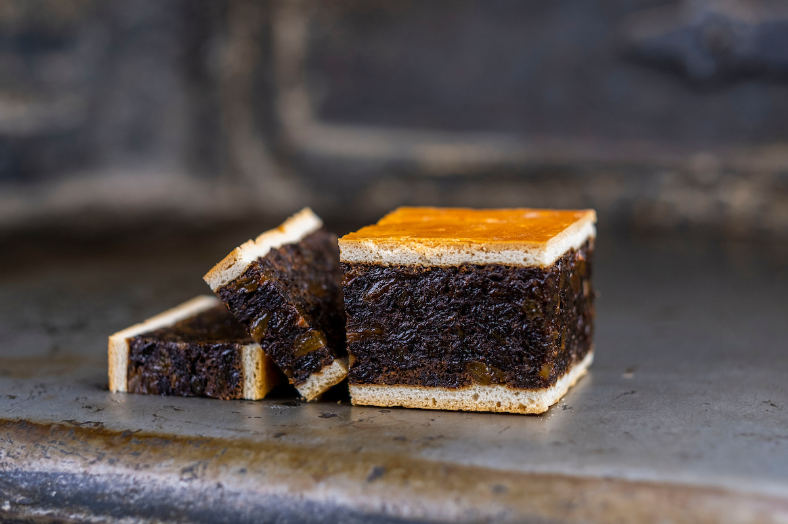

# Black Bun

*Scotland's Hogmanay fruit cake: a dense, dark fruit-and-spice cake hidden inside a thin shortcrust pastry casing. The traditional first-footer's gift on New Year's Eve, alongside a lump of coal and a bottle of whisky.*

**Serves:** 16-20

**Prep Time:** 1 hour (plus overnight fruit soak)

**Cook Time:** 3.5-4 hours (long slow bake)

## Overview
Black bun is one of Scotland's most uniquely structured cakes: a very dense, almost black fruit cake loaded with raisins, currants, almonds, candied peel and warming spices, encased in a thin shortcrust pastry shell and baked as a single piece. The pastry isn't decorative; it acts as a protective layer that lets the fruit cake inside mature without drying out, growing richer over the three or four weeks of ageing before it's served. Black bun is the traditional first-footer's gift on Hogmanay, brought to a friend or relative's house just after midnight on New Year's morning alongside a lump of coal (for warmth in the year ahead), a piece of shortbread and a bottle of whisky. Sliced thin (the density is intense) and served with a small dram of whisky. The recipe goes back to Robert Burns's era; Burns mentions black bun in "Tam o' Shanter".

## Ingredients

### Pastry
- 400 g plain flour
- ½ teaspoon fine sea salt
- 200 g cold butter (cubed)
- 1 large egg yolk
- 100 ml ice-cold water (approx)

### Fruit cake filling
- 500 g raisins
- 500 g currants
- 200 g sultanas
- 200 g mixed candied peel (orange, lemon)
- 80 g glacé cherries (roughly chopped)
- 100 g chopped blanched almonds
- 100 g chopped walnuts (or hazelnuts)
- Zest of 2 oranges
- Zest of 1 lemon
- 200 ml whisky (single malt or blended; for soaking)

### Cake batter (the binding for the fruit)
- 200 g plain flour
- 200 g soft dark brown sugar
- 200 g unsalted butter (softened)
- 4 large eggs
- 1 teaspoon ground cinnamon
- 1 teaspoon ground ginger
- 1 teaspoon mixed spice
- ½ teaspoon ground cloves
- ½ teaspoon ground nutmeg
- 1 teaspoon black treacle
- 2 tablespoons orange marmalade
- ½ teaspoon fine sea salt

### To finish
- 1 beaten egg (for pastry glaze)
- Whisky for ongoing "feeding" during ageing (about 200 ml total over 3-4 weeks)

## Method

### Stage 1 - Soak the fruit (overnight)
1. Combine the raisins, currants, sultanas, candied peel, glacé cherries, almonds, walnuts, orange zest, and lemon zest in a large bowl.
2. Pour over the 200 ml whisky.
3. Cover; leave at room temperature overnight (12+ hours).
4. Stir occasionally if you can.

### Stage 2 - Make the pastry
1. Sift the flour and salt into a bowl.
2. Rub in the cold butter with your fingertips till the mixture looks like fine breadcrumbs.
3. Mix the egg yolk with 80 ml of ice-cold water.
4. Add to the flour, mixing with a knife till it just comes together; add more water (a teaspoon at a time) if needed.
5. Form into a flat disc; wrap in cling film; refrigerate 30 minutes.

### Stage 3 - Make the cake batter
1. In a large bowl, cream the butter and brown sugar for 5 minutes till pale and fluffy.
2. Add the eggs one at a time, beating well after each addition (it may look curdled, that's fine).
3. Stir in the black treacle and marmalade.
4. Sift the flour, spices, and salt over the mixture.
5. Add the soaked fruit (with all its juice).
6. Fold in gently till everything is evenly combined.
7. The mixture will be VERY dense, almost solid with fruit. That's correct.

### Stage 4 - Prep the tin
1. Line a deep 20 cm round cake tin with parchment (bottom and sides; sides 5 cm above rim).
2. Wrap the outside of the tin with brown paper or newspaper tied with string (protects from over-browning).
3. Preheat oven to 150°C / 130°C fan / 300°F.

### Stage 5 - Roll and line with pastry
1. Roll out two-thirds of the pastry to a circle about 32 cm diameter (3-4 mm thick).
2. Carefully press into the prepared tin, letting the pastry overlap the rim slightly.
3. Patch any holes or cracks (the pastry shell is structural).

### Stage 6 - Fill with cake batter
1. Spoon the fruit-cake batter into the pastry-lined tin.
2. Press down firmly to eliminate air pockets.
3. Smooth the top.

### Stage 7 - Top with pastry lid
1. Roll out the remaining third of the pastry to a 20 cm circle.
2. Brush the edges of the bottom pastry with beaten egg.
3. Place the pastry lid over the cake batter; crimp the edges to seal.
4. Cut 4 small slits in the top (steam holes).
5. Prick all over with a fork.
6. Brush the top generously with beaten egg.

### Stage 8 - Bake
1. Bake at 150°C for 3-3.5 hours.
2. Check after 2 hours; if browning too fast, cover with parchment.
3. After 3 hours, test with a skewer through one of the steam holes; should come out clean (or with a few moist crumbs).
4. The total bake should be 3.5-4 hours.

### Stage 9 - Cool and remove
1. Cool in the tin for 1 hour.
2. Carefully lift out; cool completely on a rack (4-6 hours).

### Stage 10 - Age (2-4 weeks)
1. Wrap the cooled cake tightly in greaseproof paper, then foil.
2. Store in a cool dry place (not the fridge).
3. Every 4-5 days, prick the top with a skewer and drizzle 1-2 tablespoons of whisky over. Re-wrap.
4. Continue "feeding" for 2-4 weeks. The cake matures and intensifies.

### Stage 11 - Serve on Hogmanay
1. On New Year's Eve, unwrap the black bun.
2. Cut a wedge; slice the wedge into very thin slices (the cake is dense; thin slices are appropriate).
3. Serve with a small dram of single-malt Scotch.
4. The traditional Scottish New Year's tradition: bring a slice and a dram with you when you first-foot a friend's house just after midnight.

## Notes
- **Pastry shell, not pie:** the pastry is thin (3-4 mm) and acts as a moisture barrier. Don't make it thick.
- **Very dense fruit-to-batter ratio:** the cake is meant to be almost solid with fruit. The thin batter just holds it together.
- **Long slow bake:** 3.5-4 hours at 150°C. Don't rush. Don't increase the temperature.
- **Age 2-4 weeks minimum:** the bake just makes the cake structurally. The flavour develops during the ageing.
- **Feed with whisky:** every 4-5 days, prick and drizzle. This is what gives black bun its almost-treacly intensity.

## Variations
**With brandy or rum:** swap the whisky for brandy or dark rum, less traditional but excellent.
**Vegan black bun:** replace butter with vegan baking block; replace eggs with 4 tablespoons milled flaxseed + 12 tablespoons water; otherwise identical.
**Mini black buns:** make in 6-8 small dariole moulds, individual New Year's portions.
**Gluten-free black bun:** use gluten-free plain flour + ½ teaspoon xanthan gum; the pastry handling is harder but works.
**Heavier on the dates:** add 200 g chopped dates to the fruit, modern, sweeter.
**With ground almonds in batter:** add 100 g ground almonds to the cake batter, richer crumb.

## Serving
On Hogmanay (New Year's Eve) and through the first week of January (the traditional Scottish New Year window) · brought as a first-footer's gift just after midnight on January 1st · with a small glass of single-malt Scotch · alongside a cup of strong tea on New Year's Day · at a Scottish family New Year's lunch · at a Burns Night supper as the after-coffee biscuit (less common but valid).

## Storage
- Aged black bun (after 3-4 weeks of feeding) keeps in a sealed tin for 6-8 weeks.
- After cutting, wrap the cut face with greaseproof to prevent drying; keeps 2-3 weeks once cut.
- Freezes 6 months wrapped well; defrost overnight in a cool room.
- Stale black bun is excellent crumbled into pudding mixes or used as a Christmas-cake substitute.
- The flavour peaks at 4-6 weeks after baking with regular whisky feeding.
