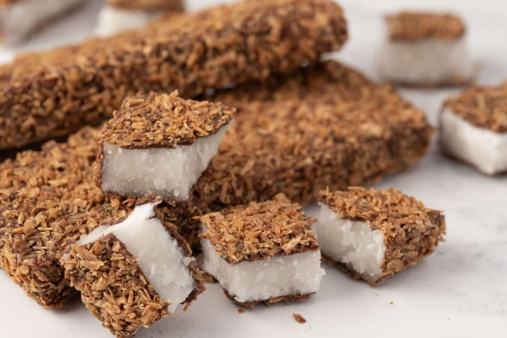

# Macaroon Bars

*Scotland's deeply weird and deeply beloved bake-sale confection: a no-bake fondant made with mashed boiled potato and icing sugar, coated in dark chocolate and rolled in toasted desiccated coconut.*

**Serves:** Makes 20-24 bars

**Prep Time:** 30 minutes (plus 4 hours setting)

**Cook Time:** None (no-bake)

## Overview
The Scottish macaroon bar is one of the country's strangest and most beloved confections: a sweet fondant made (bizarrely but traditionally) with mashed boiled potato as the bulk ingredient, combined with icing sugar to a thick paste, formed into bars, coated in melted dark chocolate and rolled in toasted desiccated coconut. The story is the recipe was invented by accident in 1930 by John Justice Lees Sr., a Coatbridge confectioner who was trying to make fondant and grabbed the wrong tin (potato instead of starch). The result was such a success that Lees Confectionery built a business around it, and Lees of Scotland still produces commercial macaroons today. The flavour is the surprise: the potato is completely undetectable (it just provides moisture and a slight chewiness); the icing sugar dominates with a sweet smoothness; the dark chocolate balances; the toasted coconut gives a nutty crunch. Unrelated to French macarons, despite the name.

## Ingredients

### Macaroon fondant
- 80 g floury potato (peeled and quartered; one small spud - about half a regular-sized potato)
- 800-900 g icing sugar (sifted; you may need slightly more or less depending on potato moisture)
- 1 teaspoon vanilla extract
- A pinch of fine sea salt

### Coating
- 300 g dark chocolate (70% cocoa solids; broken into pieces)
- 150 g desiccated coconut (toasted in a dry pan till golden)

### Equipment
- A 20 × 20 cm tin lined with parchment
- A potato masher and ricer (the ricer is helpful for super-smooth potato)
- A microwave-safe bowl or bain-marie for chocolate
- A small spreading knife

## Method

### Stage 1 - Boil the potato
1. Place the peeled, quartered potato in a small saucepan.
2. Cover with cold water (no salt; the potato must be plain).
3. Bring to a boil; simmer 12-15 minutes till COMPLETELY tender.
4. Drain very thoroughly; return to the pan over LOW heat for 1 minute to steam off all moisture.
5. Mash thoroughly with a fork or push through a ricer.
6. The mash should be smooth, dry, and pale.
7. You should have about 60-70 g of mashed potato.
8. Cool to room temperature.

### Stage 2 - Make the fondant
1. Place the cooled mashed potato in a large bowl.
2. Add the vanilla and salt.
3. Add about 200 g of the icing sugar; mix with a wooden spoon till it forms a sloppy paste.
4. Gradually add more icing sugar, stirring after each addition, till you have a very stiff fondant that holds its shape (it will look like a very thick, dry icing).
5. You'll typically use 800-900 g icing sugar in total.
6. The fondant is ready when you can press it firmly and it holds its shape without sticking to your fingers.
7. Tip onto a surface dusted with icing sugar.

### Stage 3 - Form the bars
1. Press the fondant into the lined 20 × 20 cm tin, smoothing the top with a flat spatula.
2. The layer should be about 1.5 cm thick.
3. Press very firmly with the back of a spoon to compact (loose fondant crumbles when sliced).
4. Refrigerate 1 hour to firm up.

### Stage 4 - Toast the coconut
1. Heat a dry frying pan over medium heat.
2. Add the desiccated coconut.
3. Toast, stirring constantly, for 3-5 minutes till golden and intensely fragrant.
4. Tip onto a cold plate immediately; cool completely.
5. Reserve.

### Stage 5 - Cut into bars
1. Remove the fondant from the tin using the parchment.
2. Use a sharp knife to cut into 20-24 small rectangles (about 4 × 3 cm each).
3. If the fondant cracks when cutting, pause and let it warm slightly (1-2 minutes).

### Stage 6 - Melt the chocolate
1. Place the chocolate in a microwave-safe bowl.
2. Microwave on medium-low (50% power) in 30-second bursts, stirring between, till fully melted and smooth.
3. Or melt in a bain-marie (bowl over a pan of barely simmering water).
4. Don't overheat - chocolate should be smooth, glossy, around 45°C.

### Stage 7 - Coat the bars
1. Set up a station: cooled toasted coconut on one plate, parchment-lined tray on another.
2. With a fork or skewer, dip each fondant bar in the melted chocolate (cover completely or just the top - your choice).
3. Lift out; let excess chocolate drip off.
4. Immediately roll in the toasted coconut.
5. Place on the parchment-lined tray.
6. Repeat with all the bars.

### Stage 8 - Set
1. Refrigerate the coated bars for 1-2 hours till the chocolate sets completely.
2. The finished macaroon bar should be a fondant centre, dark chocolate coating, and a generous outer layer of toasted coconut.

### Stage 9 - Serve and store
1. Serve at room temperature (the fondant softens slightly out of the fridge).
2. Pack in paper cases or wrap individually for gifts.

## Notes
- **Plain boiled potato:** no salt in the water, no butter, no milk. The potato is just a moisture-and-bulk ingredient; flavour should be neutral.
- **Add icing sugar gradually:** you may need slightly more or less depending on potato moisture. The fondant should be very stiff.
- **Toasted coconut is essential:** untoasted desiccated coconut is bland and pale. Toast till golden.
- **Dark chocolate (70%):** milk chocolate is too sweet - the fondant is already pure sugar.
- **The potato is undetectable:** if you're worried about your guests detecting potato, don't be. Once mixed with that much icing sugar, the potato disappears entirely.

## Variations
**Without potato (modern shortcut):** swap the potato for 2-3 tablespoons of water + 1 tablespoon of glucose syrup; the texture is slightly different but the dish works.
**With cocoa fondant:** add 30 g cocoa powder to the fondant mixture - chocolate macaroon bars.
**With lemon:** add the zest of 2 lemons + 1 teaspoon lemon juice to the fondant - bright, modern variant.
**With raspberry:** add 1 tablespoon freeze-dried raspberry powder to the fondant - pink-flecked version.
**Mini macaroon bites:** form into small balls instead of bars; coat and roll in coconut.
**Half-dipped:** dip only one end in chocolate, then roll the chocolate-end in coconut - visually striking.
**Triple-coated:** dip in chocolate, roll in coconut, allow to set, then drizzle with melted white chocolate - modern fancy version.

## Serving
At Scottish school bake-sales (the traditional setting; arranged on doilies on a folding table) · at a Scottish church fete · at a Saint Andrew's Day market in Edinburgh · as a Scottish Christmas-stocking treat · in Lees of Scotland branded wrapping in any Scottish corner shop · at a Highland coffee morning with a cup of strong tea · at a Burns Night supper as a curiosity for the English guests.

## Storage
- Keeps in a sealed tin (not the fridge after the initial set) for 2 weeks.
- Refrigerate in summer (the chocolate can soften).
- Freezes 2 months wrapped well; defrost at room temperature.
- The texture is best within the first week; after that the fondant can become slightly grainy.
- A made-fresh macaroon bar is a delight; one that's been in the cupboard for 3 weeks is dry and crumbly. Eat fresh.
