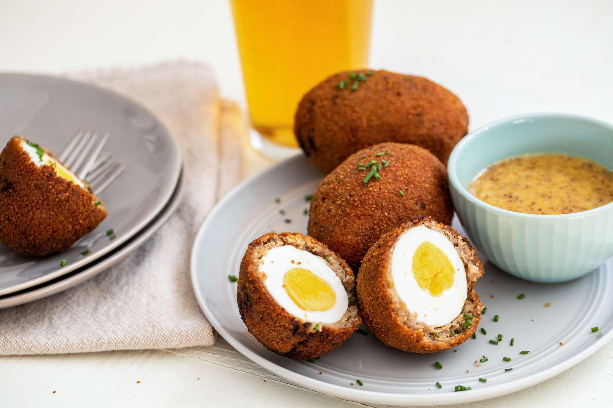

# Scotch Egg

*Britain's iconic picnic food: a soft-boiled egg wrapped in seasoned pork sausagemeat, rolled in breadcrumbs and deep-fried till golden and crisp.*

**Serves:** 6

**Prep Time:** 30 minutes (plus 30 minutes egg chill)

**Cook Time:** 8-10 minutes deep frying OR 25 minutes baking

## Overview
The Scotch egg has a contested origin: tradition credits Fortnum and Mason of London (1738), but the dish has been so thoroughly embraced by Scotland and Scottish gastropubs that it's effectively a Scottish dish now. A soft-boiled egg (6 minutes 30 seconds is the sweet spot for a just-set white with a slightly runny yolk) wraps in seasoned pork sausagemeat with sage, mustard powder, white pepper and mace, then triple-coats in flour-egg-breadcrumbs and deep-fries till golden and crisp. The Scottish refinement is to mix crumbled haggis into the sausagemeat, or Stornoway black pudding. The egg sits at the centre with that soft yolk just on the edge of running, the crisp savoury crust around it. Eaten warm at a picnic, in a pub with English mustard or HP brown sauce, on a gastropub starter plate with watercress, or cold from a packed lunch box.

## Ingredients

### For 6 Scotch eggs
- 6 large eggs (free-range; for the centre)
- 1 small egg (beaten, for the coating)
- 600 g good-quality pork sausagemeat (or 600 g pork mince + 1 tsp salt + 1 tsp pepper)
- 100 g haggis (crumbled; optional - for the haggis-coated Scottish version) OR 100 g crumbled black pudding for the black-pudding version
- 2 tablespoons finely chopped sage
- 1 tablespoon finely chopped thyme
- 1 teaspoon English mustard powder
- ½ teaspoon ground mace (or nutmeg)
- 1 teaspoon Worcestershire sauce
- 1 teaspoon flaked sea salt
- 1 teaspoon freshly ground white pepper

### Coating
- 80 g plain flour
- 2 large eggs (beaten)
- 200 g panko breadcrumbs (or fine fresh breadcrumbs)
- A pinch of salt and pepper in the flour

### For deep frying
- 1 litre vegetable oil (sunflower or rapeseed)

### To serve
- English mustard or HP Brown Sauce
- A bunch of watercress
- A wedge of pickled red cabbage (optional)
- Crusty bread and butter (for a Scottish gastropub starter)

## Method

### Stage 1 - Soft-boil the eggs
1. Bring a large pan of water to a rolling boil.
2. Carefully lower the 6 eggs in with a slotted spoon.
3. Cook EXACTLY 6 minutes 30 seconds (set a timer) for soft-set white with a slightly runny yolk.
4. Drain immediately; plunge into a bowl of ice water.
5. Leave 5 minutes in the ice water.
6. Peel carefully (the whites are delicate at this stage); rinse to remove any shell.
7. Pat dry on kitchen paper; refrigerate at least 30 minutes (helps hold shape during coating).

### Stage 2 - Mix the sausagemeat
1. In a bowl, combine the sausagemeat with the chopped sage, thyme, mustard powder, mace, Worcestershire sauce, salt, and white pepper.
2. If using the haggis or black pudding variant, crumble it in now.
3. Mix thoroughly with a wooden spoon (or your hands).
4. Divide into 6 equal portions (about 100 g each).

### Stage 3 - Wrap the eggs
1. Lay a sheet of cling film on the counter.
2. Pat one portion of sausagemeat into a flat 12 cm round on the cling film.
3. Place a peeled egg in the centre.
4. Use the cling film to wrap the sausagemeat around the egg, sealing all the edges and rolling into a smooth ball.
5. The egg should be completely encased; no gaps or thin spots.
6. Place on a tray; refrigerate 15 minutes (firms up the meat for coating).
7. Repeat with the remaining 5 eggs.

### Stage 4 - Triple coat
1. Set up three shallow bowls: flour (seasoned with salt and pepper), beaten eggs, panko breadcrumbs.
2. For each Scotch egg:
   - Roll in flour (covers all surfaces; pat off excess)
   - Dip in beaten egg (drain excess)
   - Roll in breadcrumbs (press to adhere; full coverage)
3. Place coated eggs on a tray; refrigerate 15 minutes (helps the coating set).

### Stage 5a - Deep fry (the canonical method)
1. Heat the oil to 175°C in a deep pan or fryer (use a thermometer; if too hot the coating burns before the meat cooks; too low the egg overcooks).
2. Lower 2-3 Scotch eggs into the oil with a slotted spoon.
3. Fry for 7-8 minutes, turning occasionally, till deeply golden brown.
4. Lift out with the slotted spoon; drain on kitchen paper.
5. Continue with the rest.

### Stage 5b - Oven bake (the lighter, healthier method)
1. Preheat oven to 200°C / 180°C fan / 400°F.
2. Brush the coated eggs lightly with oil.
3. Place on a parchment-lined tray.
4. Bake for 25 minutes, turning halfway, till golden brown.
5. Less crisp than deep-fried but considerably less greasy.

### Stage 6 - Serve
1. Let the Scotch eggs rest 5 minutes (the meat continues cooking off-heat).
2. Cut in half lengthways to reveal the soft yolk.
3. Place on warm plates with watercress and a dollop of mustard.
4. Serve warm or cold.

## Notes
- **6 minutes 30 seconds for soft-boiled:** longer = hard-boiled, shorter = uncomfortably runny. Use a timer.
- **Triple coat is essential:** flour, egg, breadcrumbs - in that order. Single coat tears.
- **Cold sausagemeat is key:** if the meat is warm, the coating becomes a mess. Refrigerate at each stage.
- **Don't over-fry:** 7-8 minutes at 175°C is enough. Over-frying overcooks the yolk and dries the meat.
- **The yolk should still be slightly runny when sliced:** test one Scotch egg before serving 6 to a dinner party.

## Variations
**Haggis Scotch egg (Scottish signature):** stir 100 g crumbled haggis into the sausagemeat. The Burns Night canapé and the Scottish gastropub's signature.
**Black-pudding Scotch egg (Scottish coastal):** stir 100 g crumbled Stornoway black pudding into the sausagemeat - earthier, more deeply Scottish.
**Vegetarian Scotch egg:** swap sausagemeat for a mixture of cooked Puy lentils + chopped mushrooms + breadcrumbs + chopped herbs + an egg to bind. Bake; deep-fry won't work.
**Mini Scotch eggs (canapé):** use quail eggs (soft-boil 2 minutes); halve the meat per egg; makes 24-30 from the same recipe.
**Curried Scotch egg:** add 1 teaspoon curry powder + ½ teaspoon ground cumin to the sausagemeat.
**Chorizo Scotch egg:** swap pork sausagemeat for chorizo sausagemeat - smokier, spicier.

## Serving
At a Scottish gastropub as a starter with watercress and mustard (the canonical setting) · at a Scottish picnic at a Highland castle ground · at a Burns Night canape table · at a Scottish family Sunday picnic · cold in a Scottish school packed lunch · at a Scottish craft-beer bar with a pint of heavy ale.

## Storage
- Refrigerates 3 days; eat cold from the fridge for picnics.
- Don't reheat in the microwave (the coating goes soggy). If you must reheat, use a 180°C oven for 10 minutes.
- Freezes (cooked, cold) for 2 months; defrost in the fridge and eat cold.
- A day-old cold Scotch egg is the canonical Scottish school packed-lunch item.
- The coated-but-uncooked Scotch egg freezes well; deep-fry from frozen for 12-15 minutes at 170°C.
