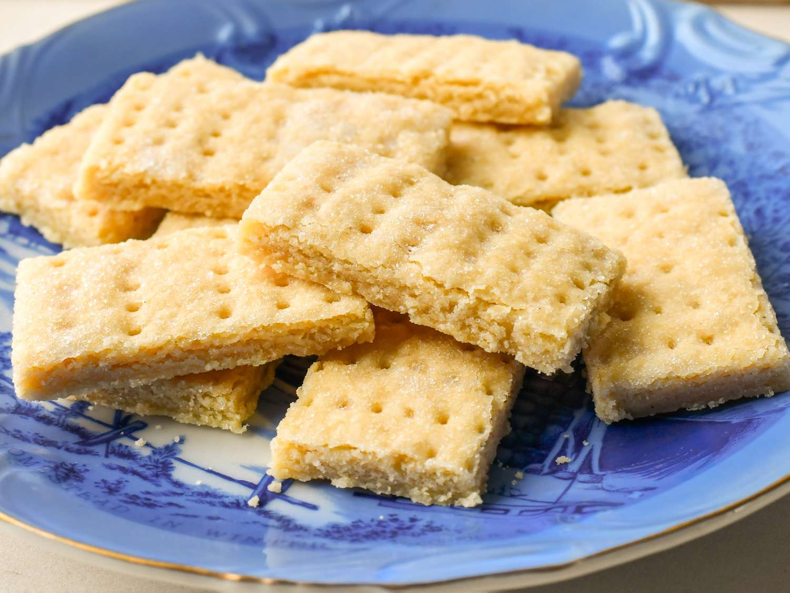

# Shortbread

*Scotland's iconic biscuit: just three ingredients (butter, sugar, flour) at a 2:1:3 ratio, mixed gently, pressed into a tin, scored into petticoat-tail fingers or rounds, and baked till pale-golden. The world's most exported Scottish food product; the traditional tea-time biscuit; the bridge between Scotland's bakery tradition and its world reputation.*

**Serves:** Makes 12-16 pieces

**Prep Time:** 15 minutes (plus 30 minutes chill)

**Cook Time:** 35-40 minutes

## Overview
Shortbread is Scotland's most famous and most exported food product. Documented Scottish origins going back to at least the 12th century, evolved from medieval "biscuit bread" (twice-baked bread sweetened with sugar). The modern recipe (three ingredients at a 2:1:3 ratio of butter:sugar:flour) was codified in the 18th and 19th centuries by Scottish bakers and confectioners. The simplicity is the genius: 200 g butter, 100 g sugar, 300 g flour. No raising agent. No eggs. No flavouring beyond perhaps a pinch of salt and (controversially) a touch of vanilla. Pressed into a tin, scored into traditional fingers or rounds (the "petticoat tails", wedges from a circular slab, named for the shape of Mary Queen of Scots's pleated petticoats), pricked with a fork to release steam, slow-baked till pale golden. Dense, buttery, crumbly, melting on the tongue, with a faint nutty caramel from the slow bake.

## Ingredients

### Classic 2:1:3 ratio
- 200 g unsalted butter (room temperature, soft enough to press your finger into; or 200 g lightly salted Scottish butter)
- 100 g caster sugar (plus extra for dusting)
- 300 g plain flour
- A pinch of fine sea salt (omit if using salted butter)
- Optional: ¼ teaspoon vanilla extract (controversial but widely used)
- Optional: 2 tablespoons rice flour (replaces 2 tablespoons plain flour for a crumblier texture)

### For tin preparation
- A small piece of butter for greasing
- A 20 × 20 cm square tin OR a 20 cm round tin OR a 23 × 18 cm rectangular tin
- A piece of parchment paper

## Method

### Stage 1 - Cream the butter and sugar
1. Place the soft butter in a large bowl.
2. Add the caster sugar.
3. Cream together with a wooden spoon or electric mixer for 2-3 minutes till pale and fluffy but NOT over-aerated (don't whip it like a sponge cake; just till combined and slightly lightened).

### Stage 2 - Add the flour
1. Sift the plain flour (and rice flour if using) and salt over the butter-sugar.
2. Add the optional vanilla.
3. Fold and press together with a wooden spoon, then your hands, till you have a smooth slightly stiff dough.
4. Don't overwork - the more you work it, the tougher the shortbread becomes.

### Stage 3 - Press into tin
1. Lightly butter the tin; line the base with parchment.
2. Tip the dough into the tin.
3. Press into an even layer about 1.5 cm thick.
4. Smooth the top with the back of a spoon or your fingers.
5. Crimp the edges with a fork if you like a decorative finish.

### Stage 4 - Score
1. With a sharp knife, score the dough into the desired pieces:
   - 12-16 fingers (cut in 4 rows × 3-4 columns)
   - 8 petticoat tails (cut from a 20 cm round into 8 wedges)
   - 16 squares (cut in 4 × 4 grid)
2. Score only halfway through the dough; don't cut all the way (the scoring helps the pieces break cleanly after baking).
3. Prick each piece all over with a fork (release steam, prevent puffing).
4. Refrigerate 30 minutes (the chill helps the shortbread hold its shape during baking).

### Stage 5 - Bake
1. Preheat oven to 160°C / 140°C fan / 325°F.
2. Bake for 35-40 minutes till pale-golden at the edges and a touch deeper on the surface.
3. The shortbread should be cooked through but still pale; do NOT bake to brown.
4. Test by gently pressing the top - should be firm and dry.

### Stage 6 - Score again while warm
1. Remove from oven.
2. Immediately re-score along the original score lines (cutting all the way through this time - the warm shortbread cuts cleanly).
3. Sprinkle generously with caster sugar (the traditional Scottish finish; gives a slight sugary crunch).

### Stage 7 - Cool and remove
1. Cool in the tin for 15 minutes.
2. Carefully transfer to a wire rack.
3. Cool completely (about 1 hour).
4. Break along the score lines.

### Stage 8 - Serve and store
1. Serve with strong tea (traditional), coffee, or a small dram of single malt.
2. Store in a sealed tin.

## Notes
- **The 2:1:3 ratio is sacred:** 200 g butter, 100 g sugar, 300 g flour. Don't deviate.
- **Good butter matters:** use the best butter you can afford. Scottish butter is traditional. Don't use spreadable margarine - texture is wrong.
- **Don't overwork:** the more you handle the dough, the tougher it becomes. Quick mix, light press.
- **Pale-golden, NOT brown:** brown shortbread is overbaked. Pale-golden is the traditional Scottish finish.
- **Score twice - before baking (lightly) and immediately after baking (fully):** the warm-cutting trick gives clean breaks.

## Variations
**Petticoat tails (round):** press the dough into a 20 cm round tin; score into 8 wedges. The visually iconic Scottish version named for Mary Queen of Scots's pleated petticoats.
**Fingers (rectangular):** the most common modern shape. Cut into 12 or 16 fingers.
**With rice flour:** swap 2-3 tablespoons of plain flour for rice flour - gives a slightly grittier, crumblier texture (the Walker's of Aberlour signature).
**With cornflour:** swap 1 tablespoon plain flour for cornflour - makes the shortbread more crumbly and tender.
**Citrus shortbread:** add the zest of 1 lemon + 1 orange to the dough - bright, fragrant.
**Whisky shortbread:** add 1 tablespoon Scotch + 1 teaspoon vanilla to the dough - Highland variant.
**Chocolate-dipped:** dip one end of each finger in melted dark chocolate after cooling - modern variant.
**Brown sugar shortbread:** swap half the caster sugar for soft light brown sugar - adds caramel depth.
**Stem-ginger shortbread:** stir 60 g finely chopped stem ginger into the dough - warming, festive.
**Lavender shortbread:** add 1 teaspoon dried culinary lavender - floral, modern.

## Serving
At every Scottish high tea (the traditional pairing with strong tea) · at a Scottish hotel afternoon-tea service · as a tourist gift in tartan-printed tins from any Edinburgh shop · alongside a dram of single malt as the traditional Scottish whisky-and-shortbread pairing · in a Christmas-stocking gift box · at a Burns Night supper as the after-dinner biscuit with coffee · at home with a cup of breakfast tea on a Saturday morning.

## Storage
- Keeps in a sealed tin (with a small piece of bread to maintain texture) for 2 weeks at room temperature.
- Freezes 3 months wrapped well; defrost at room temperature (don't microwave).
- The flavour improves slightly over the first few days as the butter mellows.
- Stale shortbread (over 2 weeks) is excellent crumbled into trifles, ice cream toppings, or used as a cheesecake base.
- Don't refrigerate (the butter hardens and the shortbread tastes dull).
