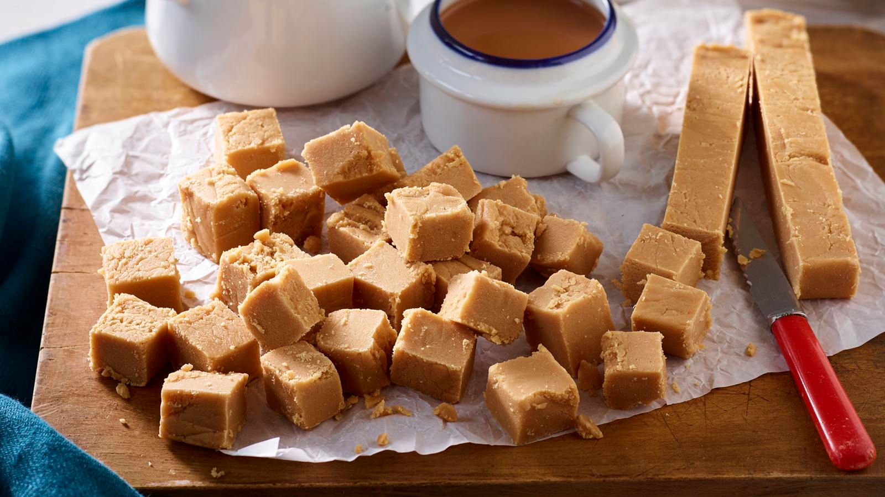

# Tablet

*Scotland's intensely sweet granular fudge: sugar, condensed milk, butter and milk boiled to soft-ball stage, beaten till the sugar crystallises, then set in a tray and cut into pale-amber squares.*

**Serves:** Makes about 40 pieces (1 kg of finished tablet)

**Prep Time:** 10 minutes

**Cook Time:** 25-30 minutes

## Overview
Tablet is Scotland's distinctively crystalline confectionery, a member of the fudge family but harder, less creamy, and with a sandy granular texture from forced crystallisation of the sugar. The roots are Highland: originally made by Scottish farm-house cooks as a way of preserving milk and sugar in a stable, portable form for travelling. The recipe is straightforward but technically demanding. Sugar, condensed milk, butter and a splash of whole milk boil together to soft-ball stage (115 to 118 °C; verified with a sugar thermometer), then come off the heat for five to ten minutes of vigorous beating with a wooden spoon until the sugar starts to crystallise and the mixture turns from glossy to grainy. Poured into a lined tray, allowed to set, cut into chunky squares. Pale-amber to honey-coloured, dense, intensely sweet, breaks with a satisfying snap. The traditional Scottish bake-sale fundraiser item.

## Ingredients

### For about 1 kg of tablet (40 squares)
- 1 kg granulated sugar (not caster; granulated has the right crystal size for tablet)
- 250 ml whole milk
- 120 g unsalted butter
- 1 × 397 g tin sweetened condensed milk
- 1 teaspoon vanilla extract (optional; controversial, some traditional Scottish recipes don't use it)
- A pinch of fine sea salt
- 1 teaspoon malt whisky (optional, for the Highland variant)

### Equipment
- A heavy-bottomed pan (at least 4 litres capacity; the mixture rises dramatically)
- A sugar thermometer
- A wooden spoon
- A 30 × 20 cm tin lined with parchment
- A jug of cold water (for soft-ball testing if thermometer fails)

## Method

### Stage 1 - Prep the tin
1. Line a 30 × 20 cm tin (or any roughly equivalent tray) with parchment paper, letting it overhang the sides.

### Stage 2 - Combine and dissolve
1. Place the sugar, milk, and butter in a heavy-bottomed pan.
2. Heat over low heat, stirring constantly with a wooden spoon, till the sugar fully dissolves (about 10 minutes).
3. Don't increase the heat until ALL the sugar is dissolved, sugar crystals stuck to the side of the pan can trigger early crystallisation later.
4. Use a wet pastry brush to wash any sugar crystals down the sides of the pan as needed.

### Stage 3 - Boil to soft-ball
1. Once fully dissolved, add the condensed milk and salt.
2. Stir to combine.
3. Increase the heat to medium-high.
4. Bring to a boil; stir constantly with the wooden spoon (essential, the mixture burns quickly otherwise).
5. The mixture will rise dramatically in the pan (this is why you need the big pan).
6. Boil, stirring constantly, for 18-22 minutes till the temperature reaches 115-118°C (the "soft-ball" stage) on a sugar thermometer.
7. SOFT-BALL TEST (if you don't have a thermometer): drop a small amount of mixture into a cup of cold water; it should form a soft ball that holds its shape when squeezed between your fingers.

### Stage 4 - Take off the heat
1. Once at temperature, immediately remove the pan from the heat.
2. Add the vanilla extract and whisky (if using).
3. Don't stir yet.

### Stage 5 - Beat (the crystallisation step)
1. With the wooden spoon, begin beating vigorously.
2. Continue beating for 5-10 minutes, your arm will get tired.
3. The mixture starts glossy and dark amber.
4. As you beat, it gradually thickens, lightens in colour (to pale-amber/honey), and starts to look matt/sandy on the surface (this is the sugar crystallising).
5. Stop beating just as the mixture starts to look matt and feels slightly grainy on the spoon, if you wait too long, it'll set in the pan.

### Stage 6 - Pour and set
1. Quickly pour the mixture into the lined tin.
2. Smooth the top with a spatula (work fast; it sets in 1-2 minutes).
3. Leave to cool at room temperature for 30 minutes (don't refrigerate; the cold causes the sugar to bloom).
4. Once partially set but still slightly warm, score into 4 × 10 squares with a sharp knife (don't cut all the way through; just score).
5. Let set completely (another 1-2 hours).

### Stage 7 - Cut and serve
1. Lift the tablet out of the tin using the parchment.
2. Cut fully through the score lines.
3. Each piece should be a thick chunky square of pale-amber crystalline fudge.
4. Serve with a strong cup of tea (the cup-of-tea-cuts-the-sweetness pairing is essential).
5. Pack into tartan tins or paper bags for gifts.

## Notes
- **Big pan:** the mixture quadruples in volume during boiling. A 4-litre pan minimum.
- **Sugar thermometer:** the 115-118°C window is narrow. A few degrees over and the tablet is hard like rock candy; a few degrees under and it stays soft like fudge.
- **Stir constantly during boiling:** the mixture burns fast. Constant stirring with a wooden spoon.
- **Beat just enough, not too long:** under-beat = soft like fudge. Over-beat = sets in the pan. The sweet spot is the moment it goes matt and slightly grainy.
- **Don't refrigerate:** room-temperature setting gives the right texture. Refrigeration causes sugar bloom.

## Variations
**Highland whisky tablet:** add 2 teaspoons single-malt Scotch in stage 4. Adult variant.
**Vanilla tablet:** add 2 teaspoons vanilla bean paste at the end for a more pronounced vanilla.
**With sea-salt flakes:** sprinkle Maldon sea salt flakes on top as the tablet sets, modern salted-caramel-style variant.
**With nuts:** stir in 100 g chopped toasted hazelnuts or pecans during the final beating, texture contrast.
**Chocolate tablet:** stir in 100 g grated dark chocolate during the final beating, bittersweet variant.
**Coffee tablet:** add 1 tablespoon strong espresso to the mixture in stage 4, bitter edge.
**Heather-honey tablet:** swap 2 tablespoons of the sugar for 2 tablespoons of heather honey, adds floral note.
**Ginger tablet:** stir 80 g finely chopped stem ginger into the mixture during final beating, warming, slightly spicy.

## Serving
At every Scottish church fete, school fundraiser, and bake-sale (the traditional sales item) · in tartan-printed tins as a tourist souvenir from any Edinburgh shop · at a Scottish family Christmas hamper · as a Scottish wedding-favour bag · at a Burns Night supper as the after-dinner sweet · at home with a strong cup of tea (the only thing that cuts the sweetness) · as a present for a Scottish dentist (joke; please don't).

## Storage
- Keeps in a sealed tin for 3 weeks (the sugar is the preservative).
- Don't refrigerate (causes the sugar to bloom and the texture to go gritty).
- Freezes 3 months (wrapped well); defrost at room temperature.
- The tablet hardens slightly over the first week as it dries; this is normal.
- Stale tablet (3+ weeks old) becomes very hard but is still edible, break into small pieces and stir into hot milk for a Scottish hot chocolate.
