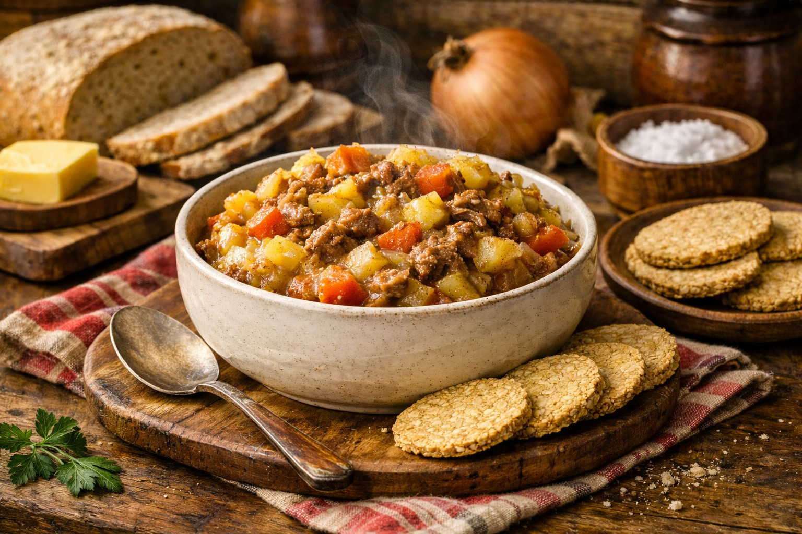

# Stovies

*Scotland's leftover-Sunday-roast hash: potatoes, onion and cold roast meat all stewed together in dripping with a slosh of beef stock till the potatoes break down into a savoury unified mass.*

**Serves:** 4

**Prep Time:** 15 minutes

**Cook Time:** 1 hour

## Overview
Stovies (the name comes from the French "étouffer", to smother or stew) is Scotland's traditional leftover dish, born from frugal Sunday-to-Monday economy. Yesterday's roast meat, today's potatoes and onions, all stewed slowly together in beef dripping till everything fuses into one unified bowl of comfort. Regional within Scotland: Aberdeenshire stovies use canned corned beef, Edinburgh stovies use leftover roast beef or lamb, and in Fife and the West, mince stovies (with raw minced beef) are common. Onions sweat in dripping or lard till sweet, then thinly sliced raw potato and chopped cold meat go in with a splash of beef stock or gravy. Lid down, low and slow for about an hour, until the potatoes have partially broken down and the meat has softened into the whole. Eat in deep bowls with oatcakes, pickled beetroot and a glass of cold milk. The traditional Bonfire Night supper, the Burns Night day-after lunch, and the staple Monday-night supper of every Scottish family with roast leftovers.

## Ingredients

### For 4 servings
- 50 g beef dripping (or 30 g lard + 30 g butter; or 50 g good butter if no dripping)
- 2 large onions (sliced thin into half-moons)
- 1 kg floury potatoes (Maris Piper or King Edward), peeled and sliced 5 mm thick
- 350-400 g leftover cooked beef, lamb, or corned beef (cold, shredded or diced)
- 300 ml beef stock (or leftover gravy thinned with a splash of water)
- 1 teaspoon Worcestershire sauce (optional but excellent)
- ½ teaspoon sea salt
- 1 teaspoon freshly ground black pepper
- A small bay leaf

### To serve
- Oatcakes (Nairn's or Walkers)
- Pickled beetroot (the proper sliced kind in vinegar)
- A small jug of cold milk (Scottish tradition - some add a splash to their stovies)
- HP Brown Sauce (optional; the British condiment of choice for stovies)

## Method

### Stage 1 - Sweat the onion
1. In a heavy-bottomed pot or Dutch oven, melt the dripping over medium heat.
2. Add the sliced onions.
3. Cook 12-15 minutes till the onions are soft, golden, and sweet (don't let them get too dark; you want soft-and-sweet, not caramelised).

### Stage 2 - Add the potato
1. Add the sliced potatoes to the onion.
2. Stir gently to coat with the dripping.
3. Add the bay leaf, salt, and pepper.

### Stage 3 - Add the meat and stock
1. Scatter the cold cooked meat over the potatoes.
2. Pour the beef stock (or leftover gravy) over.
3. Add the Worcestershire sauce.
4. Bring to a gentle simmer.

### Stage 4 - Slow cook
1. Reduce the heat to LOW.
2. Cover the pot with a tight-fitting lid.
3. Cook gently for 45-60 minutes till the potatoes are fully tender and partially broken down, and the liquid has thickened to a unified mass.
4. Stir gently halfway through to redistribute (don't stir too vigorously; you want some texture).

### Stage 5 - Check and finish
1. The finished stovies should be moist but not soupy; if too wet, leave the lid off for the last 5 minutes; if too dry, add a splash of stock.
2. The potatoes should be soft, the onions should have dissolved into the mass, and the meat should be tender and well-distributed.

### Stage 6 - Serve
1. Spoon into deep warmed bowls.
2. Place 2-3 oatcakes alongside each portion.
3. Add 2-3 slices of pickled beetroot on the side.
4. Pass HP Brown Sauce at the table.
5. Some Scots stir in a splash of cold milk at the table - the traditional finish.
6. Eat with a spoon.

## Notes
- **Beef dripping is the traditional fat:** save the dripping from your Sunday roast in a jar in the fridge; you'll use it for stovies and Yorkshire puddings. If unavailable, lard or butter works.
- **Slow and low:** stovies must stew gently. Boiling on high heat gives you mashed-meat-soup, not stovies.
- **Cold meat:** the meat must be cold from the fridge before adding. Hot meat overcooks.
- **Acid balance:** the pickled beetroot or HP sauce on the side cuts the richness. Don't skip it.
- **Oatcakes alongside:** the traditional Scottish accompaniment. The slight bitterness of oats complements the rich stovies.

## Variations
**Aberdeen stovies (corned beef):** swap the leftover roast for a tin of corned beef, broken up. The dish of north-east Scotland.
**Mince stovies (Fife / West):** swap the leftover roast for 400 g raw minced beef, browned with the onion. A from-scratch version.
**With sausage:** add a few links of Lorne sausage (Scottish square sliced sausage), fried separately and added to the stovies for the last 10 minutes.
**With smoked sausage:** add 200 g sliced smoked sausage - Polish kielbasa or similar.
**With black pudding:** add slices of black pudding (Stornoway is the traditional Scottish black pudding) to the top for the last 15 minutes.
**With dripping toast:** make extra dripping toast (bread fried in beef dripping) and serve alongside instead of oatcakes.

## Serving
On the Monday after a Sunday roast (the traditional setting) · on Bonfire Night (5 November) with the firework crowd · at a Burns Night day-after lunch · at a Scottish gastropub as a hearty winter main · at a Scottish wedding-day-after breakfast for the hung-over wedding party · at home as a Tuesday weeknight supper · in primary-school dining rooms in winter.

## Storage
- Refrigerates 3 days; many Scots think stovies are best on day 2 when the flavour fully marries.
- Reheats brilliantly in the microwave or in a pan with a splash of water.
- Freezes 3 months but the texture suffers slightly (the potatoes get a touch grainy). Eat fresh or refrigerated for best results.
- Leftover stovies on toast (with a poached egg on top) is a perfect breakfast.
