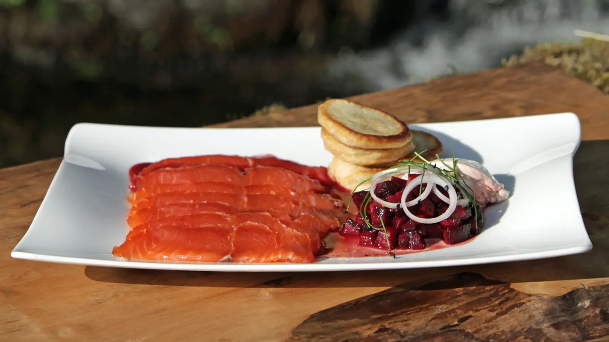

# Whisky-Cured Smoked Salmon

*Scotland's premium smoked salmon: a side of Scottish salmon dry-cured for 24 hours in salt, sugar, dill and a generous slosh of Scotch whisky, then cold-smoked over oak.*

**Serves:** 8 (as a starter or buffet item)

**Prep Time:** 30 minutes (plus 24-48 hours curing)

**Cook Time:** None (cold-cured) OR 15 minutes (hot-smoked)

## Overview
Scottish salmon, farmed in cold sea-lochs on the west and north coasts or wild-caught from the Spey, Tay or Tweed, is one of the country's most exported foods and the smoked Scottish-salmon industry is one of its most refined food trades. The whisky-cured version is a Scottish refinement on Scandinavian gravlax: instead of a pure salt-sugar-dill cure, a generous dram (or three) of single-malt Scotch goes into the mix, giving the finished salmon a faintly peaty, smoky, slightly sweet edge before any actual smoke is applied. Two finishes are possible from the same cure: the cold-cured version sliced very thin as gravlax with dill and mustard sauce, or the hot-smoked version, where the fish goes briefly into a wok rig with whisky-cask oak chips at 80 °C for a flaky warm-spice-edged finish. Eat on Hogmanay bagels, on oatcakes at Burns Night, on Christmas-morning blinis.

## Ingredients

### For one whole side of salmon (1.2 kg)
- 1 side of Scottish salmon (1.2 kg, skin on, pinboned) - farmed loch-reared or wild
- 200 g coarse sea salt
- 200 g caster sugar
- 1 large bunch of fresh dill (about 50 g, finely chopped)
- 1 tablespoon coarsely cracked black pepper
- 60 ml single-malt Scotch whisky (Highland or Speyside; not heavily peated unless you want a strong smoke note)
- Zest of 2 lemons (optional, for brightness)
- 1 tablespoon juniper berries (lightly crushed; optional but excellent)

### For hot-smoking (optional)
- 200 g oak chips (preferably whisky-cask oak; available at fishing-and-smoking suppliers)
- A heavy wok with a lid and a wire trivet
- A square of foil for the chips

### Mustard-dill sauce (Scottish gravlax sauce)
- 4 tablespoons Dijon mustard
- 1 tablespoon caster sugar
- 1 teaspoon white wine vinegar
- 1 teaspoon malt whisky
- 100 ml sunflower oil
- 3 tablespoons finely chopped dill
- Sea salt and pepper to taste

### To serve
- Pumpernickel or rye bread, sliced thin and lightly toasted
- A small bowl of crème fraîche
- Capers (the salt-packed kind, rinsed)
- Finely diced shallot
- Lemon wedges
- Fresh dill sprigs

## Method

### Stage 1 - Prepare the cure
1. In a bowl, mix the salt, sugar, chopped dill, black pepper, lemon zest (if using), and crushed juniper berries.

### Stage 2 - Lay the salmon
1. Lay a large piece of cling film on a tray (long enough to wrap the whole side).
2. Scatter a third of the cure on the film in a salmon-shaped layer.
3. Lay the salmon skin-side-down on the cure.
4. Drizzle the whisky evenly over the flesh.
5. Cover with the remaining cure, pressing it into the flesh.

### Stage 3 - Wrap and weight
1. Wrap the salmon tightly in the cling film.
2. Wrap again in a second layer for security.
3. Place on a tray (catches any liquid that seeps out).
4. Place another tray or board on top.
5. Weight with cans or weights (2-3 kg total).

### Stage 4 - Cure
1. Refrigerate 24-48 hours.
2. After 24 hours the salmon is gravlax-style (softer; light cure).
3. After 48 hours the salmon is fully cured (firmer; deeper colour).
4. Flip the package halfway through (every 12-24 hours).

### Stage 5 - Rinse and dry
1. Unwrap; rinse the salmon briefly under cold water to remove the cure.
2. Pat dry thoroughly with kitchen paper.
3. Place on a wire rack uncovered in the fridge for 2 hours to dry the surface (this gives a slight pellicle that takes smoke beautifully).

### Stage 6a - For gravlax (no smoke)
1. With a long sharp knife, slice the cured salmon very thin against the grain, at a shallow angle (almost horizontal).
2. Lift the slices off the skin (don't include the skin).
3. Arrange on a platter; serve with the mustard-dill sauce.

### Stage 6b - For hot-smoked (with smoke)
1. Line a wok with a layer of foil; place the oak chips on the foil.
2. Place a wire trivet in the wok above the chips.
3. Heat the wok over medium-high till the chips start smoking.
4. Place the cured salmon on the trivet.
5. Cover with the lid (seal with a damp cloth around the rim).
6. Smoke for 10-15 minutes (the salmon should be just-cooked through and richly smoky).
7. Cool to room temperature; flake into chunks or slice thinly.

### Stage 7 - Make the mustard-dill sauce
1. Whisk the mustard, sugar, vinegar, and whisky together.
2. Slowly drizzle in the sunflower oil while whisking (a thick emulsion forms).
3. Stir in the dill.
4. Season with salt and pepper.
5. Chill 30 minutes before serving (flavour develops).

### Stage 8 - Serve
1. Arrange thin slices of salmon on a wooden board or platter.
2. Set out small bowls of: crème fraîche, capers, diced shallot, lemon wedges, dill sprigs, mustard-dill sauce.
3. Set out pumpernickel or rye toast.
4. Each guest builds their own bite: toast + crème fraîche + salmon + capers + shallot + dill + a squeeze of lemon.
5. Serve a chilled glass of fino sherry, dry champagne, or single malt with a splash of water alongside.

## Notes
- **Sushi-grade salmon:** ensure your fish is fresh enough for raw consumption (if not, the cure will kill light bacteria but the fish should still be very fresh).
- **Whole side, skin on:** the skin protects the flesh during curing and is easier to slice against.
- **48-hour cure is the traditional Scottish version:** firmer than gravlax, slightly drier, more sliceable.
- **Slice very thin:** the technique is the difference between an excellent gravlax and a clumsy one. A long thin knife, shallow angle, confident strokes.
- **Hot-smoked Scottish salmon flakes:** if hot-smoking, the salmon flakes rather than slices; flake into chunks and serve flake-style.

## Variations
**Beetroot-cured:** add 300 g grated raw beetroot to the cure for stunning pink/purple colour and earthy sweetness.
**Gin-and-juniper instead of whisky:** swap the whisky for Scottish gin (Hendrick's, Edinburgh Gin) + extra juniper berries.
**Heather-honey-cured:** swap half the sugar for Scottish heather honey - sweeter, more floral.
**Whisky-cure-then-hot-smoke combo:** do the full cure, dry, then hot-smoke (best of both - firm-cured AND smoke-finished).
**Citrus-heavy:** add orange zest + lime zest to the cure for a citrus-bright version.
**Vodka-cured (Scandinavian):** swap whisky for vodka - closer to traditional gravlax.

## Serving
At a Hogmanay buffet (the traditional setting) · on Christmas morning with blinis and champagne · at a Scottish wedding breakfast · at a Burns Night supper as a starter · at any Scottish gastropub on Easter Sunday · on the breakfast trolley at a Highland hotel · at home for a New Year's Day brunch.

## Storage
- Cured salmon (cold) refrigerates 5-7 days wrapped tightly.
- Hot-smoked salmon refrigerates 3 days.
- Freezes well wrapped in cling film + foil for 1 month (slight texture loss).
- The mustard-dill sauce refrigerates 1 week.
- Leftover smoked salmon trimmings make excellent pâté (blitz with cream cheese, lemon zest, dill, and a splash of cream).
