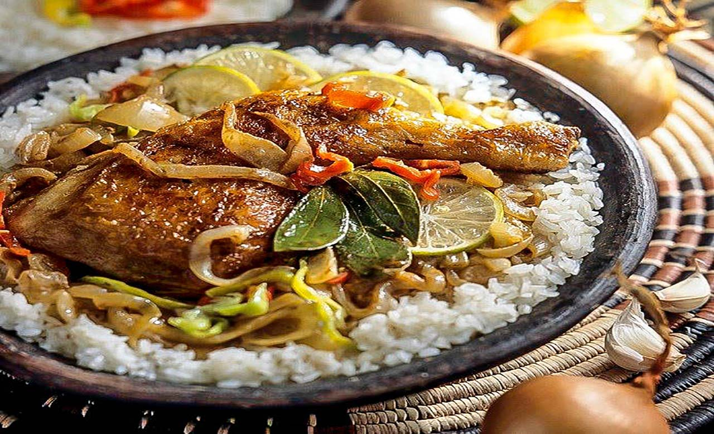

# Caldou

*Casamance's lime-bright fish stew: meaty white fish poached in a thin clear broth of fresh lime juice, onion, garlic, chilli, tomato and parsley. The bright sharp counter to the heavier peanut stews of northern Senegal, born of the Casamance river deltas.*

**Serves:** 4

**Prep Time:** 20 minutes

**Cook Time:** 30 minutes

## Overview
Caldou is the Casamance river-region fish stew of southern Senegal: the bright lime-and-citrus poached fish that is the geographical and flavour counter to the heavy peanut-based stews of the northern Wolof regions. Meaty white fish (sea bream, snapper or grouper) gently poached in a thin clear broth of fresh lime juice, onion, garlic, Scotch bonnet, tomato, parsley and bay, served over plain rice with the broth ladled into the rice rather than poured over the fish. The dish reflects the Casamance's geography and Portuguese-Creole influences; where the rest of Senegal leans into peanut and tomato richness, the Casamance favours sour, bright, citrus-forward dishes. The broth is thin and clear, not thickened. The lime juice goes in two stages: most into the poaching liquid at the start so the fish takes on the citrus character as it cooks, the rest squeezed in at the very end for the bright final hit. The simplicity of the recipe means every ingredient is exposed; use the freshest fish you can find.

## Ingredients

### Fish
- 4 thick white fish fillets (sea bream, snapper, grouper or hake; about 180 g each, skin on)
- 1 teaspoon fine sea salt (for seasoning the fish)
- ½ teaspoon ground black pepper

### Broth base
- 2 tablespoons vegetable oil (or palm oil for a richer version)
- 2 large onions (finely sliced)
- 6 garlic cloves (crushed)
- 1 thumb (3 cm) fresh ginger (finely grated)
- 3 large tomatoes (chopped; or 1 small tin chopped tomatoes)
- 1 whole Scotch bonnet chilli (left whole, unpierced)

### Liquid
- 4 tablespoons fresh lime juice (initial; from about 3 limes)
- 700 ml fish stock (or hot water)
- 2 bay leaves
- 1 small bunch fresh parsley (stems and leaves separated; stems chopped, leaves chopped for garnish)
- 1 sprig fresh thyme

### Seasoning
- 1 ½ teaspoons fine sea salt
- 1 teaspoon ground black pepper
- 1 tablespoon nététou (fermented locust bean; optional)

### To finish
- 2 tablespoons fresh lime juice (added at the end)
- ½ green chilli (finely chopped, for those who want extra heat)

### To serve
- 4 portions of boiled white rice
- 1 lime (cut into wedges)

## Method

### Stage 1 - Season the fish
1. Pat the fish fillets dry with kitchen paper.
2. Season both sides with the teaspoon of salt and the half teaspoon of pepper.
3. Set aside while you build the broth.

### Stage 2 - Build the aromatic base
1. Heat the vegetable oil in a wide deep saucepan or shallow casserole over medium heat.
2. Add the sliced onions and sweat for 8 minutes till soft and translucent but not coloured.
3. Stir in the crushed garlic and grated ginger; cook 1 minute till fragrant.
4. Add the chopped tomatoes and cook 5-6 minutes till they break down into a soft pulp.

### Stage 3 - Build the broth
1. Tuck the whole Scotch bonnet into the pan.
2. Add the chopped parsley stems, bay leaves and thyme sprig.
3. Pour in the initial 4 tablespoons of fresh lime juice.
4. Pour in the fish stock or water.
5. Add the salt, pepper and nététou (if using).
6. Bring to a gentle simmer.

### Stage 4 - Simmer the broth
1. Reduce the heat to low and simmer the broth gently, uncovered, for 15 minutes. This lets the flavours infuse and reduces the broth slightly so it tastes properly seasoned.
2. Taste; the broth should be bright and limey with a soft tomato backbone. Adjust salt if needed.

### Stage 5 - Poach the fish
1. Carefully lower the seasoned fish fillets into the simmering broth.
2. The broth should come about halfway up the sides of the fish.
3. Reduce the heat so the broth is barely simmering (small bubbles around the edges only; never a rolling boil, which would tear the fish apart).
4. Spoon some of the hot broth over the top of the fish.
5. Cover the pan loosely (not a tight seal) and poach gently for 10-12 minutes till the fish flakes easily with a fork.

### Stage 6 - Finish
1. Carefully lift the fish onto warm plates with a fish slice.
2. Remove the whole Scotch bonnet from the broth and discard.
3. Discard the bay leaves and thyme stem.
4. Squeeze in the remaining 2 tablespoons of fresh lime juice.
5. Taste the broth; adjust salt and chilli if needed.
6. Stir in the chopped fresh parsley leaves.

### Stage 7 - Serve
1. Spoon a portion of cooked rice into wide bowls or onto plates.
2. Lay a piece of poached fish on or alongside the rice.
3. Ladle a generous amount of the broth over the rice, letting it soak in. Some of the broth around the fish; the rice takes the majority.
4. Scatter chopped fresh chilli over for those who want extra heat.
5. Place a lime wedge on each plate.
6. Serve immediately.

## Notes
- **Thin clear broth, not thick stew:** caldou's signature is its thin clear broth, so don't be tempted to reduce it or thicken it. The broth should taste bright and limey and feel like a properly seasoned poaching liquid; the rice soaks it up at serving.
- **Lime in two stages:** the early lime cooks into the broth and seasons the fish through poaching; the late lime adds the bright fresh hit at serving. Skip either and you lose half the dish.
- **Fish freshness matters:** caldou is a simple dish that exposes every ingredient. Use the freshest white fish you can find; old or thawed fish gives a flat-tasting result.
- **Gentle poach, not boil:** the broth should be barely simmering around the fish. A rolling boil tears the flesh apart and makes the broth cloudy.
- **Rice eats the broth:** the rice underneath is the structural counterpart to the thin broth; ladle generously so the rice goes properly wet. Eating caldou with dry rice would miss the point.

## Variations
- **Caldou with whole fish:** instead of fillets, use 4 whole small white fish (300-400 g each, scaled and gutted). Cook for slightly longer (15 minutes); the bones add gelatin and depth to the broth.
- **Caldou with prawns:** swap the fish for 600 g of large peeled prawns added in the last 4 minutes only. Quick weeknight version.
- **With smoked fish:** add 50 g of broken-up smoked fish to the base for additional depth; brings caldou closer to the supu kanja territory but works for a richer version.
- **Caldou de poulet:** the chicken version, where bone-in chicken pieces are poached in the broth instead of fish. Cook the chicken 25-30 minutes (much longer than fish). Less traditional but works.

## Serving
- Over plain boiled white rice in wide bowls, with the broth soaking into the rice. Lime wedges on the side and chopped chilli for diners who want extra heat. Drink: bissap (hibiscus drink), bouye (baobab drink) or simply cold water with lime.

## Storage
- Best eaten the same day. The fish goes off after a day; the broth dulls after a day.
- The broth and fish keep refrigerated 2 days separately; warm the broth in a pan and add the fish briefly to warm through.
- Don't freeze; the fish texture goes off.
