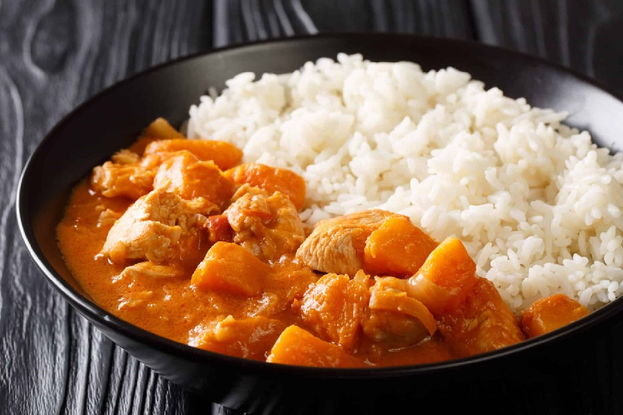

# Domoda

*The Gambia's national stew: chicken or lamb in a thinner peanut-and-tomato sauce sharpened by lime and tamarind. Poured generously over rice.*

**Serves:** 4-6

**Prep Time:** 15 minutes

**Cook Time:** 1 hour

## Overview
Domoda is the Gambia's national stew: the thinner, more citrusy cousin to Senegal's mafé. A ladleable peanut-and-tomato sauce sharpened with lime and tamarind, poured generously over a wide pile of white rice. The defining mark of domoda is the looseness of the sauce: about a third less peanut butter than mafé, more liquid, and the result should pool around the rice rather than coat it in a thick blanket. Skin the chicken thighs before browning; skin renders too much fat into a peanut sauce and turns it greasy. The whole Scotch bonnet goes in intact for aroma without fire; chop a little back in at the end if you want heat. Tamarind and lime go in off the heat, where they keep their brightness. Heaped over fluffy white rice with plenty of sauce and scattered with fresh coriander.

## Ingredients

### Stew
- 8 bone-in chicken thighs, skin removed (or 800 g lamb neck, cut in chunks)
- 2 tablespoons vegetable oil
- 2 onions (large, finely chopped)
- 4 garlic cloves (crushed)
- 2 tablespoons tomato purée
- 2 tomatoes (medium, chopped)
- 1 Scotch bonnet chilli (left whole)
- 2 bay leaves
- 1 Maggi cube
- 1 teaspoon ground black pepper
- 1 teaspoon ground white pepper (optional, traditional)
- 1 litre chicken stock
- Salt

### Peanut sauce
- 200 g smooth natural peanut butter
- 250 ml hot water

### Vegetables
- 1 sweet potato (medium, or 400 g pumpkin, peeled, cut in 3 cm chunks)
- 2 carrots (sliced into thick rounds)

### To finish
- 1 lime (juiced)
- 1 tablespoon tamarind paste (optional; see Notes)

### To serve
- 400 g long-grain white rice, steamed
- Fresh coriander leaves

## Method

### Stage 1 - Brown the chicken
1. Season the chicken thighs with salt.
2. Heat the oil in a wide pot over medium-high heat. Brown the thighs in two batches, 3 minutes a side, until golden. Set aside.

### Stage 2 - Build the base
1. Lower the heat to medium. Cook the onions in the same pot for 7 minutes until soft.
2. Add the garlic and cook 1 minute.
3. Stir in the tomato purée and fry for 3 minutes until darker.
4. Add the fresh tomatoes, whole chilli, bay leaves, Maggi cube, black and white pepper. Stir and cook 5 minutes until the tomatoes break down.

### Stage 3 - Simmer
1. Return the chicken with any juices.
2. Pour in the stock to cover.
3. Bring to a gentle simmer, cover and cook 25 minutes.

### Stage 4 - Add peanut and vegetables
1. Whisk the peanut butter with the hot water in a bowl until smooth.
2. Stir the peanut mixture into the pot. The sauce should be loose; ladle-able rather than spoon-coating. Add a splash of water if it tightens too much.
3. Add the sweet potato and carrots.
4. Simmer uncovered 20 minutes, until the vegetables are tender and the chicken is falling off the bone.

### Stage 5 - Finish
1. Stir in the tamarind paste, if using.
2. Add the lime juice. Taste and season with salt.
3. Discard the whole chilli (or chop a little of it back in if you want heat).

### Stage 6 - Serve
1. Heap rice into bowls. Ladle the stew generously over the top with plenty of sauce.
2. Scatter coriander leaves.

## Notes
- **Lighter than mafé:** Domoda uses about a third less peanut butter and more liquid than mafé. The sauce should pool, not coat.
- **Tamarind for the trademark sourness:** Authentic domoda often uses bitter tomato (jakhatu) for its citrusy edge; tamarind is the easiest substitute outside West Africa. Lime alone also works.
- **Skin off the chicken:** Skin renders too much fat into a peanut sauce and turns it greasy. Remove it.
- **Pumpkin or sweet potato:** Either is traditional; pumpkin breaks down a little and helps thicken, sweet potato holds its shape.

## Variations
**Lamb domoda:** Use neck or shoulder, brown longer (8 minutes per batch), and extend the first simmer to 50 minutes before adding peanut and vegetables.
**Bitter aubergine:** Add 200 g of cubed African aubergine (or regular aubergine with a teaspoon of mustard powder) for an authentic edge.

## Serving
Serve with: A wide pile of steamed white rice in a shallow bowl, sauce ladled around.
Garnish with: Fresh coriander leaves and a lime wedge on the side.

## Storage
- Keeps 3 days refrigerated.
- Freezes well 2 months.
- Reheat gently with extra stock or water to loosen the sauce.
