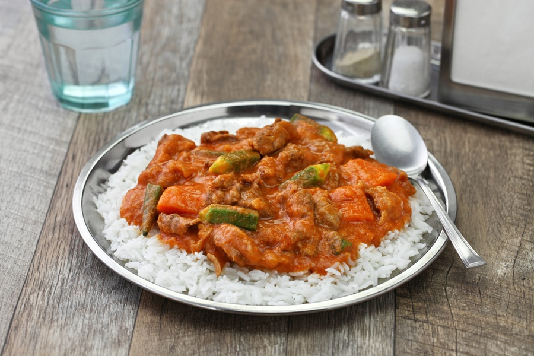

# Mafé

*West Africa's great peanut stew: bone-in beef or lamb braised in a thick rust-coloured peanut-butter-and-tomato sauce. Served over plain rice.*

**Serves:** 6

**Prep Time:** 20 minutes

**Cook Time:** 1 ¾ hours

## Overview
Mafé is West Africa's great peanut stew: a deep rust-coloured sauce that turns up on family tables from Senegal across to Mali and Côte d'Ivoire, bone-in beef or lamb braised slow in tomato and peanut butter till the meat falls off the bone and the sauce coats the back of a spoon. The choice of peanut butter is the whole foundation. Use natural, with peanuts (and maybe salt) on the label only; sweetened or hydrogenated supermarket spreads make the sauce gluey and cloying. Cassava, sweet potato, carrot and cabbage go in late in the cook so they hold their shape. The peanut oil rises around the edges as it cooks; stir it back in for richness or skim it off if too oily. Peanut butter needs a serious lift of salt, so taste and season generously. Spooned over mounds of steamed white rice with the sauce ladled around.

## Ingredients

### Stew base
- 1 kg beef shin (or lamb shoulder on the bone), cut in 4-5 cm pieces
- 3 tablespoons vegetable oil
- 2 onions (large, chopped)
- 5 garlic cloves (crushed)
- 2 cm piece of ginger (grated)
- 3 tablespoons tomato purée
- 400 g tinned chopped tomatoes
- 1 Scotch bonnet chilli (left whole)
- 2 bay leaves
- 1 teaspoon ground black pepper
- 2 Maggi (or other seasoning cubes)
- 1.2 litres beef stock (or chicken stock)
- Salt

### Peanut sauce
- 250 g smooth natural peanut butter (no added sugar)
- 200 ml hot water

### Vegetables
- 400 g cassava (peeled, cut in 4 cm chunks)
- 1 sweet potato (medium, peeled, cut in 4 cm chunks)
- 2 carrots (cut in thick batons)
- ½ small white cabbage (cut in wedges)

### To serve
- 500 g long-grain white rice, steamed

## Method

### Stage 1 - Brown the meat
1. Pat the meat dry and season generously with salt.
2. Heat the oil in a heavy lidded pot over high heat. Brown the meat in batches, 3-4 minutes per side, until deeply coloured. Set aside.

### Stage 2 - Build the base
1. Lower the heat to medium. Add the onions and cook 6-8 minutes until soft and just golden.
2. Stir in garlic and ginger; cook 1 minute.
3. Add the tomato purée and fry hard for 4 minutes until it darkens.
4. Add the chopped tomatoes, whole chilli, bay leaves, pepper and Maggi cubes. Simmer 5 minutes.

### Stage 3 - Braise
1. Return the meat with any juices to the pot.
2. Pour in the stock to cover the meat by about 2 cm.
3. Bring to a low simmer, cover and cook 45 minutes, until the meat is starting to yield.

### Stage 4 - Add the peanut and vegetables
1. Whisk the peanut butter with the hot water in a bowl until smooth and pourable.
2. Stir the peanut mixture into the pot. The sauce will thicken visibly.
3. Add the cassava, sweet potato and carrots. Simmer 20 minutes, uncovered, stirring occasionally so the bottom does not catch.
4. Add the cabbage wedges and simmer a further 10-15 minutes, until everything is tender and the sauce coats the back of a spoon.

### Stage 5 - Finish and serve
1. Taste and season with salt; the peanut butter often needs a generous lift.
2. Fish out the whole chilli and bay leaves.
3. Spoon over mounds of steamed rice and serve.

## Notes
- **Natural peanut butter only:** Sweetened or hydrogenated supermarket spreads make the sauce gluey and over-sweet. Look for one with just peanuts (and maybe salt) on the label.
- **Bone-in meat:** The marrow and connective tissue enrich the sauce. Boneless shin or stewing lamb works but is one-dimensional.
- **The sauce splits, then comes back:** Peanut oil will rise around the edges. Stir it back in or skim a little off if you find it too oily.
- **Whole chilli for aroma:** Leave intact for a warming background heat. Pierce it only if you want fire.

## Variations
- **Mafé poulet:** Use chicken thighs on the bone; reduce initial simmer to 25 minutes before adding vegetables.
- **Vegetarian:** Omit the meat. Use vegetable stock and double the cassava and sweet potato. Add chickpeas in stage 4 for protein.

## Serving
- **Serve with:** A heap of plain steamed white rice in the centre of the plate, sauce ladled around.
- **Garnish with:** A few slices of fresh chilli for those who want extra heat.

## Storage
- Improves overnight. Keeps 3 days refrigerated.
- Freezes well 2 months (without the cabbage; add fresh on reheating).
- Reheat gently with a splash of water; the sauce stiffens when cold.
