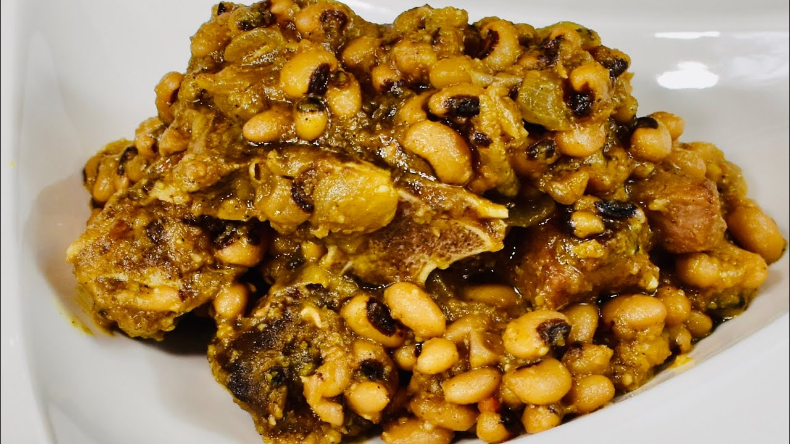

# Ndambé

*Senegal's black-eyed pea stew: dried black-eyed peas slow-cooked with onion, tomato, palm oil, garlic and Scotch bonnet till the beans go silky and the sauce turns deep rust-red. The everyday lunch served on bread or with rice, and the proper Sunday breakfast across Senegal.*

**Serves:** 6

**Prep Time:** 15 minutes (plus overnight soaking)

**Cook Time:** 1 hour 30 minutes

## Overview
Ndambé is Senegal's everyday black-eyed pea stew, eaten across the country as the proper Sunday breakfast (often piled into a fresh halved baguette as a sandwich) and as a hearty lunch side or main: dried black-eyed peas (called niébé in Wolof) slow-cooked with onion, tomato, garlic, palm oil and Scotch bonnet till the beans go properly silky and the sauce turns deep rust-red. The flavour profile is the heavy comforting Senegalese savoury: tomato-rich, onion-sweet, with the gentle smoke of red palm oil and a backbone of Scotch bonnet heat. It bridges between side and main; piled onto a Sunday breakfast sandwich it's the meal; spooned alongside grilled fish or chicken yassa it's a side. The technique is patient bean cooking and a properly-built tomato base. Soak the beans overnight (12-24 hours), then simmer them for 45-60 minutes in plain salted water till tender; meanwhile build a tomato-onion sauce of finely chopped onion sweated in red palm oil till sweet, tomato purée stirred in and cooked till it darkens, then chopped tomato added and reduced to a thick pulp. Combine the cooked beans (drained, with cooking liquor reserved) and the sauce; thin with reserved bean liquor to your preferred consistency and simmer 15-20 minutes more to let the flavours marry. The finished ndambé should be thick (chunky beans suspended in a rich rust-red sauce, not soupy), with the beans whole-looking but tender enough to crush against the roof of your mouth. Serve hot, ideally with fresh baguette to scoop or piled into a baguette as a sandwich.

## Ingredients

### Beans
- 350 g dried black-eyed peas (or 2 large tins of black-eyed peas, drained, if absolutely necessary; see notes)
- 1.5 litres water (for cooking the beans)
- 1 ½ teaspoons fine sea salt

### Sauce base
- 4 tablespoons red palm oil (or substitute vegetable oil if unavailable)
- 2 large onions (finely chopped)
- 6 garlic cloves (crushed)
- 2 tablespoons tomato purée
- 3 large tomatoes (chopped; or 1 (400 g) tin chopped tomatoes)
- 1 fresh Scotch bonnet chilli (whole, unpierced, or finely chopped for serious heat)

### Aromatics and seasoning
- 1 large bay leaf
- 2 thyme sprigs
- 1 teaspoon ground cumin
- ½ teaspoon ground coriander
- 1 ½ teaspoons fine sea salt
- 1 teaspoon ground black pepper
- 2 tablespoons nététou (fermented locust bean; optional, traditional)

### To finish
- 3 tablespoons fresh parsley (chopped)
- 1 lime (juice)

### To serve
- Fresh baguette (for scooping or making sandwiches)
- Or boiled rice or [thiéré](thiere.md) (Senegalese millet couscous)
- A spoonful of finely chopped raw onion and tomato on the side (optional)

## Method

### Stage 1 - Soak the beans (do this the day before)
1. Tip the dried black-eyed peas into a wide bowl.
2. Cover with cold water by 10 cm.
3. Leave to soak overnight (12-24 hours). The beans should at least double in size.
4. Drain and rinse just before cooking.

### Stage 2 - Cook the beans
1. Tip the soaked beans into a wide saucepan and cover with the 1.5 litres of water.
2. Bring to the boil over high heat, skimming any scum that rises.
3. Reduce to a low simmer and cook 45-60 minutes till the beans are tender (you can squash one easily between thumb and forefinger but they still hold shape).
4. Add the first teaspoon of salt in the last 10 minutes (salting earlier toughens the skins).
5. Drain in a colander set over a measuring jug, reserving the bean cooking liquor. Set the cooked beans aside.

### Stage 3 - Build the aromatic base
1. Heat the red palm oil in a wide heavy casserole over medium heat. The oil should be bright red and slightly thick.
2. Add the chopped onions and sweat 8-10 minutes till soft and starting to colour at the edges.
3. Stir in the crushed garlic; cook 30 seconds.
4. Add the tomato purée; cook 2 minutes till it darkens.

### Stage 4 - Build the tomato sauce
1. Add the chopped tomatoes and cook 5-6 minutes till they break down into a thick pulp.
2. Stir in the cumin, ground coriander and black pepper; cook 30 seconds.
3. Tuck in the bay leaf, thyme sprigs and Scotch bonnet.
4. Add the nététou (if using).

### Stage 5 - Combine and simmer
1. Add the cooked beans to the sauce.
2. Pour in about 400 ml of the reserved bean liquor; the beans should be just covered.
3. Stir gently to combine.
4. Bring to a simmer, then reduce to low heat.
5. Cook uncovered for 20-25 minutes, stirring every 5 minutes. The sauce thickens and the flavours marry. The finished consistency should be thick (a wooden spoon drawn through leaves a clear channel briefly), not soupy.
6. If the sauce thickens too fast and the beans look dry, add another splash of bean liquor.

### Stage 6 - Finish
1. Remove the Scotch bonnet (or leave in for serious heat eaters), bay leaf and thyme sprigs.
2. Squeeze in the lime juice; stir gently.
3. Taste; adjust salt and pepper.
4. The ndambé should taste deeply savoury, with tomato, onion, garlic and gentle Scotch bonnet heat balanced.

### Stage 7 - Serve
1. As a breakfast: split a fresh baguette and pile the hot ndambé generously inside; close and eat with both hands (Senegalese Sunday breakfast).
2. As a lunch side: spoon onto plates alongside grilled fish, yassa or thiéré; provide bread for scooping any leftover sauce.
3. As a stand-alone meal: pile into bowls with rice or thiéré underneath.
4. Scatter fresh parsley over each portion.
5. A small dish of finely chopped raw onion and tomato on the side for crunch.

## Notes
- **Dried beans, not tinned:** the cooking liquor from properly soaked and simmered dried beans is what gives ndambé its depth. Tinned beans come in plain brine and produce a thinner-tasting sauce. If you absolutely must use tinned, save the can liquid and use 200 ml of it in place of 200 ml of the cooking liquor; result is less rich.
- **Soak overnight:** dried black-eyed peas need 12-24 hours of soaking; quick-soak methods (boil 1 min, rest 1 hour) give patchy results. Plan ahead.
- **Red palm oil if you can find it:** this is the proper fat for the dish. The colour and gentle earthy flavour are part of the signature. Vegetable oil substitutes acceptably; the dish will taste good but less authentically Senegalese.
- **Salt beans at the end:** add salt in the last 10 minutes of bean cooking, not at the start. Early salt toughens bean skins and slows the cook.
- **The Sunday breakfast sandwich:** the proper Senegalese way to eat ndambé is piled into a halved fresh baguette and eaten as a breakfast sandwich, often with a glass of fresh ginger drink or strong coffee on the side. The baguette wrap is messy and brilliant; embrace it.

## Variations
**Ndambé with smoked fish:** add 100 g of broken-up smoked fish (mackerel or bonga) to the sauce in the last 10 minutes; turns a vegetarian side into a heartier meal.
**Ndambé with beef:** add 300 g of diced beef shin to the aromatic base after the onions; brown briefly, then simmer with the tomato for 20 minutes before adding the cooked beans. Wedding-banquet version.
**Cold ndambé salad:** leftover ndambé tossed cold with diced cucumber, more chopped tomato and lime juice, served with bread; a Senegalese summer lunch.
**Ndambé farci:** the elaborate Saint-Louis version where the ndambé is stuffed into halved aubergines or peppers and baked till the vegetable goes soft and the filling crisps slightly on top.

## Serving
The classic forms: piled into a fresh baguette as a Sunday breakfast sandwich, or spooned over rice or thiéré as a side or stand-alone meal. Drink: bissap (hibiscus drink), bouye (baobab drink), strong coffee with sugar, or fresh ginger drink.

## Storage
- Keeps refrigerated 4 days; the flavour deepens overnight and day-after ndambé is excellent.
- Freezes 3 months. Defrost in the fridge overnight and reheat gently over low heat.
- Don't microwave; the palm oil splits and the texture suffers.
- Reheated ndambé piled into a fresh baguette is the canonical Monday breakfast.
