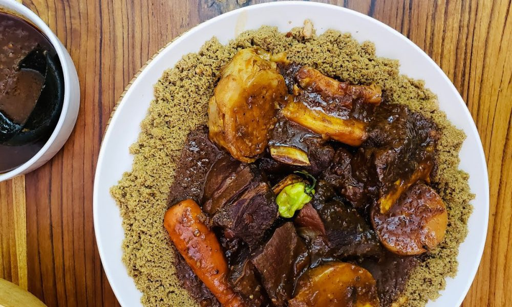

# Thiéré

*Senegal's millet couscous: small pearl-grey grains of hand-rolled millet flour, steamed in three stages till tender and fluffy. The proper carb-base for thieboudienne, mafé and any saucy Senegalese main, in place of the broken rice eaten elsewhere.*

**Serves:** 6

**Prep Time:** 20 minutes

**Cook Time:** 1 hour (3 steam stages of 20 minutes each)

## Overview
Thiéré is Senegal's hand-rolled millet couscous: small pearl-grey grains made from finger-millet flour (sometimes mixed with maize), rolled by hand with water into tiny couscous-like pellets, then steamed in three sequential stages till the grains turn properly tender and fluffy. It is the traditional starch base for thieboudienne, mafé, supu kanja and other saucy Senegalese mains, particularly outside the cities where broken rice has become the dominant base. The hand-rolling stage is something rural cooks still do, but most urban cooks buy pre-made dried thiéré from a West African grocer. The three-stage steaming is the signature technique. Each 20-minute steam is followed by tipping the grains out, sprinkling with a little water (and sometimes oil or butter), and working with the fingers to break up clumps before returning to the steamer. A single steam compacts the grains and never quite comes right; three stages is the traditional minimum, and some cooks go four for extra fluffy results. Pairs beautifully with the saucy stews of Senegal because it absorbs sauce well.

## Ingredients

- 500 g pre-made dried thiéré (millet couscous; from a West African grocer; or substitute fine semolina couscous as a last resort)
- 750 ml warm water (divided across the three steaming stages)
- 2 tablespoons vegetable oil (for working through between stages)
- 1 teaspoon fine sea salt
- 2 tablespoons butter (optional, for the final stage)

## Method

### Stage 1 - First hydration
1. Tip the thiéré into a wide shallow bowl.
2. Sprinkle 250 ml of the warm water over the grains, working through with your fingers as you go to distribute evenly.
3. Sprinkle in the salt; work through.
4. Let stand 5 minutes for the water to absorb. The grains should look damp and slightly clumped; not floating in water.

### Stage 2 - Set up the steamer
1. Set up a steamer with about 5 cm of water in the bottom (a couscoussier if you have one; otherwise a regular steamer or a pasta pot with a colander insert works fine).
2. Line the steamer basket with a clean fine cloth (cheesecloth or muslin) so the small grains don't fall through.
3. Bring the water to a steady simmer.

### Stage 3 - First steaming
1. Pile the moistened thiéré loosely into the cloth-lined steamer.
2. Cover with the lid and steam for 20 minutes over medium heat.
3. Lift the steamer off the pan and tip the thiéré back into the wide bowl.
4. Sprinkle 1 tablespoon of vegetable oil over the grains and work through with your fingers, breaking up any clumps and separating the grains.
5. Sprinkle another 250 ml of warm water over; work through.

### Stage 4 - Second steaming
1. Return the worked thiéré to the cloth-lined steamer.
2. Cover and steam another 20 minutes.
3. Tip back into the wide bowl.
4. Sprinkle 1 more tablespoon of vegetable oil over and work through.
5. Sprinkle the remaining 250 ml of warm water over; work through.

### Stage 5 - Third steaming
1. Return the worked thiéré to the steamer.
2. Cover and steam a final 20 minutes.
3. Tip into a warm serving bowl.
4. Dot the optional butter over the top; cover briefly so it melts.
5. Fluff with a fork, mixing the butter through if used.

### Stage 6 - Serve
1. Pile thiéré in shallow bowls or on plates.
2. Ladle the saucy main (mafé, thieboudienne, supu kanja) generously over the top so the grains soak up the sauce.
3. Serve immediately while hot. Thiéré goes denser as it cools.

## Notes
- **The three-stage steaming is the whole technique:** each cycle of steam-and-work is what gives thiéré its proper fluffy character. A single one-pass steam gives you compacted grains; the cycling steams develop the texture. Three stages is the traditional minimum; four works too.
- **Use a cloth liner in the steamer:** the grains are small enough to fall through standard steamer holes. A clean fine cloth (muslin, cheesecloth, or even a clean tea towel) catches them.
- **Work the grains between stages:** the fingertip work between steamings (oil rubbed in, water sprinkled, clumps broken up) is essential. Skipping it gives you stuck-together blobs of thiéré rather than separate grains.
- **Couscous as fallback:** if you can't find real millet thiéré, fine semolina couscous from North African stores is the closest substitute. The technique is the same; the flavour shifts toward Maghrebian couscous and away from authentic Senegalese millet.
- **Plan the timing:** with three 20-minute steam stages plus working time between, expect about an hour from start to serve. Coordinate with the main dish; thiéré at its best when freshly steamed and still hot.

## Variations
- **Thiéré au lait caillé:** the dessert version where steamed thiéré is mixed with curdled milk (lait caillé), sugar and sometimes orange-flower water; a Senegalese sweet course. Pleasant but a different dish entirely.
- **Thiéré with peanuts:** add 50 g of crushed roasted peanuts in the final fluffing for textural contrast; less traditional but works.
- **Thiéré au gras:** the indulgent version where thiéré is steamed with a tablespoon of butter and a beaten egg in the final stage; gives a richer more luxurious finish.
- **Maize-millet thiéré:** if proper millet thiéré is impossible to find, the maize-meal variant (made from maize flour with the same hand-rolling technique) is sometimes available and works well.

## Serving
- Under a generous ladle of mafé, thieboudienne, supu kanja, or any saucy Senegalese main. The sauce soaks into the grains. Side dishes of pickled vegetables or chopped salad to add brightness.

## Storage
- Best eaten warm and freshly steamed. The grains harden and dry as they cool.
- Keeps refrigerated 3 days. Reheat by steaming again for 8-10 minutes; the texture comes back close to fresh-steamed.
- Don't microwave; the grains go dry and dense.
- Leftover thiéré reheats best with a splash of water added before steaming.
