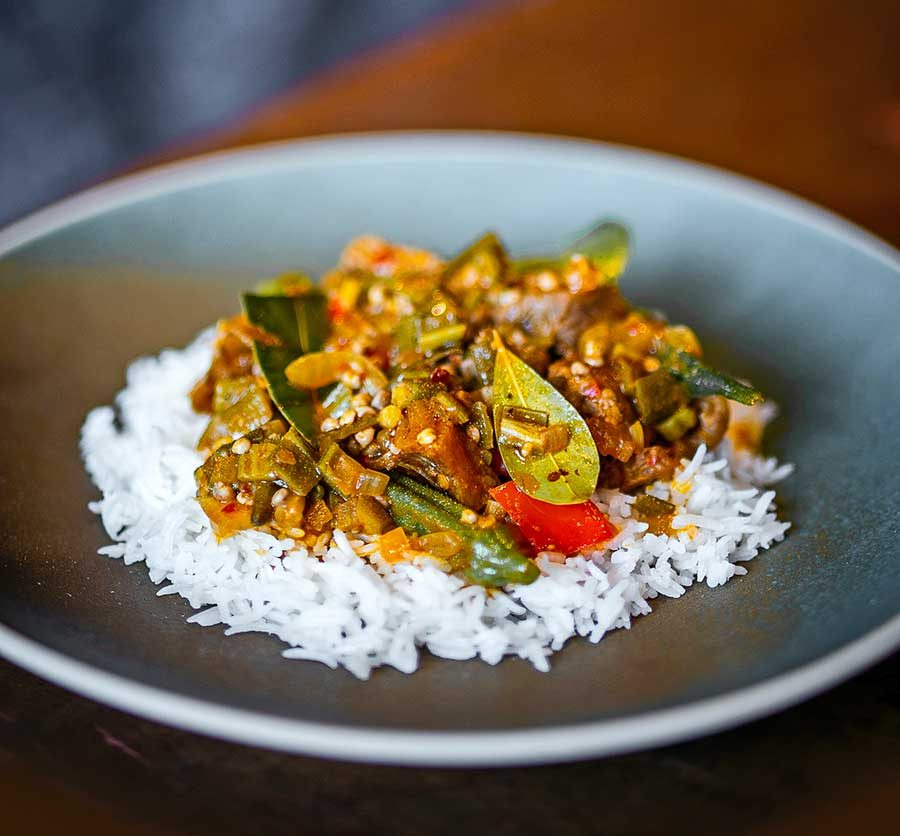

# Supu Kanja

*Senegal's okra stew: finely sliced fresh okra simmered with smoked fish, palm oil, onion, tomato, leafy greens and Scotch bonnet till the stew goes thick and properly slippery. Eaten over millet couscous or rice across Senegal, Gambia and Casamance.*

**Serves:** 6

**Prep Time:** 25 minutes

**Cook Time:** 1 hour

## Overview
Supu kanja (also soupou kandja or soupkanja) is the Wolof okra stew eaten across Senegal, Gambia and the Casamance: finely sliced fresh okra simmered with smoked fish, red palm oil, onion, tomato, dried bonga shrimp, leafy greens and Scotch bonnet till the stew goes thick and properly slippery from the okra mucilage that is the dish's signature. The slipperiness is the point, not a fault. The viscous texture makes the stew cling to whatever you eat it with (millet couscous, rice, fufu, or bread), and Senegalese diners actively prize it. Red palm oil (not refined palm kernel, which is different) gives the stew its deep red colour and earthy flavour; vegetable oil substitutes but the profile shifts. Smoked fish carries the savoury bedrock; smoked bonga, kethiakh or smoked mackerel all work. Fresh fish only goes in at the end if at all. The okra is sliced thin and added in two stages: half early for body, half later for texture.

## Ingredients

### Base
- 4 tablespoons red palm oil (or substitute vegetable oil if unavailable)
- 2 large onions (finely chopped)
- 4 garlic cloves (crushed)
- 3 large tomatoes (chopped, or 1 (400 g) tin chopped tomatoes)
- 2 tablespoons tomato purée

### Protein
- 150 g smoked dried fish (bonga, mackerel, or any smoked fish; broken into chunks, bones and skin removed; or 100 g smoked fish + 100 g fresh tilapia or sea bream)
- 200 g fresh fish fillet (white fish like tilapia, snapper, or sea bream; cut into 4 cm chunks; optional)
- 50 g dried small shrimp (or fresh prawns peeled and chopped; optional but traditional)

### Okra
- 600 g fresh okra (stems trimmed; sliced into thin 5 mm rounds)

### Greens
- 200 g leafy greens (spinach, sorrel leaves, or hibiscus leaves; roughly chopped)

### Aromatics and heat
- 1 whole Scotch bonnet chilli (left whole; or 1 deseeded and finely chopped for serious heat)
- 1 teaspoon dried thyme
- 2 bay leaves
- 700 ml fish stock (or water)

### Seasoning
- 1 ½ teaspoons fine sea salt
- 1 teaspoon ground black pepper
- 2 tablespoons nététou (fermented locust bean; optional but traditional Senegalese addition; substitute with 2 tsp soy sauce + 1 tsp miso if unavailable)

### To finish
- 1 lemon (juice)
- 3 tablespoons fresh parsley (chopped)

### To serve
- 6 portions of [thiéré](side-dishes/thiere.md) (millet couscous) or boiled white rice

## Method

### Stage 1 - Prepare the smoked fish
1. Place the smoked dried fish in a bowl and cover with hot water.
2. Soak for 10 minutes to soften.
3. Drain, then break the fish into small chunks with your fingers, removing any visible bones and tough skin. Set aside.

### Stage 2 - Build the aromatic base
1. Heat the red palm oil in a wide heavy casserole over medium heat. The oil should be bright red and slightly thick; if you're using vegetable oil instead, the colour won't be the same.
2. Add the chopped onions and sweat 8-10 minutes till soft and starting to colour at the edges.
3. Stir in the crushed garlic; cook 30 seconds.
4. Add the tomato purée and cook 1 minute till it darkens.
5. Add the chopped tomatoes and cook 5-6 minutes till they break down.

### Stage 3 - Add smoked fish and aromatics
1. Add the prepared smoked fish chunks and dried small shrimp (if using).
2. Stir well to coat in the tomato base.
3. Add the thyme, bay leaves and whole Scotch bonnet.
4. Pour in the fish stock; bring to a simmer.

### Stage 4 - First okra addition
1. Add half the sliced okra (about 300 g) to the pan.
2. Stir gently; the okra will start to release its mucilage immediately.
3. Cover the pan and simmer 25 minutes on low heat. The okra in this first batch will dissolve into the sauce and thicken it.

### Stage 5 - Add fresh fish and remaining okra
1. Add the fresh fish chunks (if using) carefully so they don't break apart.
2. Add the remaining 300 g of sliced okra.
3. Stir gently, then cover and continue simmering for another 12-15 minutes till the fresh fish is just cooked through and the second batch of okra is tender but still slightly textured.

### Stage 6 - Add greens and finish
1. Add the chopped leafy greens.
2. Sprinkle in the salt, pepper and nététou (or soy + miso substitute) if using.
3. Stir gently; cover and cook 5 more minutes till the greens wilt and the sauce thickens noticeably.

### Stage 7 - Finish
1. Remove the whole Scotch bonnet (without piercing) and discard.
2. Squeeze in the lemon juice; stir gently.
3. Taste; adjust salt.
4. The sauce should be thick, deep red-orange, properly slippery, and properly aromatic.

### Stage 8 - Serve
1. Spoon a generous portion of millet couscous or rice into wide bowls.
2. Ladle a generous portion of the supu kanja over the top, making sure each bowl gets pieces of fish and a good amount of sauce.
3. Scatter chopped parsley over.
4. Diners may want a small spoonful of nététou or a piece of fresh chilli on the side.

## Notes
- **Red palm oil if you can find it:** West African shops and many large supermarkets sell red palm oil; it's the proper fat for this dish. If you can only find refined (yellow) palm oil, it's not the same; use a good vegetable oil instead. Refined palm oil has been processed past the point of carrying the proper flavour.
- **Smoked fish is the bedrock:** the smoked-fish foundation gives supu kanja its depth. If you can't find dried smoked fish, smoked mackerel from the supermarket works adequately; smoked salmon does not (too oily, wrong flavour). At a real push, a teaspoon of liquid smoke plus extra anchovy paste approximates the umami.
- **Embrace the slipperiness:** the okra mucilage that creates the slippery texture is a feature, not a fault. Senegalese diners actively prize this character; if it's too much for you, you can rinse the sliced okra briefly under cold water before adding (washes off some mucilage), but you're moving away from the proper dish.
- **Two-stage okra:** the first batch dissolves into the sauce, the second stays textural. Don't be tempted to add all the okra at once or all at the end; the staged approach gives proper texture.
- **Nététou is the Senegalese MSG:** fermented locust bean is the secret umami ingredient that adds the proper savoury depth. Available at West African grocers; expensive but a small amount lasts a long time. The substitute (soy sauce + miso) approximates the umami if you can't find the real thing.

## Variations
**Supu kanja with meat:** add 200 g of diced beef brisket or smoked beef to the aromatic base at the start; the meat gives extra depth but the smoked fish character can dominate, so use sparingly.
**Supu kanja sans fish:** vegetarian version is rare but possible; use vegetable stock instead of fish stock, double the nététou or miso, and add extra smoked paprika and a Parmesan rind for umami. Not authentic but workable.
**Casamance version:** in the Casamance region of southern Senegal, the dish often includes hibiscus leaves (bissap) and a more generous handful of fresh chilli; brighter and hotter than the northern Wolof version.
**Gambian version:** Gambian cooks often add a generous amount of dried bay leaf and an additional tablespoon of palm oil; slightly heavier and oilier.

## Serving
Over thiéré (millet couscous) or plain boiled rice, in deep bowls, eaten with a fork and a spoon. The sauce is the point; ladle generously. Drink: bissap (hibiscus drink), bouye (baobab drink), or cold ginger drink.

## Storage
- Keeps refrigerated 3 days. The flavour deepens overnight; day-after supu kanja is excellent.
- Freezes 2 months. Defrost in the fridge and reheat gently over low heat.
- Don't microwave; the okra texture and palm oil both suffer.
