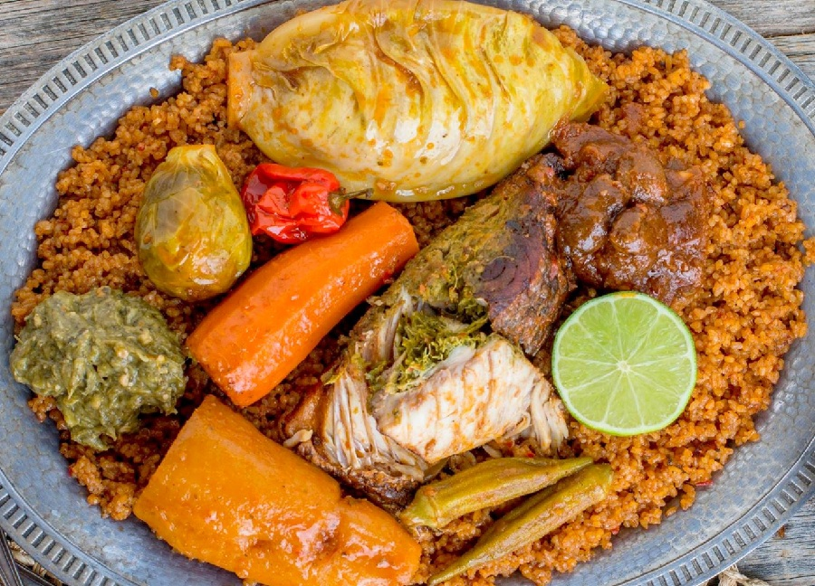

# Thiéboudiène

*Senegal's national dish: white fish stuffed with a green herb paste, simmered in a tomato sauce with cassava, carrot and cabbage, over broken rice.*

**Serves:** 6

**Prep Time:** 40 minutes

**Cook Time:** 1 ½ hours

## Overview
The fish is scored and stuffed with rof, a fragrant paste of parsley, garlic, chilli and stock cube. It poaches in a tomato-and-fish-sauce broth alongside hardy vegetables. The fish and veg come out, broken rice goes in to absorb every drop of flavoured liquid until it turns deep brick-red. The whole thing is plated together in one mound: stained rice underneath, fish and vegetables on top.

## Ingredients

### Rof (green stuffing paste)
- 1 large bunch flat-leaf parsley (about 60 g)
- 6 garlic cloves
- 1 Scotch bonnet or habanero chilli (deseeded if you prefer mild)
- 1 onion (small)
- 1 Maggi or other seasoning cube
- 1 teaspoon black pepper
- 1 tablespoon vegetable oil

### Fish and broth
- 6 thick white fish steaks on the bone (sea bream, grouper or hake), about 1.2 kg total
- 120 ml vegetable oil
- 2 onions (large, finely sliced)
- 4 tablespoons tomato purée
- 400 g tinned chopped tomatoes
- 2 tablespoons nététou (fermented locust bean) or 1 tablespoon dark miso (see Notes)
- 1 Maggi cube
- 2 dried smoked fish pieces or 1 tablespoon shrimp paste (optional but traditional)
- 2 bay leaves
- 1.5 litres water

### Vegetables
- 300 g cassava (peeled, cut in 4 cm chunks)
- 2 carrots (large, peeled, cut in 4 cm chunks)
- 1 white cabbage (small, cut into 6 wedges through the core)
- 1 aubergine (small, quartered)
- 2 turnips (small, peeled, halved, optional)
- 1 whole Scotch bonnet chilli (left intact, for aroma)

### Rice
- 600 g broken jasmine rice (or short-grain rice broken in a blender; see Notes)

### To serve
- 1 lime (cut in wedges)
- A spoonful of homemade chilli paste (mash 1 chilli with salt and a splash of vinegar)

## Method

### Stage 1 - Make the rof and stuff the fish
1. Pulse parsley, garlic, chilli, onion, Maggi, pepper and oil in a food processor to a coarse green paste.
2. Score each fish steak twice on each side, about 1 cm deep.
3. Push a generous teaspoon of rof into each score and into the central cavity. Reserve any leftover paste for the broth.

### Stage 2 - Build the tomato broth
1. Heat the oil in a wide, deep pot over medium heat. Add the sliced onions and cook 8-10 minutes until soft and just golden.
2. Stir in the tomato purée and fry hard for 4 minutes until it darkens to brick red.
3. Add the tinned tomatoes, nététou (or miso), Maggi cube, smoked fish, bay leaves and any leftover rof. Stir to combine.
4. Pour in the water, bring to a steady simmer and cook 15 minutes.

### Stage 3 - Poach the fish and vegetables
1. Lower the stuffed fish into the broth. Add the whole Scotch bonnet on top (do not pierce it).
2. Add the cassava and carrots. Simmer 10 minutes.
3. Add the cabbage wedges, aubergine and turnips. Simmer a further 12-15 minutes, until the fish flakes and the vegetables are tender at a knife point.
4. Lift the fish out carefully with a slotted spoon onto a tray. Lift the vegetables out and arrange around it. Cover loosely with foil.

### Stage 4 - Cook the rice in the broth
1. Rinse the rice in cold water until it runs almost clear. Drain.
2. Measure the broth left in the pot. You want about 1.2 litres of liquid for 600 g of rice; top up with hot water if short, or boil hard to reduce if too much.
3. Tip the rice into the broth. Stir once, bring back to a simmer, then cover and cook on the lowest heat for 18-20 minutes, without stirring, until the liquid is absorbed and the rice is tender and deeply stained.
4. Remove from the heat. Rest covered for 5 minutes.

### Stage 5 - Serve
1. Fluff the rice with a fork. Tip onto a large platter in a flat mound.
2. Arrange the fish steaks on top, surround with the vegetables.
3. Cut the whole Scotch bonnet in half if anyone wants extra heat (warn first; it is fierce).
4. Spoon a few tablespoons of broth over the lot. Serve with lime wedges and chilli paste on the side.

## Notes
- **Rof is the soul of the dish:** Make it generous and pungent; thin fish stuffing tastes of nothing once braised.
- **Nététou substitute:** Fermented locust bean (also sold as iru or dawadawa) is hard to source outside African shops. A tablespoon of dark miso gives a similar funky depth. Skip if you have neither; just season more boldly.
- **Broken rice:** Genuine Senegalese broken rice gives a clingy, slightly sticky finish that holds the sauce. If you cannot find it, pulse jasmine rice in a blender for 5 seconds in batches, until grains are mostly halved.
- **Cassava prep:** Peel thickly. Discard the fibrous central core if your piece has one. Frozen cassava chunks work fine and are easier to find.
- **Whole chilli, no pierce:** A whole Scotch bonnet perfumes the broth without making it punishingly hot. Pierce it and you change the dish.

## Variations
**Thiéboudiène rouge vs blanc:** This recipe is the red (rouge) version. For the white (blanc), omit tomato and use more onions and a touch of dried tamarind for the cooking liquid.
**Chicken:** Yassa-style chicken thighs can replace the fish if you can not source firm steaks; reduce poaching to about 25 minutes.

## Serving
Serve with: Lime wedges and chilli paste; sometimes a small dish of sour mustard pickle.
Garnish with: A handful of chopped parsley over the rice.

## Storage
- Keeps 2 days refrigerated; reheat gently with a splash of water.
- Not recommended for freezing: cassava and cabbage turn watery.
- Leftover rice is excellent fried the next day with an egg on top.
