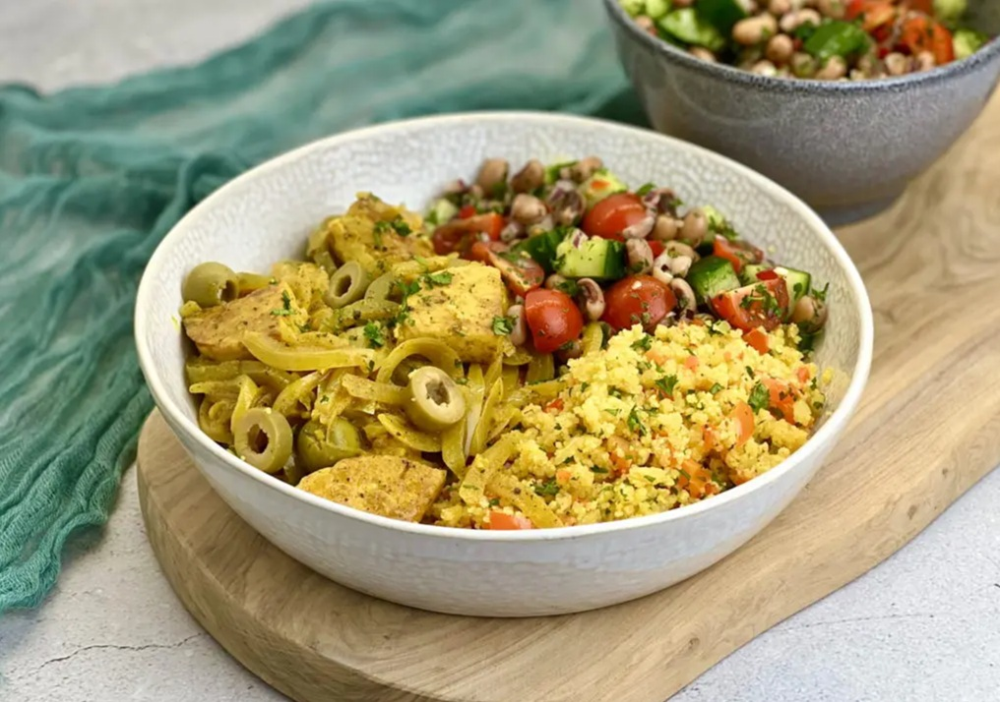

# Thiof Yassa

*Senegal's fish yassa: meaty white fish marinated in lime, mustard and onion, grilled till the skin blisters, then served in a thick onion-mustard sauce simmered down till the onions go sweet and silky. The Saint-Louis classic, sister to yassa poulet.*

**Serves:** 4

**Prep Time:** 25 minutes (plus 2-4 hours marinating)

**Cook Time:** 35 minutes

## Overview
Thiof yassa is the fish version of Senegal's famous yassa, a Saint-Louis specialty from the northern coast where thiof (white grouper, the king of West African fish) is plentiful: meaty white fish marinated in fresh lime, Dijon mustard, onion and Scotch bonnet, grilled over charcoal till the skin blisters, then returned to a thick onion-and-mustard sauce that has simmered down till the onions go properly sweet and silky. The dish carries the influence of French colonial cooking crossed with West African ingredients. The long onion cook is the heart of the dish: two large onions per portion, cooked low and slow till they collapse into a soft sweet pale-brown mass. Rushing this gives crunchy onion in a thin sauce, nothing like proper yassa. The Dijon goes in late and doesn't cook; more than three or four minutes in the pot and it loses its punch. Use a meaty white fish; flaky fish like cod or haddock doesn't hold up.

## Ingredients

### Fish
- 4 whole white fish (sea bream, snapper or whole small grouper, about 400 g each; cleaned and gutted, slashed 3 times on each side) or 4 thick white fish fillets (180-200 g each, skin on)

### Marinade
- 5 tablespoons fresh lime juice (from about 4 limes)
- 3 tablespoons Dijon mustard
- 4 large onions (very finely sliced; about 800 g total)
- 5 garlic cloves (crushed)
- 1 fresh Scotch bonnet chilli (deseeded and finely chopped; or use whole for serious heat)
- 1 teaspoon fine sea salt
- ½ teaspoon ground black pepper
- 4 tablespoons vegetable oil
- 1 teaspoon dried thyme

### Sauce additions
- 2 large onions (additional, finely sliced; the marinade onions go into the sauce, plus these extra)
- 3 tablespoons additional Dijon mustard (added at the end)
- 250 ml chicken stock or fish stock
- 2 bay leaves
- 1 tablespoon olive oil (for sautéing the additional onions)

### To finish
- 1 lime (juice; added at the end)
- 2 tablespoons fresh parsley (chopped)

### To serve
- 4 portions of plain boiled rice (or [thiéré](side-dishes/thiere.md), Senegalese millet couscous)

## Method

### Stage 1 - Marinate the fish
1. Lay the fish in a wide non-reactive dish.
2. In a bowl, combine the lime juice, Dijon mustard, sliced onions (the first 4), crushed garlic, chopped Scotch bonnet, salt, pepper, vegetable oil and dried thyme. Whisk to mix.
3. Pour the marinade over the fish, working some of the marinade into the slashes in the skin (if using whole fish) and turning to coat thoroughly. The onions should be mostly under the fish.
4. Cover with cling film and refrigerate at least 2 hours, ideally 4. Don't go longer than 6 hours; the lime juice will start to "cook" the fish flesh.

### Stage 2 - Separate fish and marinade
1. Lift the fish out of the marinade onto a clean plate. Pat dry with kitchen paper; you want to grill it without dripping marinade.
2. Reserve the marinade and onions in a bowl; they'll go into the sauce.

### Stage 3 - Cook the additional onions
1. While the fish drains, heat the tablespoon of olive oil in a wide heavy pan over medium-low heat.
2. Add the additional 2 sliced onions.
3. Cook 25-30 minutes, stirring every 5 minutes, till the onions collapse into a soft pale-brown mass. Drop the heat if they threaten to scorch.
4. Add the bay leaves.

### Stage 4 - Build the sauce
1. Add the reserved marinade (with its onions) to the pan with the long-cooked onions.
2. Stir to combine; the onions from the marinade are still mostly raw and will cook now.
3. Pour in the stock; bring to a simmer.
4. Cook 10-15 minutes till the marinade onions soften and the sauce reduces by about a third. The sauce should be thick but pourable.

### Stage 5 - Grill the fish
1. While the sauce simmers, heat a grill or grill pan to medium-high.
2. Brush the fish lightly with oil so it doesn't stick.
3. Grill 4-5 minutes per side for whole fish; 3-4 minutes per side for fillets. The skin should blister and char in spots; the flesh should be just cooked through and lift easily from the bone.

### Stage 6 - Finish the sauce and combine
1. With the sauce still simmering, stir in the additional 3 tablespoons of Dijon mustard.
2. Cook for only 2-3 minutes; don't longer. The mustard should warm through and integrate into the sauce while keeping its sharp character.
3. Squeeze in the lime juice; stir.
4. Carefully transfer the grilled fish into the sauce, spooning sauce over the top.
5. Warm together for 1-2 minutes, no more.

### Stage 7 - Serve
1. Lift the fish out onto warm serving plates.
2. Spoon a generous amount of the onion-mustard sauce over and around each piece.
3. Scatter chopped parsley over.
4. Serve immediately with plain boiled rice or thiéré (millet couscous) on the side.

## Notes
- **Long onion cook is the foundation:** the 25-30 minutes of slow onion cooking gives the sauce its sweet creamy base. Skimping on this time gives you a sharp-onion sauce that doesn't taste like proper yassa. Watch the heat; if the onions threaten to brown rather than just slowly collapse, drop the heat further.
- **Mustard quality matters and timing matters:** use a proper sharp Dijon, not a sweet American yellow mustard. Add the bulk of the mustard at the end of cooking; cooking it long degrades the flavour and the sauce loses its signature mustard punch.
- **Marinate but not too long:** 2-4 hours is right; longer than 6 and the lime starts ceviche-cooking the fish, which means it'll cook unevenly when you grill it. Plan the timing.
- **Meaty fish only:** grouper (thiof) is the proper fish; sea bream, snapper, hake or any meaty white fish substitutes. Cod and haddock fall apart in the multi-stage cooking; skip them.
- **Char on the grill matters:** the lightly blackened skin from the grill adds a smoky note that the sauce-only version lacks. If you don't have a grill, brown the fish hard in a hot pan first.

## Variations
- **Yassa poulet:** the chicken version (the more famous one outside Senegal). Bone-in chicken thighs grilled hard then finished in the same onion-mustard sauce. Cook the chicken longer (10 minutes per side on the grill).
- **Yassa au gigot d'agneau:** the lamb version using leg of lamb roasted then sliced and served in the sauce. Special occasion.
- **Yassa au boeuf:** the beef version with cubed beef, more like a stew than a grilled-protein-with-sauce dish; slow-cooked rather than grilled.
- **With habanero:** swap Scotch bonnet for habanero if Scotch bonnet isn't available; almost identical heat profile.

## Serving
- On a wide platter with the sauce spooned over the fish, rice or millet couscous on the side. A lime wedge per plate for additional brightness. Drink: bissap (hibiscus drink), ginger drink, or cold beer (Senegal's Flag or Castel brewery lagers).

## Storage
- Best eaten the day of cooking; the fish loses its texture as it sits.
- Sauce keeps refrigerated 3 days; fish keeps 2 days. Reheat the sauce in a pan; warm the fish briefly in the hot sauce.
- Don't freeze the assembled dish; the texture goes off.
- The sauce alone freezes 2 months; defrost in the fridge, reheat over low heat, and use to dress a freshly-cooked fish.
