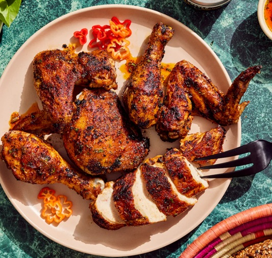

<!-- TODO: hero image undersized, refresh from Pexels or hand-curate -->
# Yassa Spice-Rubbed Grilled Chicken

*Casamance's grilled chicken: bird steeped overnight in a tart mustardy onion marinade, grilled smoky and served back into its slow-cooked onion sauce.*

**Serves:** 4

**Prep Time:** 25 minutes (plus 4 to 12 hours marinating)

**Cook Time:** 50 minutes

## Overview
Yassa is one of the foundational dishes of Senegalese cooking, born in the Casamance region in the south of the country and carried by the Wolof and Joola diaspora across West Africa and beyond. At its heart it is a study in three things: acidity, alliums and smoke. Chicken is rubbed with a spice mix and marinated for hours in lemon juice, Dijon mustard, garlic and a heap of sliced onions, then charred over fire so the marinade caramelises in patches on the skin. The onions, meanwhile, are cooked low and slow in the leftover marinade with a little stock until they collapse into a glossy, tangy sauce that is both sweet and sharp. Not a fiercely spicy dish, though a Scotch bonnet usually rides along in the pot for backbone; the flavour profile is closer to a French-North African pickle than to the chilli-heavy stews further east. Yassa rewards patience at two stages: the marinade and the onion reduction. Served over plain white rice or attieke so the sauce has somewhere to go.

## Ingredients

### Chicken and marinade
- 1.2 kg bone-in chicken thighs and drumsticks (skin on)
- 4 yellow onions (large, about 700 g, thinly sliced)
- 120 ml fresh lemon juice (about 3 lemons)
- 3 tbsp Dijon mustard
- 6 garlic cloves (minced)
- 30 ml neutral oil
- 1 Scotch bonnet chilli (left whole, pierced once)
- 2 bay leaves
- 1 tbsp Dijon mustard (extra, for finishing)

### Spice rub
- 2 tsp sweet paprika
- 1 tsp ground black pepper
- 1 tsp ground white pepper
- ½ tsp ground cumin
- 1 tsp salt
- ½ tsp dried thyme

### To finish
- 250 ml chicken stock
- 30 ml neutral oil (for the pan)
- 1 tbsp Dijon mustard
- Salt to taste
- Steamed white rice (or attieke), to serve

## Method

### Stage 1 - Marinate
1. Mix all the spice rub ingredients in a small bowl.
1. Pat the chicken dry. Rub the spice mix all over each piece, working it under the skin where you can.
1. In a large bowl, combine the sliced onions, lemon juice, Dijon mustard, garlic, oil, Scotch bonnet and bay leaves. Stir to coat the onions.
1. Add the chicken, turn through the onions until every piece is buried, cover, and refrigerate at least 4 hours, ideally overnight.

### Stage 2 - Grill the chicken
1. Heat a charcoal grill, gas grill or a heavy cast-iron griddle to medium-high.
1. Lift the chicken pieces out of the marinade, brushing off any onions clinging to them (reserve all the marinade and onions).
1. Grill 6-8 minutes per side until the skin is charred in patches and the chicken is almost cooked through. It will finish in the sauce.

### Stage 3 - Cook the onions
1. Heat 30 ml oil in a wide heavy pan over medium heat.
1. Tip in the reserved onions and all of the marinade liquid, including the Scotch bonnet and bay leaves.
1. Cook 20-25 minutes, stirring often, until the onions are soft, glossy and golden and most of the liquid has reduced.
1. Stir in the chicken stock and the extra tablespoon of Dijon. Bring to a gentle simmer.

### Stage 4 - Bring it together
1. Nestle the grilled chicken into the onions, spooning sauce over each piece.
1. Cover and simmer 10-12 minutes until the chicken is cooked through and the sauce has thickened to a loose, jammy consistency.
1. Taste and adjust salt. Remove the Scotch bonnet (or break it open if you want more heat).
1. Serve over white rice or attieke with a generous spoonful of the onion sauce.

## Notes
- **Don't skip the long marinade:** yassa's character is built overnight. Anything less than 4 hours and the lemon and mustard never reach the meat.
- **Scotch bonnet whole, not chopped:** piercing it gives perfume and a slow background heat without overwhelming the dish. Chop it only if you want a much hotter result.
- **Char matters:** the smoky edges from the grill are part of the flavour. If using a griddle indoors, get it properly hot first so you get colour, not steam.
- **Onion volume:** the recipe looks onion-heavy because it is. The onions are half the dish, not a garnish.

## Storage
- Keeps 3 days refrigerated in a sealed container; the flavour deepens overnight.
- Reheats gently on the hob with a splash of water or stock to loosen the sauce.
- Freezes well for up to 2 months; defrost in the fridge before reheating.
