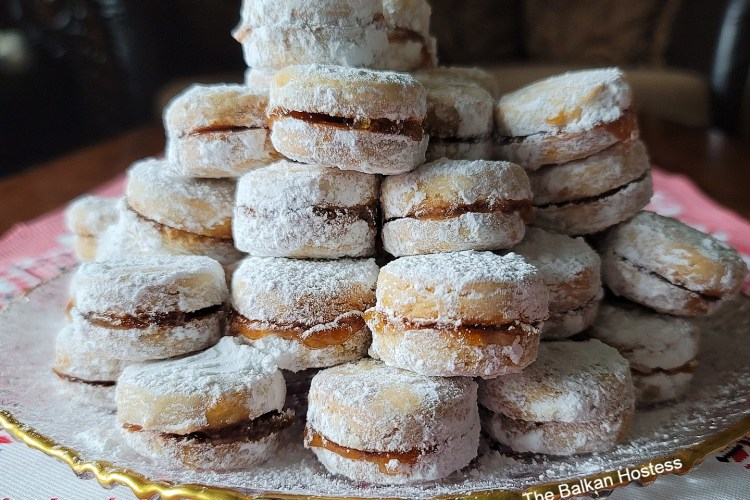

# Vanilice

*Small jam-filled ground-walnut sandwich cookies dusted in icing sugar. The Christmas and Slava biscuit of the Serbian household, baked by the hundred in December.*

**Serves:** about 40 sandwich cookies

**Prep Time:** 45 minutes (plus 1 hour resting)

**Cook Time:** 12 minutes

## Overview
Vanilice (little vanillas) are the Serbian Christmas cookie. Every household has a recipe (almost identical, but every grandmother's is the only correct one); every December the kitchen gets handed over to whoever is baking, and a vast tray comes back with maybe 80 round biscuits ready to be paired up. The dough is short and crumbly, made with lard and ground walnuts; the biscuits are cut small (the size of a hazelnut shell) and bake fast; once cool, they get sandwiched in pairs with a thick rose-hip jam or apricot jam, then rolled in icing sugar so each looks like a snowball. They keep for weeks in a tin, soften over time as the jam moisture travels into the dough, and disappear faster than you'd expect. Use lard if you can find it (the texture is irreplaceable); butter works as a substitute.

## Ingredients

### Dough
- 300 g plain flour
- 100 g icing sugar, plus extra for rolling
- 150 g lard (or unsalted butter, very soft)
- 100 g ground walnuts (or finely ground almonds)
- 2 large egg yolks
- 1 tsp vanilla extract
- 1 tbsp brandy or rum (rakija is the Serbian choice)
- A pinch of fine salt
- Grated zest of 1/2 lemon (optional)

### Filling
- 200 g thick rose-hip jam (šipak), apricot jam or sour cherry jam
- 1 tbsp boiling water (only if the jam is too stiff to spread)

### To finish
- 100 g icing sugar, in a wide bowl

## Method

### Stage 1 - Make the dough
1. Beat the lard or soft butter with the icing sugar in a wide bowl until pale and creamy.
1. Beat in the egg yolks one at a time, then the vanilla, brandy and salt.
1. Stir in the ground walnuts and lemon zest if using.
1. Sift in the flour; mix with a spatula and then with your fingers until it just comes together into a soft dough.
1. Press into a flat disc, wrap and rest in the fridge 1 hour.

### Stage 2 - Cut and bake
1. Heat the oven to 175 C. Line two baking trays with parchment.
1. Roll the dough out between two sheets of baking parchment to 5 mm thick.
1. Cut small rounds with a 2.5 to 3 cm cutter (the size of a small coin); the biscuits should end up the size of a hazelnut.
1. Lay them on the trays 2 cm apart; you'll have around 80.
1. Bake 10 to 12 minutes until just set and barely coloured; they should not brown.
1. Slide on the parchment onto a wire rack; cool completely.

### Stage 3 - Sandwich and roll
1. Loosen the jam with a little boiling water if needed; it should be thick but spreadable.
1. Spread a small dot of jam (around 1/4 tsp) on the flat side of a biscuit; press another flat-side-down on top.
1. As each pair is made, drop into the bowl of icing sugar and roll to coat heavily.
1. Lift out and arrange in a single layer on a tray.

### Stage 4 - Mature
1. Pack the finished vanilice into an airtight tin in single layers, separated by parchment.
1. Leave at least 24 hours before serving; the jam softens the dough and the flavours marry.

## Notes
- **Small is the rule.** Vanilice are biscuits of grandmothers and small hands; 2.5 cm is the right size. Larger biscuits feel wrong on the plate.
- **Lard gives the right texture.** It's what gives proper vanilice their crumbly melt-on-the-tongue feel; butter is a fair substitute but firmer.
- **Don't brown the biscuits.** They should stay pale; if they colour you've cooked them too far and they lose the right tenderness.
- **The 24-hour rest.** Crucial; eaten the same day they're dry, eaten two days later they're transformed.

## Variations
- **Rose-hip jam (šipak).** The classic and the prettiest pink; if you can find a jar of Serbian rose-hip jam, use it.
- **Quince jam.** Goes well with the walnut dough and is a common alternative.
- **Almond vanilice.** Replace the walnuts with ground almonds; lighter, almost amaretti-like.
- **Cocoa version.** Add 2 tablespoons of cocoa to the flour for a chocolate variant; sandwich with raspberry jam.

## Serving
On a plate piled in a small pyramid · with Turkish coffee · alongside slatko at the welcome tray · packed in tins as Christmas gifts · with a glass of cold mineral water

## Storage
- Keep in an airtight tin at room temperature 3 weeks; they get better through week one
- Don't refrigerate; the jam goes hard and the dough loses its melt
- Freeze the baked biscuits (unsandwiched) for 2 months; sandwich and dust after thawing

