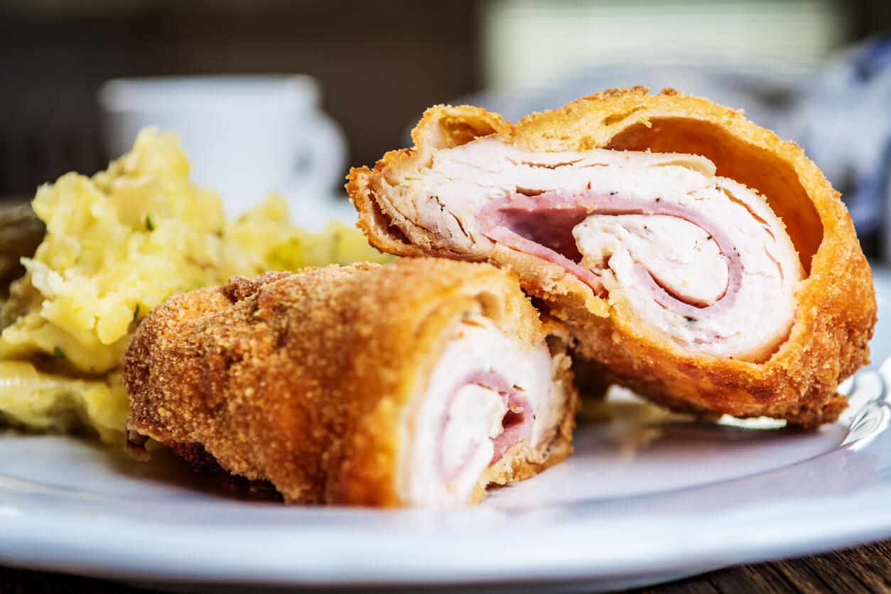

# Karađorđeva Šnicla

*A thick veal escalope pounded thin, rolled around a slab of kajmak, breaded and deep-fried golden. The grand Belgrade hotel-restaurant dish, named for Karađorđe, the first leader of modern Serbia.*

**Serves:** 4

**Prep Time:** 30 minutes (plus 1 hour chilling)

**Cook Time:** 12 minutes

## Overview
Karađorđeva šnicla is the showpiece of post-war Belgrade cooking. The story goes that a chef at the Hotel Moskva invented it in the 1950s when a Russian diplomat's order for chicken Kiev hit the kitchen without chicken on hand; veal got pounded thin, wrapped around kajmak, breaded and fried, and the result took the chef's name from the Serbian national hero. The dish is half escalope and half stuffed cutlet: a single sheet of veal beaten paper-thin, layered with a fat finger of cold kajmak, rolled tight, breaded twice and deep-fried until the casing turns golden and the cream cheese inside melts to a hot pour. A wedge of lemon, a spoon of tartare and a heap of roast potatoes finish the plate. Cut it across with the side of the fork at the table; the kajmak should flow out like a yolk.

## Ingredients

### Šnicla
- 4 thick veal escalopes (or pork loin steaks, 180 g each)
- 200 g cold firm kajmak (or full-fat cream cheese mixed with double cream, see Notes)
- 1 tsp fine salt
- 1/2 tsp ground white pepper

### Crumb
- 100 g plain flour
- 3 large eggs, beaten with 1 tbsp milk
- 200 g fine dried breadcrumbs (panko works)
- Sunflower oil, for deep-frying (around 1 litre)

### To serve
- 1 lemon, quartered
- Tartare sauce
- Roast potatoes or chips

## Method

### Stage 1 - Pound the veal
1. Lay each escalope between two sheets of baking parchment.
1. Beat with a smooth meat hammer or rolling pin until 4 to 5 mm thick and roughly 22 cm by 18 cm. Don't tear the meat; work outwards from the centre.
1. Season both sides with salt and white pepper.

### Stage 2 - Roll
1. Shape a quarter of the cold kajmak into a fat finger about 12 cm long; lay it along the centre of an escalope, a little in from one short edge.
1. Fold the short edge over the kajmak, then fold both long sides in tight to seal the ends.
1. Roll up firmly, tucking as you go; pinch any gaps closed. The kajmak must not be able to leak.
1. Repeat with the other three. Chill all four rolls in the fridge for 1 hour, uncovered, so the surfaces dry.

### Stage 3 - Bread twice
1. Set out three shallow dishes: flour, beaten egg, breadcrumbs.
1. Roll a chilled šnicla through the flour, then the egg, then the breadcrumbs, pressing the crumbs on.
1. Repeat the egg and crumb step a second time for a thick double crust; this is the key to a sealed šnicla.
1. Set on a tray; repeat with the others.

### Stage 4 - Fry
1. Heat 5 cm of sunflower oil in a deep heavy pan to 170 C (a cube of bread browns in 60 seconds).
1. Lower in two šnicla and fry 5 to 6 minutes, turning once, until deep golden all over. The crumb sets fast; the kajmak melts in the residual heat.
1. Lift onto kitchen paper; fry the second pair.
1. Rest for 3 minutes before serving so the kajmak settles slightly and won't gush out the moment you cut.

## Notes
- **Kajmak temperature is everything.** It must be cold and firm going into the meat. Soft warm kajmak bursts the casing during frying.
- **Double bread.** The single coating leaks; the double coating holds. Don't skip the second egg-and-crumb pass.
- **Veal or pork.** Veal is traditional; pork loin pounded the same way is the everyday Serbian home swap.
- **Oil temperature.** Too hot and the crust burns before the kajmak softens. Too cool and the crust soaks fat and splits.

## Variations
- **With smoked ham.** Lay a slice of pršuta (Serbian dry-cured ham) inside the roll, kajmak on top; the dish becomes Belgrade-by-way-of-Italy.
- **With mushrooms.** Add a tablespoon of finely chopped fried mushrooms to the kajmak before rolling; a 1960s hotel-kitchen flourish.
- **Topped with kajmak sauce.** Pour over a warm sauce of melted kajmak with a splash of cream and parsley after frying.

## Serving
- On a warm plate with the cut side towards the diner · lemon wedge on the rim · a heap of crisp roast potatoes or chips · a small bowl of tartare or homemade mayonnaise · šopska salata alongside

## Storage
- Best eaten straight from the pan; the crust softens fast
- Uncooked breaded rolls keep 24 hours refrigerated; fry from cold
- Leftovers keep 2 days but the kajmak congeals; reheat in a hot oven 8 minutes, not the microwave

