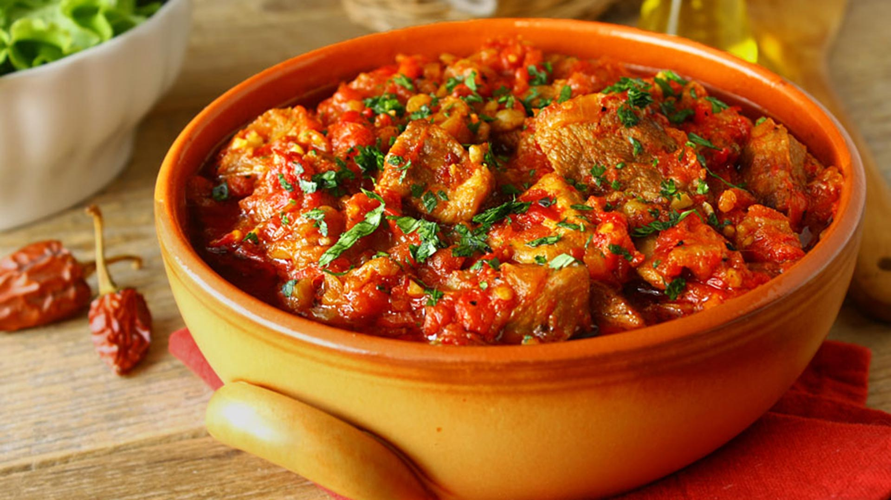

# Mućkalica

*A pork-and-pepper skillet from southern Serbia: leftover grilled meat tossed back over the fire with onions, fresh peppers and tomatoes until everything collapses into a smoky paprika stew.*

**Serves:** 4 to 6

**Prep Time:** 20 minutes

**Cook Time:** 1 hour

## Overview
Mućkalica started as the Sunday-after-the-grill dish in Leskovac and the southern Serbian hill country: the morning after a long roštilj evening, the leftover charred bits of pork, the half-eaten ćevapi and the odd sausage went into a heavy pan with new onions, fresh red and yellow peppers, ripe tomatoes and a heavy hand of paprika, then simmered down into a soft, smoky stew named after the verb mućkati, to shake or stir. The version that made it into restaurant menus uses fresh pork shoulder cut into strips, browned hard in lard, then stewed with peppers; the grill-leftover roots show in the heavy smoke, the dried chilli and the suggestion of charcoal at the back of every bite. Eat with a thick slice of fresh white bread to mop the sauce, or with mashed potato.

## Ingredients

### Mućkalica
- 800 g pork shoulder, cut into 3 cm strips (or leftover grilled pork)
- 3 tbsp lard or sunflower oil
- 2 large onions, finely sliced
- 4 garlic cloves, finely chopped
- 4 red bell peppers, deseeded and sliced into thick strips
- 2 yellow bell peppers, deseeded and sliced
- 2 long green chillies, sliced (or 1 tsp dried chilli flakes)
- 4 ripe tomatoes, roughly chopped (or 1 tin chopped tomatoes)
- 2 tbsp sweet paprika
- 1 tsp ground black pepper
- 1 tsp dried savory or marjoram
- 2 bay leaves
- 1 tbsp tomato paste
- 200 ml hot water
- Salt to taste
- A handful of flat-leaf parsley, chopped

### To serve
- Fresh white bread, in thick slices
- Soured cream or a spoon of kajmak (optional)

## Method

### Stage 1 - Brown the pork
1. Heat the lard in a deep heavy pan over high heat.
1. Pat the pork strips dry; brown in two batches so the pan stays hot, 4 minutes per batch. Lift onto a plate.

### Stage 2 - Build the base
1. Turn the heat to medium; add the sliced onions to the pork fat and cook 8 minutes until soft and pale gold.
1. Stir in the garlic; cook 1 minute.
1. Add the peppers and the green chilli; cook 10 minutes, stirring, until they soften and start to blacken at the edges.

### Stage 3 - Stew
1. Pull off the heat. Stir in the paprika and black pepper (they will bloom; don't let them burn).
1. Return to medium. Stir in the tomato paste and cook 1 minute.
1. Add the chopped tomatoes, savory, bay leaves and the browned pork with all its juices.
1. Pour in the hot water; bring to a slow bubble.
1. Cover loosely and cook on low for 45 minutes, stirring twice. The pork should be tender, the peppers collapsed, the sauce thick.
1. Taste; salt as needed. Scatter the parsley on top.

## Notes
- **Char the peppers.** Mućkalica wants the peppers cooked hard enough that the edges blacken; that's where the grill flavour comes from. Don't lift them off the heat too early.
- **Leftover grill.** The original mućkalica uses leftover grilled meat (pljeskavica, ćevapi, ražnjići); skip the browning step and toss it in for the last 15 minutes of stewing instead.
- **Lard or sunflower oil.** Lard gives the authentic taste; sunflower oil is the everyday Serbian home swap.
- **Dried savory.** Čubar (savory) is the Serbian and Bulgarian backbone herb; dried marjoram is the closest substitute.

## Variations
- **Leskovačka mućkalica.** From the grill capital; uses only leftover charred meat, three kinds of pepper, and twice the chilli.
- **With smoked sausage.** Slice in 200 g of smoked kobasica or chorizo with the pork for an extra layer of smoke.
- **Vegetarian mućkalica.** Skip the pork; use a generous quantity of mushrooms (king oyster or chestnut) and brown them hard before building the stew.

## Serving
- In a wide warm bowl with the sauce loose around the pork · thick slabs of fresh white bread for mopping · a spoon of kajmak or soured cream stirred in at the table · šopska salata on the side · a small glass of rakija to start

## Storage
- Improves on day two; keeps 4 days refrigerated
- Freezes 3 months
- Reheat gently with a splash of water; the sauce thickens as it sits

