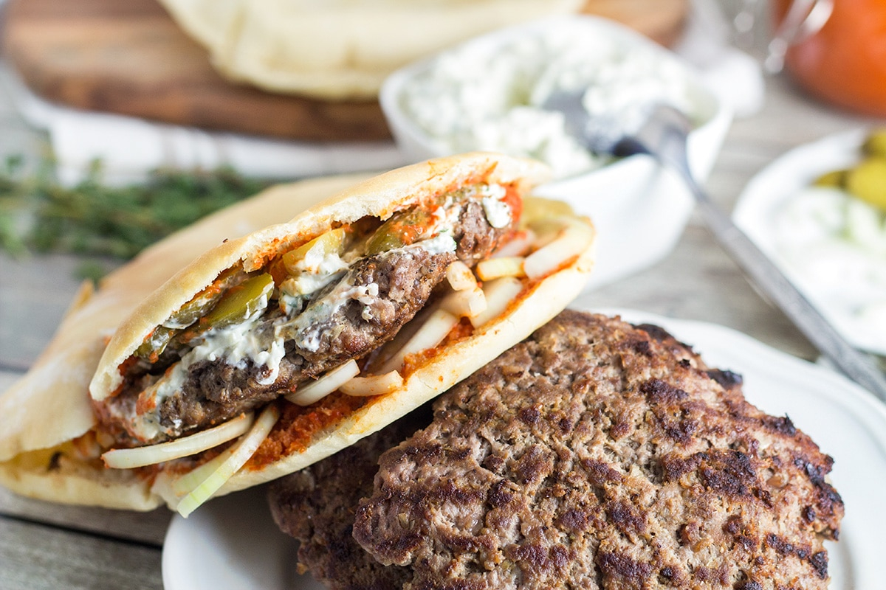

# Pljeskavica

*The flat Balkan burger: 200 g of seasoned minced meat patted out into a thin disc the size of the plate, charcoal-grilled hard and fast, slid into a halved warm lepinja with raw onion and ajvar.*

**Serves:** 4

**Prep Time:** 20 minutes (plus 12 hours resting)

**Cook Time:** 8 minutes

## Overview
Pljeskavica is the Serbian street meal and the Serbian grill-house headline act, the dish that turned the city of Leskovac into a national symbol and gave Belgrade its late-night fix. The meat is the same kind of mix that goes into ćevapi (beef-heavy, garlic, salt, bicarbonate, an overnight rest) but rather than being shaped into fingers it goes onto the grill as one massive thin patty, dinner-plate wide and a finger thick, charred fast over coals so the outside crisps and the inside stays juicy. It lands in a halved warm lepinja (the soft Balkan bun the size of the patty) with a heap of raw chopped onion, a slick of ajvar and a generous spoonful of kajmak; some grill-houses add tomato, kraut or shredded cabbage. Eat by hand. The Leskovac version is the hottest and spiciest; the Belgrade version is plain and beefy; both are right.

## Ingredients

### Pljeskavica
- 800 g minced beef chuck (20% fat, coarse grind)
- 200 g minced lamb shoulder (or all beef for the Belgrade version)
- 4 garlic cloves, finely grated
- 1 tsp fine salt
- 1 tsp bicarbonate of soda
- 1 tsp sweet paprika
- 1/2 tsp ground black pepper
- 60 ml ice-cold sparkling water

### To serve
- 4 large lepinja or thick pita flatbreads (around 18 cm across)
- 2 large red onions, finely chopped
- 4 heaped tbsp ajvar (Roasted red pepper relish, smoky and sweet-sharp)
- 4 heaped tbsp kajmak (Similar to Full-fat crème fraîche.)
- A small bowl of urnebes or feta cheese, crumbled (optional)

## Method

### Stage 1 - Mix and rest
1. Combine the beef and lamb in a wide bowl.
1. Add the garlic, salt, bicarbonate, paprika, pepper and ice-cold sparkling water.
1. Knead hard for 5 minutes until the mix is smooth and slightly tacky.
1. Cover and refrigerate overnight (12 to 24 hours).

### Stage 2 - Shape
1. Take the meat from the fridge 20 minutes before cooking.
1. Wet your hands with cold water. Divide the mix into four 250 g portions.
1. Press each one between two sheets of cling film into a thin disc, around 20 cm wide and 1 cm thick. Larger and thinner than you think it should be.
1. Peel off the top film; flip onto an oiled tray, peel off the second film.

### Stage 3 - Grill
1. Fire up a charcoal grill so the coals are white-hot, or heat a heavy ridged pan very hot.
1. Lift one pljeskavica with a wide spatula and slide it onto the grill.
1. Grill 3 to 4 minutes on the first side without moving, then flip once and give it 2 to 3 minutes more. The edges should crisp and the centre should be just pink.
1. Lift onto a warm plate to rest 1 minute; grill the rest.

### Stage 4 - Build
1. Split each warm lepinja in half horizontally, opening it like a clam.
1. Spread a generous spoon of ajvar over the bottom half.
1. Lay a pljeskavica on top; the patty should overhang the bread by a finger on every side.
1. Top with a heaped tablespoon of kajmak, a heap of raw chopped onion, and a scatter of crumbled cheese or urnebes if using.
1. Drop the top half of the bread on; squeeze gently. Eat by hand.

## Notes
- **Thin is right.** A thick pljeskavica is a burger, not a pljeskavica. The patty should be the size of a salad plate and barely a finger thick.
- **Overnight rest.** As with ćevapi, the bicarbonate and salt need time to work. Same-day pljeskavica is grainy.
- **Lepinja, not a hamburger bun.** Lepinja (or somun) is soft and chewy and the same diameter as the patty. A brioche bun is the wrong vessel.
- **Charcoal heat.** If you only have gas, get the grill as hot as it will go and don't move the patty for the first 3 minutes; you need that crust.

## Variations
- **Leskovačka pljeskavica.** Dial the paprika up and add 1/2 tsp ground hot dried chilli to the mix. The hot southern version.
- **Šarska pljeskavica.** Stuff the disc with kajmak and ham before grilling; eaten in Šar mountain country and in Belgrade restaurants since the 1970s.
- **Hajdučka.** A patty stuffed with smoked bacon and onion; the highland-bandit version.

## Serving
- On a warm board, tucked inside the halved lepinja with the patty wider than the bun · heap of chopped raw onion on top · spoon of kajmak melting into it · ajvar showing at the edges · pickled chilli on the side · cold beer or rakija

## Storage
- Raw shaped patties keep 24 hours refrigerated, separated by film; freeze 2 months
- Cooked pljeskavica keep 2 days refrigerated; reheat in a hot dry pan, never the microwave
- Lepinja stale fast; reheat under a damp cloth in a hot oven 3 minutes

