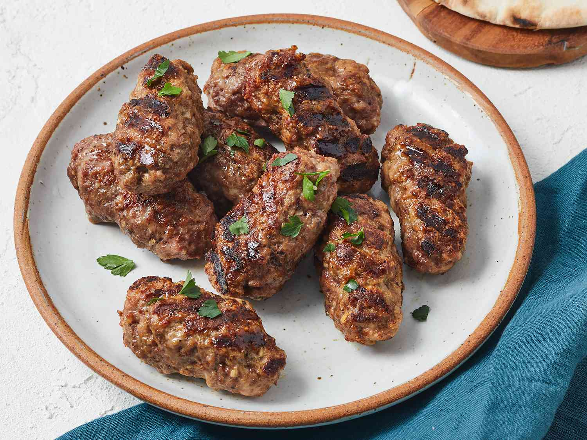

# Ćevapi Serbian-Style

*Small grilled minced-beef sausages, charred over coals and served hot with raw onion, kajmak and warm somun bread. The Serbian grill-house standard and a meal in itself.*

**Serves:** 4 (40 to 50 ćevapi)

**Prep Time:** 30 minutes (plus 12 hours resting)

**Cook Time:** 10 minutes

## Overview
Ćevapi are the Balkans on a plate: little fingers of seasoned minced meat, no casing, no rusk, just meat, salt, garlic and a hint of bicarbonate to soften the texture. The Serbian version leans almost entirely beef (the Bosnian leans beef-lamb, the Croatian uses pork), shaped by hand or with a piping nozzle into finger-length logs and grilled hard over hot coals so the outside chars while the inside stays just pink. They arrive in tens on a wooden board with a halved warm somun (the soft Bosnian-Balkan flatbread), a heap of finely chopped raw onion and a generous spoonful of kajmak that melts into the bread as the meat hits it. A side of ajvar finishes the plate. Rest the seasoned meat overnight; the texture comes from time as much as from the mix.

## Ingredients

### Ćevapi
- 800 g minced beef (chuck, 20% fat; ask the butcher for a coarse mince)
- 200 g minced lamb shoulder (optional but traditional)
- 4 garlic cloves, very finely grated
- 1 tsp fine salt
- 1 tsp bicarbonate of soda
- 1 tsp sweet paprika
- 1/2 tsp ground black pepper
- 60 ml very cold sparkling water

### To serve
- 4 somun or pita flatbreads (or thick pita, warmed)
- 2 large white onions, finely chopped
- 200 g kajmak (or soft cream cheese mixed with double cream, see Notes)
- Ajvar Serbian (recipe in side-dishes)

## Method

### Stage 1 - Mix and rest
1. Combine the minced beef and lamb in a wide bowl.
1. Add the grated garlic, salt, bicarbonate, paprika and pepper.
1. Pour in the cold sparkling water and knead hard with one hand for 5 to 7 minutes; the mix should turn smoother and slightly tacky.
1. Cover and refrigerate overnight (12 to 24 hours). This step is not optional; the bicarbonate works on the proteins and the salt distributes.

### Stage 2 - Shape
1. Take the meat from the fridge 30 minutes before grilling.
1. Wet your hands with cold water and roll the meat into finger-length logs about 8 cm long and 2 cm thick (a piping bag with a wide plain nozzle gives identical shapes; pipe onto a tray and snip).
1. Lay them on an oiled tray; you should have 40 to 50.

### Stage 3 - Grill
1. Fire up a charcoal grill or heat a heavy ridged pan very hot.
1. Lay the ćevapi across the bars and grill 2 minutes per side, turning once, until charred outside and just cooked through.
1. Pile them onto a warm wooden board as they come off.

### Stage 4 - Serve
1. Split the warm somun in half and tuck 8 to 10 ćevapi inside each.
1. Top with a heap of chopped raw onion and a heavy spoonful of kajmak so it starts to melt.
1. Pass the ajvar around the table.

## Notes
- **The overnight rest is the recipe.** Skipping it gives crumbly, hamburgery ćevapi. The bicarbonate needs time to work.
- **Kajmak substitute.** Outside the Balkans, mix 200 g full-fat cream cheese with 50 ml double cream and a pinch of salt; it's not identical but it melts the same way.
- **Coarse mince matters.** Twice-ground supermarket mince goes pasty. Ask for a single coarse grind, or pulse cubed chuck in a food processor with the lamb.
- **Charcoal is the right heat.** Gas grills work but you lose the smoke. A ridged cast-iron pan run very hot is the indoor option.

## Variations
- **Bosnian ćevapi.** 50/50 beef and lamb, no paprika, served in a stretchier lepinja with raw onion only (no kajmak).
- **With urnebes.** Swap the kajmak for urnebes, a punchy Serbian cheese-and-chilli spread (feta, kajmak, ground dried chilli, a clove of garlic mashed together).
- **Leskovački style.** From the southern grill town of Leskovac; bump up the paprika, add a pinch of dried red chilli, grill closer to the coals.

## Serving
Wooden board piled high · halved warm somun · mound of chopped raw onion · scoop of kajmak melting on top · bowl of ajvar on the side · cold beer or a glass of rakija to start

## Storage
- Raw shaped ćevapi keep 24 hours refrigerated; freeze on a tray then bag for 2 months
- Cooked ćevapi keep 2 days refrigerated; reheat in a dry pan, never the microwave
- Kajmak keeps 2 weeks refrigerated, sealed

