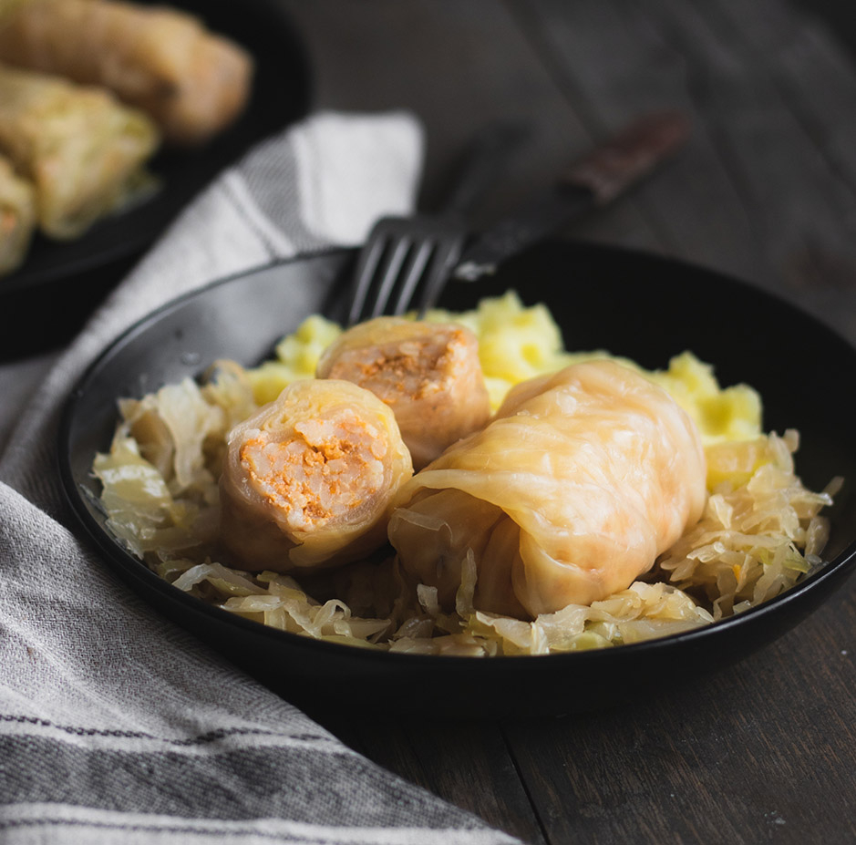

# Sarma Serbian

*Sour cabbage leaves wrapped around a pork and rice filling, then slow-cooked for hours with smoked meat until the leaves turn mahogany and the broth thickens to a rich paprika gravy.*

**Serves:** 6 to 8

**Prep Time:** 1 hour

**Cook Time:** 3 hours

## Overview
Sarma is the Serbian winter feast, the dish that comes out for Christmas, Slava and the New Year's table. Whole cabbages are fermented in brine through autumn (kiseli kupus, sour cabbage) until the leaves turn soft, sharp and pliable; those leaves get rolled around a mix of minced pork, short-grain rice, onion and paprika, then stacked in a deep pot with smoked ribs and a smoked sausage or two, covered with water and left to cook gently for three hours. The leaves go bronze, the meat falls off the bones, and the cooking liquid reduces to a thick rust-coloured gravy that gets ladled back over every plate. It improves on day two and three, so most Serbian households cook a big pot and eat it down through the week with mashed potato or a slab of proja cornbread.

## Ingredients

### Cabbage and meat
- 1 whole sour cabbage (kiseli kupus, around 2 kg; from a Balkan or Polish deli)
- 500 g smoked pork ribs or smoked pork hock
- 2 smoked pork sausages (kobasica; Polish kabanos works)

### Filling
- 700 g minced pork shoulder (20% fat)
- 100 g short-grain rice, rinsed
- 2 large onions, very finely chopped
- 4 garlic cloves, minced
- 2 tbsp sweet paprika
- 1 tsp ground black pepper
- 1 tsp dried savory or marjoram
- 1 tsp salt (taste the cabbage first; if very salty, use less)

### Roux and pot
- 4 bay leaves
- 1 tbsp tomato paste
- 3 tbsp lard or sunflower oil
- 3 tbsp plain flour
- 1 tbsp sweet paprika

## Method

### Stage 1 - Prepare the cabbage
1. Rinse the whole sour cabbage under cold water to wash off excess brine.
1. Carefully separate the leaves, cutting around the core with a small knife.
1. Trim the thick rib down the centre of each large leaf so it lies flat. Set aside 12 to 16 of the best leaves; shred the rest and the heart.

### Stage 2 - Make the filling
1. Mix the minced pork, rinsed rice, chopped onions, garlic, paprika, pepper, savory and salt in a wide bowl.
1. Knead for 2 minutes until uniform and slightly sticky.

### Stage 3 - Roll the sarma
1. Lay a cabbage leaf flat, rib-end towards you.
1. Place 2 heaped tablespoons of filling along the bottom edge.
1. Fold the bottom up over the filling, fold the sides in, then roll up tight into a fat cigar.
1. Repeat with all leaves; you should get 12 to 16 rolls.

### Stage 4 - Layer and cook
1. Scatter a third of the shredded cabbage across the base of a deep heavy pot.
1. Lay the smoked ribs and sausages on top.
1. Arrange the rolls seam-side down in tight rings on top of the meat.
1. Tuck the bay leaves between them and dot the tomato paste into the gaps.
1. Cover with the remaining shredded cabbage and pour in cold water just to cover.
1. Bring to a slow bubble over medium heat, then turn down to the lowest setting, cover and cook for 2 hours and 30 minutes. Check the level once and top up with hot water if needed.

### Stage 5 - The roux
1. Heat the lard in a small pan over medium heat.
1. Stir in the flour and cook 2 minutes until pale gold.
1. Pull off the heat, stir in the paprika (it will bloom; don't let it burn).
1. Ladle in 200 ml of the cooking liquid; whisk smooth.
1. Pour the roux back into the pot, swirl gently to mix, and cook a further 20 minutes uncovered. The gravy will thicken and darken.

## Notes
- **Sour cabbage is essential.** Regular cabbage rolled and brined for an hour does not give the same flavour. Buy whole heads from a Balkan, Polish or Russian deli in late autumn through spring.
- **Don't stir the pot.** Once stacked, leave the rolls alone or they break apart. Lift the lid to check, never to stir.
- **Smoked meat is the flavour.** Smoked ribs, hock, and a good kobasica build the broth. Fresh pork alone gives a flat result.
- **Day two is better.** Make sarma the day before serving; the flavours deepen and the gravy thickens further.

## Variations
- **Lenten sarma.** Skip the meat: fill with rice, finely diced onion, mushrooms and walnuts; cook with vegetable stock. Made through Orthodox fasts.
- **Vojvodina-style.** Heavier on the paprika, with a splash of vinegar in the pot; the northern Serbian/Hungarian-influenced version.
- **Beef and pork.** Replace half the pork with minced beef chuck for a firmer roll.

## Serving
- Deep bowls with a roll or two, smoked rib alongside · plenty of the paprika gravy ladled over · mashed potato or thick slabs of proja cornbread · a spoon of soured cream on the side · pickled chilli and rakija to start

## Storage
- Cooked sarma keeps 5 days refrigerated; reheats better than it cooks first time
- Freeze for 3 months in the gravy; defrost overnight and reheat low and slow
- Don't freeze the cabbage leaves raw; they go limp on thawing

