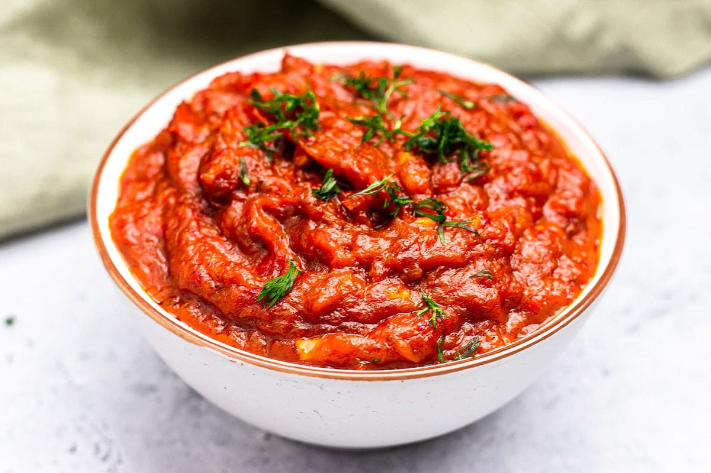

# Ajvar Serbian

*The autumn jar: red peppers roasted black, peeled, ground with garlic, salt and oil, cooked down to a thick smoky relish. The single most-spooned condiment in Serbia.*

**Serves:** about 4 jars (around 1.4 kg)

**Prep Time:** 1 hour (plus 1 hour sweating peppers)

**Cook Time:** 2 hours

## Overview
Ajvar is the September project of every Serbian household. As the long red roga peppers come ripe and pile up at the markets in the second half of the month, families set up outside on the terrace with a sheet of metal over the gas burner or a wood fire and start roasting peppers by the kilo. Twenty kilos in, the peeled flesh gets minced and slowly cooked down with garlic, salt and sunflower oil for a couple of hours until it goes thick, dark red and glossy. The result is the year's supply: a jar comes down off the shelf when sarma needs a spoon, when ćevapi land on the board, when there's a slice of bread and not much else. Roga peppers (long, sweet, fleshy, deep red) are the right kind; in their absence, ramiro or red bell peppers will do, though the result is less concentrated.

## Ingredients

### Ajvar
- 5 kg long sweet red peppers (roga, romano, ramiro or sweet pointed peppers)
- 1 small fresh red chilli (or 1 tsp dried chilli flakes), optional, for blaga (mild) leave out
- 8 garlic cloves, peeled
- 200 ml sunflower oil
- 2 tsp fine salt (or to taste)
- 2 tbsp white wine vinegar (optional, helps preserving)

### Equipment
- 4 to 5 clean glass jars (around 350 g each) with new lids
- A heavy wide pan or roasting tray
- A food processor or hand mincer

## Method

### Stage 1 - Roast the peppers
1. Heat the oven to 230 C or fire up a gas burner with a metal sheet, or use a charcoal grill.
1. Roast the peppers whole in batches until the skins blacken and blister all over, around 15 to 20 minutes per batch in the oven, less on direct flame; turn them as the skins go.
1. Drop the hot peppers into a large bowl as they come off; cover with a plate or cling film and leave to sweat for 1 hour. The skins loosen as they cool.

### Stage 2 - Peel and drain
1. Over a sink, slip the blackened skins off each pepper with your fingers (rubber gloves help; the juice stains).
1. Tear the peppers open, pull out the stems and seeds. Don't rinse; the smoky char on the flesh is what you want.
1. Lay the peeled flesh in a wide colander set over a bowl. Leave to drain for 30 minutes; you'll lose around 500 ml of liquid. This is essential; ajvar wants flesh, not water.

### Stage 3 - Mince and cook
1. Pulse the drained pepper flesh in a food processor with the chilli and garlic to a coarse paste (or pass through a hand mincer with a medium plate; that's the traditional method).
1. Tip into a heavy wide pan; you should have around 2 kg.
1. Cook over medium-low heat for 1 hour 30 minutes, stirring every 5 to 10 minutes with a wooden spoon. The colour deepens, the texture thickens, and the water evaporates. Don't walk away; ajvar burns the moment you do.
1. After an hour, start adding the sunflower oil 50 ml at a time, stirring it in until each addition is absorbed before adding the next. This is what gives ajvar its gloss.
1. Stir in the salt and vinegar in the last 10 minutes. Taste; adjust salt.

### Stage 4 - Jar
1. Scoop boiling-hot ajvar into clean dry jars; tap each jar firmly on a folded tea towel to settle and remove air pockets.
1. Pour a thin film of sunflower oil over the top of each jar (around 1 tbsp; seals against air).
1. Seal tight and invert for 5 minutes, then turn upright. The lids should pop down as they cool.

## Notes
- **Drain the peppers seriously.** The single most common ajvar problem is wet ajvar that won't thicken. 30 minutes draining minimum.
- **Low heat, long time.** Ajvar must not boil hard; it spatters everywhere and burns at the bottom. A slow heavy bubble.
- **Mild or hot.** Blagi ajvar (mild) skips the chilli; ljuti ajvar (hot) gets a fresh chilli or two ground in. Both are standard.
- **The oil seal.** A thin layer of fresh sunflower oil on top of each jar keeps the ajvar from oxidising while opened.

## Variations
- **Aubergine ajvar (pindjur).** Roast 1 kg of aubergines alongside the peppers; peel and add to the mince. Softer, smokier, common in southern Serbia and Macedonia.
- **Sweet ajvar.** Add 1 tablespoon of caster sugar in the last 10 minutes; a Vojvodina touch with the Hungarian border in mind.
- **Garlic-heavy.** Double the garlic if you like a sharper jar; common in Šumadija.

## Serving
- A scoop on the side of ćevapi, pljeskavica or sarma · spread on warm bread for breakfast · folded into mashed potato · stirred into bean stew · with eggs in any form · with cold roast meat

## Storage
- Sealed jars keep 12 months in a cool dark cupboard
- Once opened, refrigerate and use within 3 weeks; keep the oil layer topped up
- Don't freeze; the texture splits on thawing

