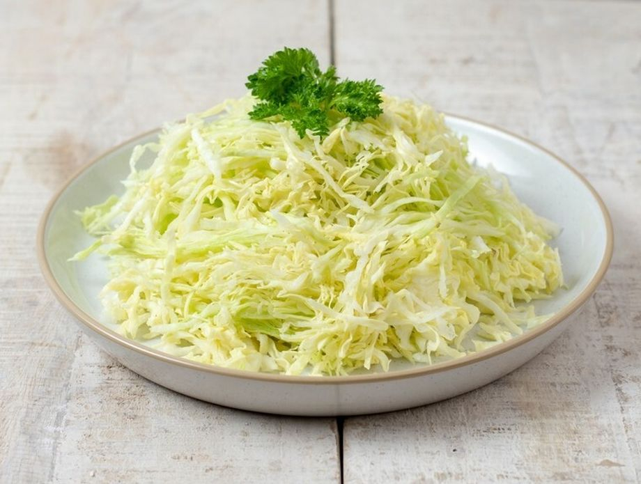

# Kupus Salata

*Finely shredded white cabbage massaged with salt and dressed with sunflower oil and vinegar. The cold winter salad of the Serbian table, the one that arrives with every plate of grilled meat.*

**Serves:** 4 to 6

**Prep Time:** 15 minutes (plus 30 minutes salting)

**Cook Time:** 0 minutes

## Overview
Kupus salata is what happens in Serbian kitchens between November and April when the summer tomato is long gone and there's no šopska on the table. A half head of white cabbage gets shredded as thinly as the cook can manage (a mandolin helps but a sharp knife and patience does fine), then salted hard, massaged until it weeps water, drained, and dressed with sunflower oil and a heavy hand of white vinegar. Some households add a grated carrot for colour or a teaspoon of caster sugar to balance; most don't. It's punchy, sharp, and bottomless: a small mountain of it sits on every grill-house table and gets refilled all night. Cold, crunchy and properly vinegary, it cuts the fat of pork roast, ćevapi, sarma and anything fried.

## Ingredients

### Salad
- 1/2 medium white cabbage (around 700 g), core trimmed
- 2 tsp fine salt
- 1 medium carrot, peeled and coarsely grated (optional)
- 1 small white onion, very finely sliced (optional)

### Dressing
- 4 tbsp sunflower oil
- 3 tbsp white wine vinegar (or apple cider vinegar)
- 1/2 tsp ground black pepper
- 1 tsp caster sugar (optional, balances the vinegar)
- 1/2 tsp dried chilli flakes (optional)

## Method

### Stage 1 - Shred
1. Quarter the cabbage half and cut out the hard core.
1. Lay each piece flat and slice as thinly as you can manage, ideally 2 mm or less. A mandolin gives the best result.
1. Tip the shred into a large bowl.

### Stage 2 - Salt and squeeze
1. Sprinkle the salt over the cabbage.
1. With clean hands, massage and squeeze the cabbage hard for 4 to 5 minutes. The shreds will soften, darken and start to release water.
1. Leave to sit for 20 to 30 minutes.

### Stage 3 - Drain and dress
1. Tip the cabbage into a colander; press down to drain off the salty liquid. Don't rinse; you want the salt level in the leaves.
1. Return to the bowl. Add the carrot and onion if using.
1. Pour over the sunflower oil and vinegar; add the black pepper, sugar and chilli if using.
1. Toss thoroughly with two spoons or clean hands until every shred is glossy.

### Stage 4 - Rest
1. Cover and refrigerate at least 15 minutes; an hour is better. The vinegar mellows, the cabbage softens further, the flavours come together.

## Notes
- **Thin shred is the whole thing.** Thick shreds give a tough, chewy salad. The thinner you slice, the better the texture.
- **Salt-massage step.** This breaks down the cabbage's hard cell walls and is what turns it from raw and squeaky to tender and quick-pickled. Don't skip it.
- **Vinegar level.** Serbian kupus salata is properly vinegary; trust the quantity in the recipe. Adjust after resting if needed.
- **The carrot is optional.** Many southern Serbian households leave it out for the plain white winter version; the carrot is a Vojvodina northern touch.

## Variations
- **With sauerkraut.** Mix half raw shredded cabbage with half drained kiseli kupus (sour cabbage) for a stronger, half-fermented version.
- **With apple.** Grate a tart green apple in with the carrot; sharper, slightly sweeter.
- **Lemon instead of vinegar.** Replace the vinegar with the juice of one lemon for a brighter, less Balkan version.

## Serving
- In a wide bowl on the table next to grilled meat · piled alongside sarma · with pork roast and roast potatoes · with bean stew · with anything fried · refilled when empty

## Storage
- Improves on day two; keeps 4 days refrigerated, sealed
- The cabbage softens further over time and the vinegar mellows; if too soft, add a fresh handful of shred
- Don't freeze

