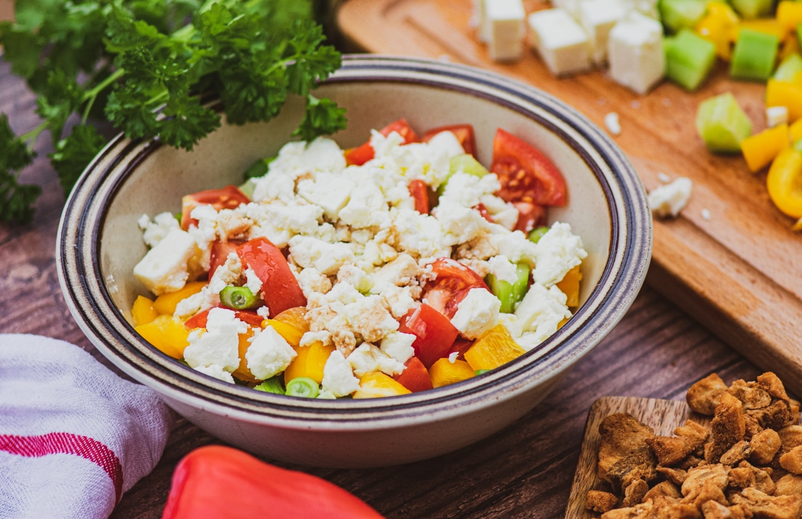

# Šopska Salata Serbian-Style

*Tomato, cucumber, raw onion and roasted pepper, dressed plain with oil and vinegar, topped with a snow-fall of grated white cheese. The shared salad of every Serbian summer table.*

**Serves:** 4

**Prep Time:** 15 minutes

**Cook Time:** 0 minutes

## Overview
Šopska is the Bulgarian-Serbian-Macedonian summer salad that travels across all three of those tables under near-identical names, the dish that hits the table the moment the first ripe tomatoes show up in July and stays there until late October. The Serbian version is the leanest of the three: ripe tomato cut into thick wedges, cucumber in fat chunks, a few rings of raw onion, a roasted red pepper if there's one in the fridge, dressed at the table with sunflower oil, a splash of vinegar, salt and pepper, and then crowned with a heavy grating of sirene or another firm white sheep's-milk cheese piled snow-white on top. The trick is good tomatoes; you can't fake them. Eat with grilled meat, sausages, ćevapi, pljeskavica or just with a piece of bread on a hot day.

## Ingredients

### Salad
- 4 large ripe tomatoes (around 600 g)
- 1 large cucumber, peeled if waxed
- 1 small red onion (or half a regular one)
- 1 roasted red pepper, peeled and torn (optional but classic)
- 1 small bunch of flat-leaf parsley, chopped (optional)

### Dressing
- 3 tbsp sunflower oil (or mild olive oil)
- 1 tbsp white wine vinegar (or apple cider vinegar)
- 1/2 tsp fine salt
- 1/4 tsp ground black pepper

### To finish
- 150 g sirene (Bulgarian sheep's-milk cheese) or a firm Greek feta, very cold, grated on the large holes of a box grater
- A handful of pitted black olives (optional)

## Method

### Stage 1 - Cut
1. Cut the tomatoes into thick wedges, around 6 to 8 per tomato, into a wide salad bowl.
1. Halve the cucumber lengthwise; cut into thick half-moons. Add to the bowl.
1. Slice the onion into thin rings; scatter over the top.
1. Tear the roasted pepper into thumb-sized pieces and add.
1. Scatter the parsley if using.

### Stage 2 - Dress
1. Drizzle the sunflower oil over the salad.
1. Sprinkle on the vinegar, salt and black pepper.
1. Toss gently with two spoons; don't bruise the tomato.

### Stage 3 - The cheese pile
1. Grate the very cold cheese coarsely over the top in a thick even layer; it should obscure most of the vegetables under it.
1. Drop a few olives across the top if using.
1. Serve immediately, before the cheese starts to sweat.

## Notes
- **Ripe tomatoes are the recipe.** Out-of-season supermarket tomatoes give a watery, flavourless šopska. Wait for August or hunt down a farmers' market.
- **Cold cheese, grated, on top.** Don't mix the cheese in; the pile on top is the visual signature of šopska. Cold cheese grates cleanly; warm cheese smears.
- **Sirene or feta.** Bulgarian sirene is the closest thing in flavour; a firm Greek feta (not the wet supermarket kind in cubes) is the standard substitute.
- **Sunflower, not olive.** Serbian sunflower oil is what's poured on at home. A mild olive oil works; a heavy extra-virgin will dominate.

## Variations
- **With a hard-boiled egg.** Quarter a chilled boiled egg and arrange around the rim; a common Sunday addition.
- **Without the roasted pepper.** The pared-back everyday version; just tomato, cucumber, onion, cheese.
- **Bulgarian version.** Includes more onion, more parsley, and often a clove of grated garlic in the dressing.

## Serving
At room temperature in a wide shallow bowl, cheese piled high · alongside grilled meat, ćevapi or pljeskavica · with thick slices of fresh white bread to mop up the juices · slick of leftover dressing makes the bread-dipping medal of the meal

## Storage
- Best within an hour of dressing; the tomato bleeds and the cheese softens
- Undressed cut vegetables keep 24 hours refrigerated separately
- Don't refrigerate dressed; the tomato goes cold and dull

