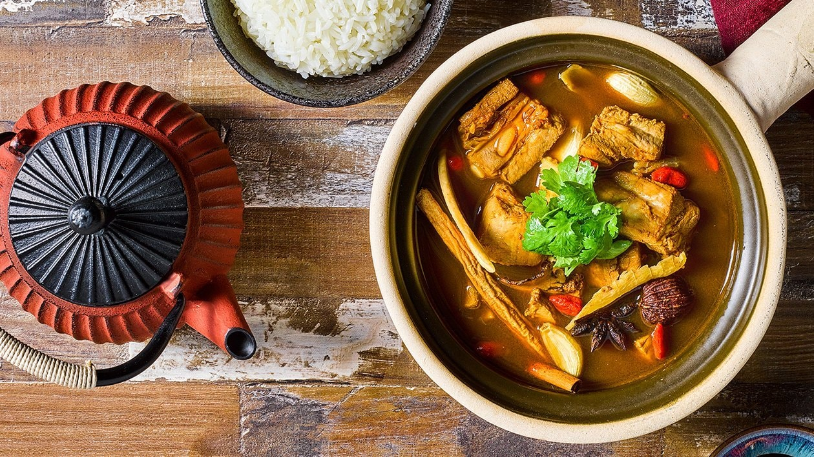

# Bak Kut Teh

*Singapore bak kut teh: pork ribs simmered for hours in a peppery garlic-and-soy broth, served with white rice, dough fritters and a dipping bowl of dark soy with chilli. The breakfast soup that wakes up hawker-stall Singapore.*

**Serves:** 4-6

**Prep Time:** 15 minutes (plus overnight pork soak optional)

**Cook Time:** 2 hours 30 minutes

## Overview
Bak kut teh ("meat bone tea" - though no tea is involved; the name is debated) is the soulful pork-rib soup that Singaporean Hokkien immigrants developed for the morning shift workers of the harbour. The Singapore version is the pale, pepper-heavy "Teochew style" - clean clear broth, no dark soy, dominated by white pepper, garlic and a small bouquet of star anise and cinnamon. Pork ribs go in with whole heads of garlic; long slow simmering pulls collagen out into the broth; the result is a transparent broth that's nonetheless full-bodied, with falling-off-the-bone ribs floating in it. Served with white rice, you-tiao (Chinese dough fritters) for dipping into the soup, and a small saucer of dark soy with sliced bird's eye chilli for dipping the ribs.

## Ingredients

### Broth
- 1.2 kg pork spare ribs, cut into 4-5 cm sections (ask the butcher)
- 2 whole heads of garlic, papery skin on, halved horizontally
- 1 tbsp white peppercorns, lightly crushed
- 4 star anise
- 1 cinnamon stick
- 2 tsp coriander seeds (lightly toasted)
- 1 tbsp Sichuan peppercorns (optional)
- 2 tbsp light soy sauce
- 1 tbsp dark soy sauce
- 1 tsp salt
- 2 litres water

### To serve
- 4-6 you-tiao (Chinese fried dough sticks) - sub savoury croutons of crusty bread
- Steamed white rice
- 4 tbsp dark soy sauce
- 4 bird's eye chillies, sliced into rings
- 2 spring onions, sliced
- A small bunch of fresh coriander
- A few sprigs of pickled mustard greens (optional)

## Method

### Stage 1 - Blanch the ribs
1. Place ribs in a pot; cover with cold water.
2. Bring to a boil; boil 5 minutes - scum rises to the surface.
3. Drain; rinse the ribs under cold water (this removes the impurities that would cloud the broth).
4. Discard the cooking water.

### Stage 2 - Build the broth
1. Wrap the peppercorns, star anise, cinnamon, coriander seeds and Sichuan peppercorns in muslin or cheesecloth, tied securely.
2. Place blanched ribs in a clean pot.
3. Add the halved garlic heads, the spice bag, soy sauces and salt.
4. Pour in 2 litres fresh water.

### Stage 3 - Slow simmer
1. Bring to a simmer; reduce heat to very low.
2. Cover loosely (the lid slightly ajar).
3. Simmer 2-2.5 hours, until the meat pulls off the bone easily.
4. Skim any surface scum every 30 minutes.

### Stage 4 - Finish
1. Lift out and discard the spice bag.
2. Taste the broth; adjust salt or soy.
3. The garlic is now soft and gentle - leave it in to be squeezed onto the rice if desired.

### Stage 5 - Serve
1. Ladle broth and ribs into deep bowls.
2. Slice you-tiao into thirds; serve in a separate bowl for dipping into the soup (they soak up the broth like sponges).
3. Mix dark soy and sliced chilli in a small saucer per diner - this is the rib-dipping sauce.
4. Scatter spring onion and coriander over the soup.
5. Steamed rice on the side; pickled greens too if using.

## Notes
- **The blanch step:** Skipping it leaves cloudy broth and a slightly off-taste from the scum. Five minutes is enough; long blanching washes flavour away.
- **White pepper, not black:** Singaporean bak kut teh is distinctively white-pepper-driven, which gives a different aromatic character from black pepper. Whole peppercorns; crushed lightly.
- **The dipping ritual:** Diners take a rib piece, dip it briefly in the dark-soy-and-chilli, then eat. The plain broth gets sipped from a spoon. Rice gets eaten alongside.

## Serving
- Serve hot for breakfast or lunch. The Singapore tradition is to slurp the soup quickly while it's piping hot, dipping you-tiao between sips. Tea on the side - any Chinese tea works.

## Storage
- Refrigerate 4 days. The broth often improves overnight as the garlic mellows.
- Freezes 2 months; ladle broth and ribs into a freezer-safe container.
