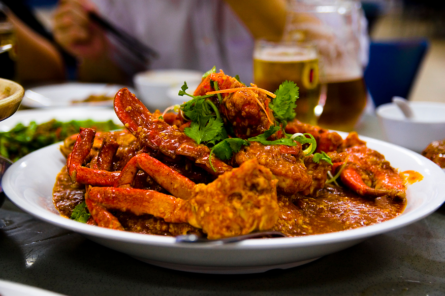

# Chilli Crab

*Singapore's showstopper: mud crabs stir-fried in a thick sweet-spicy tomato-and-chilli sauce with egg-ribboned through, eaten with fried mantou buns for soaking up every drop. The signature seafood dish of the East Coast hawker centres.*

**Serves:** 4

**Prep Time:** 25 minutes

**Cook Time:** 25 minutes

## Overview
Chilli crab is Singapore's calling-card seafood dish - whole mud crabs cracked into the wok and stir-fried in a tomato-based sauce thickened with cornflour, brightened with sambal (chilli paste) and finished with a beaten egg dragged through to form gold ribbons. Sweet and spicy in equal measure; the heat is moderate by Singapore standards (the crab itself is the star), the tomato underpins the sauce, and the egg gives it the slightly silky texture that distinguishes Singapore chilli crab from neighbouring versions. Eaten with the fingers, accompanied by fried mantou buns (the small steamed-then-fried Chinese rolls) for mopping up.

## Ingredients

### Crabs
- 2 live mud crabs (about 800 g each) - or 1.5 kg pre-cooked frozen mud crab pieces
- 2 tbsp cornflour, for dusting

### Sauce
- 4 tbsp vegetable oil
- 6 cloves garlic, minced
- 1 thumb of ginger, finely grated
- 3 tbsp sambal oelek (or 3 fresh red chillies, pounded to a paste)
- 1 tbsp fermented soybean paste (taucu - sub miso)
- 4 tbsp tomato ketchup
- 2 tbsp tomato paste
- 2 tbsp chilli sauce (Lingham's-style sweet chilli, or substitute)
- 2 tbsp light soy sauce
- 2 tbsp rice vinegar
- 2 tbsp sugar
- 400 ml chicken or seafood stock
- 1 tbsp cornflour mixed with 3 tbsp cold water
- 2 large eggs, beaten
- Salt and white pepper to taste

### To serve
- 8-12 mantou buns (Chinese fried/steamed buns), warmed
- 2 spring onions, sliced
- Coriander leaves

## Method

### Stage 1 - Prepare the crabs
1. If using live crabs, dispatch humanely with a knife to the central nervous bundle on the underside.
2. Lift off the top shell; remove the gills (the feathery brown frills).
3. Crack each leg and claw firmly with the back of a cleaver - this lets sauce in.
4. Cut each body in half along the central seam.
5. Lightly dust the cracked pieces with cornflour.

### Stage 2 - Sear the crab
1. Heat 3 tbsp oil in a large wok or wide pan over high heat.
2. Add the crab pieces; stir-fry 3-4 minutes until the shells turn vivid red-orange.
3. Lift out onto a plate.

### Stage 3 - Build the sauce
1. Reduce heat to medium. Add the remaining 1 tbsp oil.
2. Add garlic and ginger; stir 30 seconds.
3. Add sambal oelek and fermented soybean paste; cook 1 minute.
4. Add the ketchup, tomato paste, chilli sauce, soy sauce, rice vinegar and sugar. Stir thoroughly.
5. Pour in the stock; bring to a simmer.

### Stage 4 - Combine
1. Return the crab pieces to the sauce.
2. Toss to coat. Cover; cook 6-8 minutes for the crab to finish cooking through.
3. Stir the cornflour slurry; pour into the sauce, stirring. The sauce thickens immediately.

### Stage 5 - The egg ribbons
1. Drizzle the beaten egg in a slow stream across the bubbling sauce.
2. Wait 5 seconds, then stir gently - the egg forms soft ribbons through the sauce.
3. Taste; adjust sugar/salt - the sauce should be sweet, sour, spicy and savoury all at once.

### Stage 6 - Serve
1. Tip onto a wide platter.
2. Scatter spring onion and coriander.
3. Serve with warm mantou buns on the side.

## Notes
- **Live crab:** The Singapore version uses live mud crab. Pre-cooked frozen mud crab is the practical substitute - skip the searing step and add to the sauce after the cornflour thickens.
- **Sambal oelek:** Indonesian-style chilli paste, widely available. Sub fresh chillies pounded with garlic for a more home-Singapore taste.
- **The egg:** Drizzling slowly into bubbling sauce, then stirring gently, gives the signature ribbons. Whisking too hard breaks them up.

## Serving
Serve hot in the centre of the table, family-style. Each diner gets a plate, a finger bowl, and a stack of paper napkins. The mantou buns get torn and dipped into the sauce.

## Storage
- Best the same day. Mud crab in chilli sauce doesn't keep well - the crab meat tightens overnight.
- Refrigerate 1 day; reheat very gently.
- Do not freeze.
