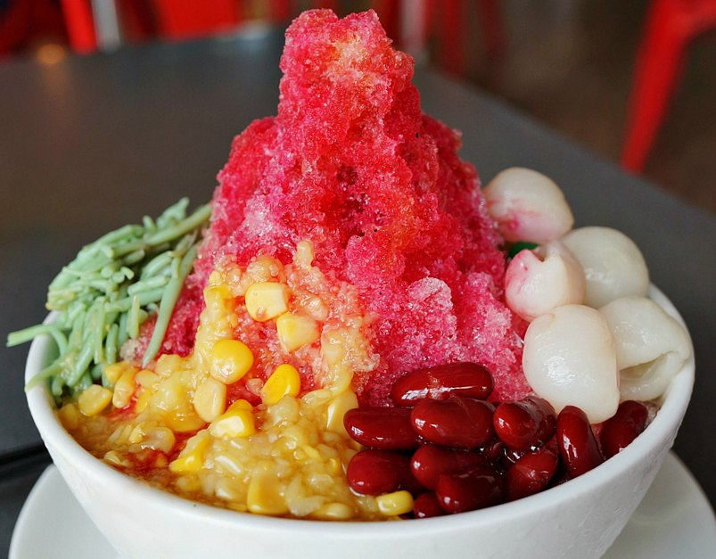

# Ice Kachang

*Singapore-Malay shaved-ice dessert: a mound of finely shaved ice piled high in a bowl, drizzled with rose syrup, palm sugar and condensed milk, and built over a base of red beans, sweet corn, grass jelly, agar cubes and palm-fruit. The hawker-stall summer cooler.*

**Serves:** 4

**Prep Time:** 20 minutes

**Cook Time:** None

## Overview
Ice kachang ("kachang" means "beans" in Malay) is the rainbow-coloured shaved-ice dessert of Singapore and Malaysia, sold from hawker stalls equipped with hand-cranked or electric ice shavers. The classic build is layered from the bottom up: a spoonful of cooked red beans, sweet corn kernels, grass jelly cubes, agar-jelly cubes, and sometimes palm fruit (attap chee) at the base; then a tall mound of shaved ice over the top; then a flamboyant drizzle of rose syrup (the bright pink), palm-sugar syrup (the dark brown), and a generous pour of condensed milk for the white. Eaten with a long spoon, mixing the ice into the syrups as you go.

## Ingredients

### Base (cooked / ready)
- 100 g cooked red azuki beans (from a tin, sweetened type)
- 100 g sweet corn kernels (tinned)
- 100 g grass jelly (cincau), cut into 1 cm cubes - sold ready in tins/blocks at Asian shops
- 100 g attap chee (palm fruit) in syrup - optional but traditional
- 100 g rainbow agar-jelly cubes - shop-bought or home-made

### Shaved ice
- 2 litres ice cubes (regular ice cubes work in a shaved-ice machine; if you don't have one, use a powerful blender for "snow ice")

### Syrups
- 4 tbsp rose syrup (the bright pink store-bought Singaporean kind, e.g. Marigold Rose)
- 4 tbsp palm sugar syrup (gula melaka melted with a splash of water)
- 4 tbsp sweetened condensed milk

### Optional toppings
- 50 g salted peanuts, crushed
- A scoop of vanilla ice cream

## Method

### Stage 1 - Prep the base
1. Drain the beans, corn, grass jelly, attap chee and agar cubes.
2. Have all the syrups and toppings ready.

### Stage 2 - Shave the ice
1. **With a shaved-ice machine:** feed ice cubes through; collect the snow-fine shavings.
2. **Without a machine:** in a powerful blender, pulse 500 g of ice cubes with 2 tbsp cold water for short bursts until you have fine snow. Repeat for each portion.
3. The texture should be like fresh snow - not crushed ice, which is too coarse.

### Stage 3 - Build
1. In each tall serving bowl, spoon a layer of red beans, then sweet corn, grass jelly cubes, attap chee and agar cubes (about 2 tbsp each).
2. Mound the shaved ice generously over the top - aim for a dome shape, packed loosely (it should be light, not compacted).

### Stage 4 - Sauce
1. Drizzle 1 tbsp rose syrup over the top of each ice mound.
2. Drizzle 1 tbsp palm sugar syrup over (the dark contrasts beautifully with the pink).
3. Pour 1 tbsp condensed milk over the top.
4. Scatter crushed peanuts if using; add a scoop of vanilla ice cream alongside.

### Stage 5 - Serve immediately
1. Place a long spoon in each bowl.
2. Eat right away - the ice melts fast.

## Notes
- **The base ingredients:** Available at most Asian/South-East Asian shops. Grass jelly (cincau) comes in tins as a solid block to cube. Sweet red beans (azuki) come pre-sweetened in tins.
- **Shaved ice texture:** Real shaved ice is feather-light and powdery. Crushed ice from a blender is coarser; it works, but the texture is noticeably less refined.
- **The drizzle:** Don't be shy with the syrups. Singapore ice kachang is meant to be excessive - bright pink, sticky-sweet, dripping condensed milk. Restraint defeats the point.

## Serving
- Serve in tall sundae bowls. Eat with a long spoon, mixing the ice down into the syrupy beans-and-corn base. A long pull of cold water on the side.

## Storage
- Eat immediately - the ice melts within 10 minutes.
- The base ingredients keep refrigerated 5 days.
- Make the ice fresh per serving.
