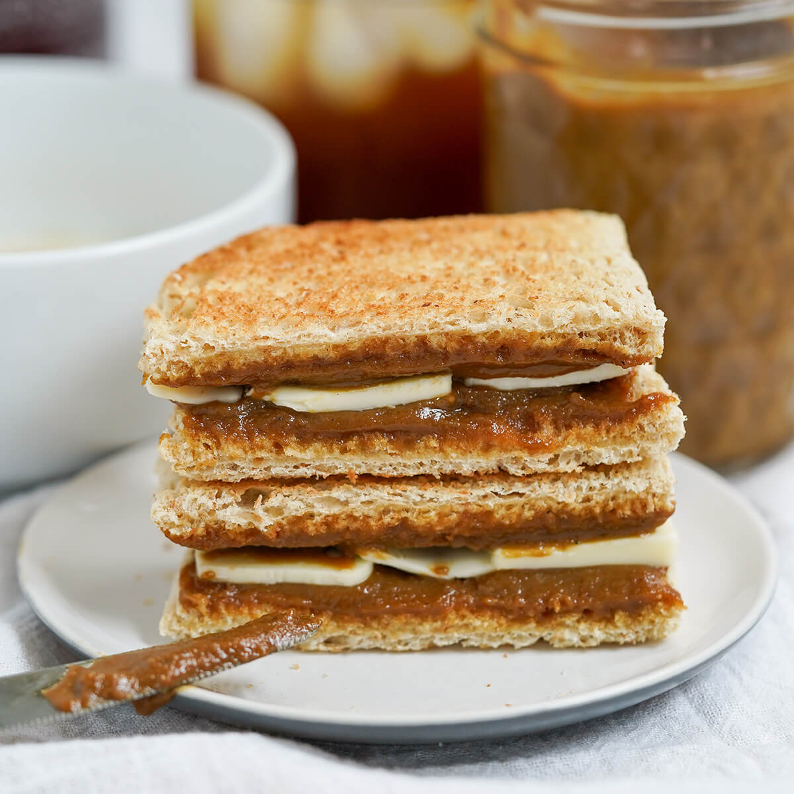

# Kaya Toast

*Singapore breakfast classic: thick slices of toasted white bread spread with cold butter and a generous layer of kaya - the green-tinged coconut-egg jam scented with pandan. Eaten alongside half-boiled eggs and a strong cup of kopi.*

**Serves:** Makes 1 jar kaya (about 400 g); enough for 12-15 toast portions

**Prep Time:** 10 minutes

**Cook Time:** 1 hour (kaya); 4 minutes (toast)

## Overview
Kaya toast is Singapore's signature breakfast and the inevitable last item at any kopitiam (traditional coffee shop). The "toast" part is simple - white bread, charcoal-toasted in the old days, electric-toasted now. The "kaya" part is the dish: a slow-cooked custard of coconut milk, eggs, sugar and pandan leaves, stirred patiently over a double boiler for an hour until it thickens to a spreadable green jam. The two go together with a generous slab of cold butter sandwiched between - the cold butter melts against the warm toast, the kaya provides the sweet coconut-pandan note, and the texture is bread, butter, jam, butter, bread. The proper Singapore breakfast pairs it with half-boiled eggs (whole-egg-in-shell, briefly cooked so the white is barely set and the yolk runny) and a small cup of strong condensed-milk-sweetened kopi.

## Ingredients

### Kaya (Coconut-pandan jam)
- 6 large egg yolks
- 200 g caster sugar
- 250 ml thick coconut cream (top of a refrigerated tin of coconut milk)
- 5 pandan leaves, knotted in a bundle (or 1 tsp pandan extract as substitute)
- 1/4 tsp salt

### Per portion of kaya toast
- 2 thick slices white bread (preferably the soft Asian "milk bread" or brioche-style)
- 30 g cold unsalted butter, sliced thick
- 2 tbsp kaya
- 2 soft-boiled eggs to serve (optional but traditional)
- A small cup of kopi or strong tea

## Method

### Stage 1 - Cook the kaya
1. Place a heatproof bowl over a saucepan of simmering water (double boiler / bain-marie).
2. In the bowl, whisk the egg yolks and sugar until smooth.
3. Whisk in the coconut cream.
4. Tuck the knotted pandan leaves into the mixture (or stir in pandan extract).
5. Add the salt.
6. Stir continuously with a wooden spoon or whisk over the simmering water for 45-60 minutes.
7. The kaya thickens slowly; you'll know it's ready when it coats the back of the spoon thickly and a line drawn through it stays clean (custard-test).
8. Lift out the pandan leaves.
9. For a smoother kaya, pass through a fine sieve.
10. Cool; transfer to a clean jar; refrigerate.

### Stage 2 - Make the toast
1. Toast the bread to deep golden brown - dark enough to be crisp on the outside but not burned.
2. Spread one slice with 2 tbsp kaya.
3. Lay 2-3 thick slices of cold butter on top - generous; the butter is half the dish.
4. Top with the second slice of toast.
5. Cut diagonally and serve immediately while the toast is still hot and the butter is starting to melt.

### Stage 3 - Half-boiled eggs (optional)
1. Bring a small pot of water to a boil; turn off the heat.
2. Lower 2 room-temperature eggs into the hot water.
3. Cover; rest 8 minutes - the whites set just barely, the yolks stay runny.
4. Crack into a small bowl; add a few drops of dark soy sauce and a pinch of white pepper.
5. Eat with a small spoon, between bites of toast.

## Notes
- **Pandan leaves:** Available frozen at South-East Asian shops. Pandan extract (the green liquid) is the convenient substitute. Without pandan the kaya is still good but loses its green colour and characteristic aroma.
- **Yolks only, not whole eggs:** Kaya is a yolk-rich custard. Save the whites for meringues or breakfast omelettes.
- **The slow cook:** 45-60 minutes over a bain-marie is correct. Cooking faster (direct heat) scrambles the eggs.

## Serving
Serve as breakfast in a Singapore kopitiam-style: kaya toast on a small plate, two half-boiled eggs in a saucer next to it (with a small bowl of dark soy + white pepper for seasoning), and a cup of kopi (Malayan-style coffee with sweetened condensed milk).

## Storage
- Kaya refrigerated 2 weeks in a clean sealed jar.
- Kaya freezes 3 months.
- Make the toast fresh per serving.
