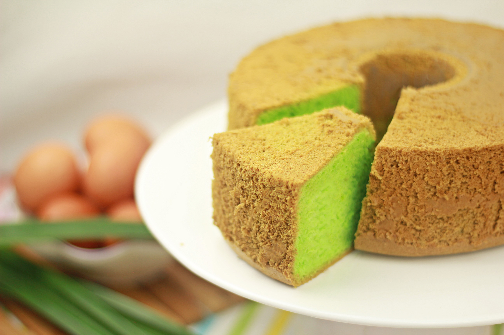

# Pandan Chiffon Cake

*Singapore pandan chiffon: a pale green spongy chiffon cake flavoured with the juice of fresh pandan leaves and a splash of coconut milk, baked tall and inverted to cool. The cake every Singaporean grandmother makes, sold in every neighbourhood bakery.*

**Serves:** 10-12 slices

**Prep Time:** 20 minutes

**Cook Time:** 50 minutes

## Overview
Chiffon cake came to Asia via American post-war influence; pandan chiffon is what Singapore did with it. The green colour comes from real pandan juice (blended fresh leaves with water, then strained); a splash of coconut milk in the batter reinforces the South-East Asian character. The technique is classic chiffon: oil-based batter (not butter-based), separately whipped egg whites folded in, baked in an ungreased tube pan, then inverted to cool. The result is a tall, springy, deeply green cake with a tender crumb and an unmistakable pandan aroma. Sliced into thick wedges and eaten with a cup of strong kopi.

## Ingredients

### Pandan juice
- 12 fresh pandan leaves (or 1 tsp pandan extract - the natural one, not bright green food colour)
- 80 ml water

### Cake batter
- 7 large eggs, separated, at room temperature
- 200 g caster sugar (split: 80 g for yolks, 120 g for whites)
- 100 ml vegetable oil
- 80 ml coconut milk
- 1 tsp vanilla extract
- 200 g cake flour (or plain flour minus 2 tbsp + 2 tbsp cornflour)
- 1.5 tsp baking powder
- 1/2 tsp salt
- 1 tsp cream of tartar (for stabilising the whites)

## Method

### Stage 1 - Make the pandan juice
1. Roughly chop the pandan leaves.
2. Place in a blender with the 80 ml water.
3. Blend to a thick green slurry.
4. Strain through muslin or a fine sieve, pressing out as much green liquid as possible.
5. You should get about 60 ml deep-green pandan juice.

### Stage 2 - Prep
1. Heat oven to 160 C.
2. Have an UNGREASED 23 cm chiffon (tube) pan ready - greasing prevents the chiffon from climbing the sides during baking.
3. In a wide bowl: separate the eggs. Whites in one bowl, yolks in another.

### Stage 3 - Yolk batter
1. To the yolks, add 80 g of the sugar; whisk until pale and slightly thickened.
2. Add the oil; whisk in.
3. Add the coconut milk, pandan juice and vanilla; whisk in.
4. Sift in the flour, baking powder and salt; whisk gently until smooth (don't overwork - chiffon is light).

### Stage 4 - Whip the whites
1. In a clean dry bowl, whisk the egg whites with the cream of tartar to soft peaks.
2. Gradually add the remaining 120 g sugar in 3 additions, whisking back to stiff glossy peaks.
3. The meringue should hold its shape on the whisk and slightly droop at the tip.

### Stage 5 - Fold and bake
1. Fold 1/3 of the meringue into the yolk batter to slacken it.
2. Fold the lightened batter back into the remaining meringue gently - keep the air in.
3. Pour into the ungreased chiffon pan.
4. Tap once on the counter to release large bubbles.
5. Bake 45-50 minutes - the top should spring back when lightly pressed.

### Stage 6 - Cool inverted
1. Immediately invert the pan onto a wire rack or onto a bottle through the central tube hole.
2. Cool fully upside-down (1-2 hours) - this prevents the chiffon from collapsing.

### Stage 7 - Release and serve
1. Run a thin spatula or knife around the edge of the pan.
2. Run around the central tube.
3. Lift out; gently release the cake from the bottom plate.
4. Slice with a serrated knife.

## Notes
- **Real pandan, not food colouring:** Fresh pandan leaves give a soft, natural green and a real aromatic. Pandan extract (the natural one) is acceptable; bright artificial green food colouring is the wrong choice.
- **Ungreased pan:** The cake clings to the sides as it rises, which is what gives it the tall springy structure. Greasing makes it collapse.
- **Inverted cooling:** Non-negotiable. A chiffon that cools right-way-up collapses under its own weight.

## Serving
- Serve in thick wedges at room temperature with a small cup of kopi or tea. A dusting of icing sugar is optional but the cake is meant to stand alone.

## Storage
- In an airtight tin at room temperature: 3 days.
- The cake stays moist a long time; don't refrigerate (humidity makes it soggy).
- Freezes 2 months wrapped well.
