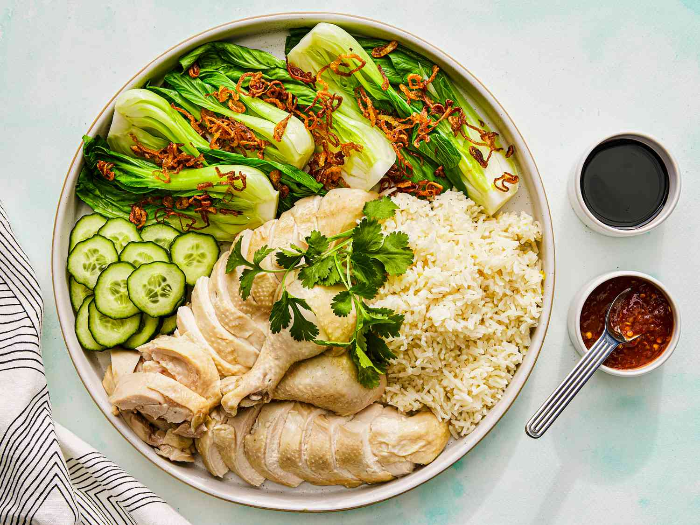

# Hainanese Chicken Rice

*Singapore's national dish: a whole chicken poached gently in seasoned stock, the cooking liquid then used to cook rice with garlic and ginger. Served sliced and at room temperature with chilli sauce, dark sweet soy and a small bowl of the poaching broth.*

**Serves:** 4-6

**Prep Time:** 30 minutes

**Cook Time:** 1 hour 15 minutes

## Overview
Hainanese chicken rice came to Singapore with 19th-century Hainanese immigrants and became, over generations, the country's most claimed dish. A whole chicken is poached gently (never boiled - boiling toughens it) in a stock seasoned with ginger, spring onion and pandan; once cooked, it's plunged into ice water to firm the skin and set it aside. The poaching liquid then becomes the cooking water for jasmine rice that has been first toasted with ginger, garlic and pandan in chicken fat. The chicken is sliced; the rice is mounded alongside; and three sauces (the famous bright-red chilli sauce, dark sweet soy, and fresh ginger) come on the side. A small bowl of clarified poaching broth completes the plate.

## Ingredients

### Chicken and poaching liquid
- 1 whole chicken (1.5-1.8 kg), preferably free-range
- 2 thumbs of ginger, sliced
- 6 spring onions, white parts only
- 2 pandan leaves, tied in a knot (optional but traditional - sub bay leaf)
- 2 tbsp sea salt
- 1 tbsp sesame oil
- 2 litres water (enough to submerge the chicken)
- A bowl of iced water (for the ice bath)

### Rice
- 400 g jasmine rice
- 30 g chicken fat (skimmed from the chicken cavity before cooking) - sub 30 ml vegetable oil
- 1 small onion, finely chopped
- 4 cloves garlic, minced
- 1 thumb of ginger, finely grated
- 1 pandan leaf, knotted (or 1 bay leaf)
- 600 ml of the chicken poaching broth
- 1 tsp salt

### Chilli sauce
- 6 fresh red chillies (mix bird's eye and milder long red)
- 4 cloves garlic
- 1 thumb of ginger
- 1 tbsp lime juice
- 1 tbsp sugar
- 1/2 tsp salt
- 60 ml of the chicken poaching broth

### Ginger sauce
- 1 thumb of ginger, finely grated
- 2 spring onions, white parts only, finely chopped
- 1/2 tsp salt
- 60 ml hot oil

### To serve
- Dark sweet soy sauce (kecap manis), to drizzle
- Sliced cucumber
- Coriander sprigs

## Method

### Stage 1 - Prep the chicken
1. Trim the chicken of excess fat from the cavity (save it for the rice).
2. Rub the chicken inside and out with sea salt; rinse.
3. Stuff the cavity with the sliced ginger, spring onion whites and pandan.

### Stage 2 - Poach
1. Fill a large pot with 2 litres water; bring to a strong boil.
2. Lower the chicken into the boiling water, breast-down. The water should just cover.
3. Reduce heat to the gentlest simmer - barely bubbling.
4. Cover; cook 35-40 minutes (5 min per 250 g). The chicken is done when the juices from the thigh run clear.

### Stage 3 - Ice bath
1. Lift the chicken carefully into a bowl of iced water for 5 minutes - this firms the skin and gives Hainanese chicken its signature smooth gelatinous texture under the skin.
2. Lift out; rub the skin with sesame oil.
3. Reserve the poaching broth.

### Stage 4 - Make the rice
1. Rinse the jasmine rice until the water runs clear.
2. Render the chicken fat in a wide pot over medium heat (or use 30 ml vegetable oil).
3. Add the chopped onion; cook 5 minutes.
4. Add garlic and ginger; cook 1 minute.
5. Add the rinsed rice; toast in the fat for 2 minutes, stirring.
6. Pour in 600 ml of the poaching broth; add salt and pandan.
7. Bring to a strong simmer; reduce to lowest heat, cover tightly.
8. Cook 15 minutes; rest covered 10 more minutes.

### Stage 5 - Make the sauces
- **Chilli sauce:** Blend all ingredients to a smooth paste.
- **Ginger sauce:** Mix grated ginger, spring onion and salt in a heatproof bowl. Heat the oil until shimmering and pour over - it sizzles. Stir.

### Stage 6 - Assemble
1. Chop the chicken into pieces (or carve and slice).
2. Mound the rice on a serving plate.
3. Arrange the chicken pieces on top or alongside.
4. Garnish with cucumber and coriander.
5. Serve the chilli sauce, ginger sauce and dark sweet soy in small dishes on the side.
6. Ladle clear poaching broth into small bowls for each diner.

## Notes
- **The gentlest simmer:** Boiling toughens the chicken. The water should be just barely bubbling - 90-93 C. A thermometer helps.
- **The ice bath:** Critical for the texture under the skin. Skip and the dish loses its character.
- **The three-sauce arrangement:** Each Singaporean has their preferred ratio. The chilli is the loudest; the ginger is the comfort; the dark soy is the depth. Most diners use all three.

## Serving
Serve at room temperature - the chicken should not be hot off the heat. The rice and broth are warm. A whole-meal plate.

## Storage
- Refrigerate the chicken and rice separately 3 days. Reheat the rice in a steamer; serve the chicken cold or briefly warmed.
- The poaching broth keeps refrigerated 4 days; freezes 3 months.
- The sauces keep refrigerated 1 week.
