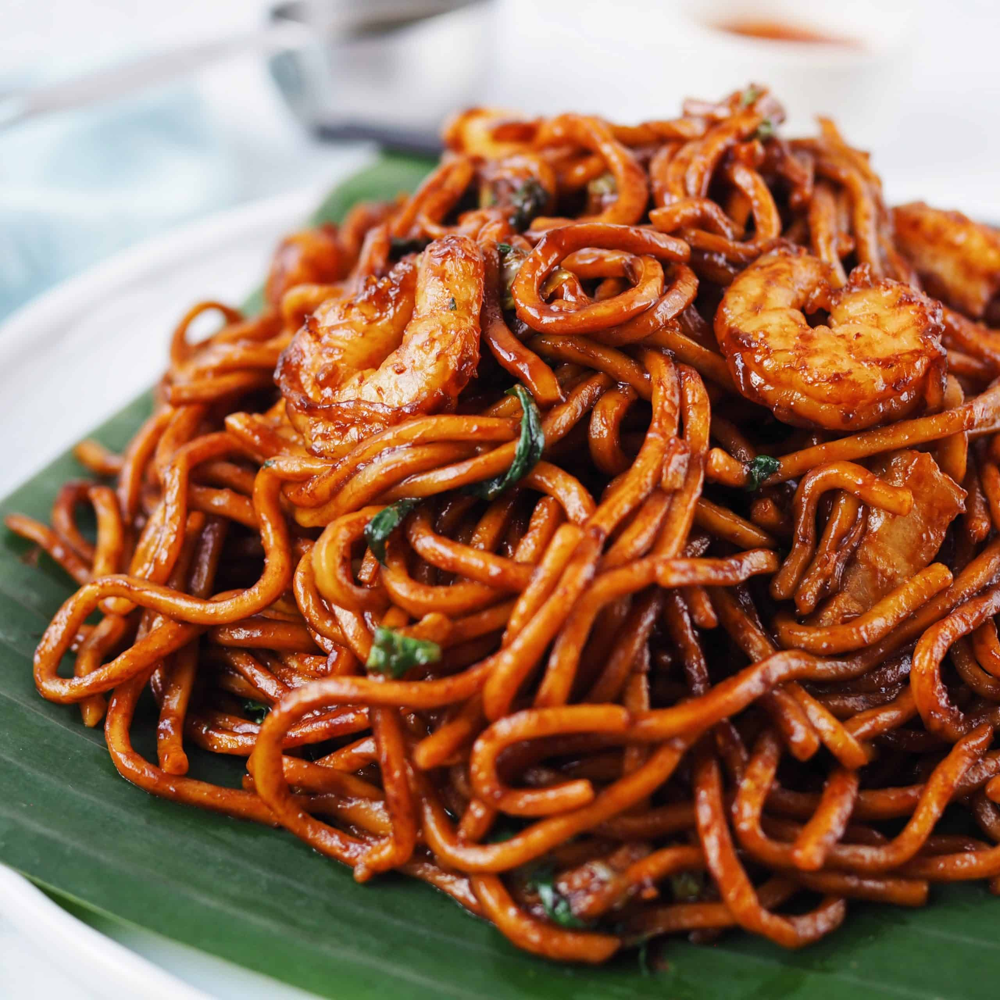

# Hokkien Mee

*Singapore Hokkien mee: yellow egg noodles and rice vermicelli stir-fried together with prawns, squid, pork belly and bean sprouts in a rich seafood-stock-and-soy sauce, finished with lime and sambal. The wok-charred hawker classic of Hokkien Singapore.*

**Serves:** 4

**Prep Time:** 25 minutes

**Cook Time:** 25 minutes

## Overview
Hokkien mee in Singapore (distinct from the darker Kuala Lumpur version) is a stir-fried noodle dish with strong wok-hei (the smoky char that only a properly hot wok produces). Yellow egg noodles and thin rice vermicelli are tossed together with prawns, squid rings, pork belly slices and bean sprouts, all in a stock-and-soy sauce that has reduced enough to coat the noodles without leaving them soupy. The dish finishes with lime juice squeezed over and a spoon of sambal belacan (shrimp-paste chilli sauce) on the side. Eaten standing up at a hawker stall, or sitting at a coffee shop with a Tiger beer.

## Ingredients

### Stock (or use 500 ml ready stock)
- Heads and shells from 200 g prawns
- 4 cups water
- 1 thumb of ginger
- 2 cloves garlic

### Stir-fry
- 300 g thick yellow egg noodles
- 200 g thin rice vermicelli, soaked in warm water 10 min and drained
- 200 g raw prawns, peeled (keep heads/shells for stock above)
- 200 g squid, cleaned and cut into rings
- 150 g pork belly, sliced thin
- 4 cloves garlic, minced
- 200 g bean sprouts
- 4 large eggs, lightly beaten
- 3 tbsp light soy sauce
- 2 tbsp dark soy sauce
- 1 tbsp fish sauce
- 1 tbsp sugar
- 1 tsp white pepper
- 4 tbsp vegetable oil
- 500 ml prawn stock (from above, or ready)

### To serve
- 1 lime, quartered
- 4 tbsp sambal belacan (or sambal oelek)
- 2 spring onions, sliced
- A handful of fresh coriander

## Method

### Stage 1 - Make the stock
1. In a small pot, combine the prawn heads/shells, water, ginger and garlic.
2. Simmer 25 minutes; strain. Discard solids. Reserve the stock.

### Stage 2 - Prep everything mise-en-place
1. Have the noodles, prawns, squid, pork, garlic, bean sprouts, beaten eggs and sauces all ready at the wok station - this dish moves fast once cooking starts.

### Stage 3 - Stir-fry
1. Heat the wok over the highest possible heat until smoking.
2. Add 2 tbsp oil; swirl. Add the pork belly slices; stir-fry 2 minutes until crisp at the edges. Add the garlic; stir 20 seconds.
3. Add the prawns and squid; stir 1 minute until they begin to turn opaque.
4. Push everything to one side; add the remaining 2 tbsp oil to the empty space; pour in the beaten eggs.
5. Let the eggs set for 15 seconds, then scramble briefly; mix with the other ingredients.
6. Add both noodles; toss to combine.
7. Pour in soy sauces, fish sauce, sugar, white pepper.
8. Ladle in the stock 100 ml at a time, tossing constantly - the noodles absorb the stock.

### Stage 4 - Finish
1. Add the bean sprouts in the final minute; toss just to wilt slightly (they should stay crunchy).
2. Taste; adjust soy and sugar.

### Stage 5 - Serve
1. Tip onto wide plates.
2. Scatter spring onion and coriander.
3. Serve with lime wedges and a small dish of sambal belacan on each plate.

## Notes
- **The wok must be screaming hot:** Wok-hei is what distinguishes hawker hokkien mee from a home stir-fry. If your wok smokes when oil hits it, you're in the right zone.
- **Don't overcrowd:** Cook in 2 batches if you don't have a big enough wok. Crowding steams the noodles and they go soft.
- **Stock-soup balance:** The dish is wet (slightly soupy at the bottom of the plate) but the noodles should be coated, not floating. Add stock gradually.

## Serving
- Serve immediately on wide plates. Lime + sambal belacan are non-negotiable accompaniments - the lime cuts the richness; the sambal adds the heat.

## Storage
- Best the same hour. Cold hokkien mee is acceptable but loses the wok-hei character.
- Refrigerate 1 day; reheat briefly in a very hot pan.
