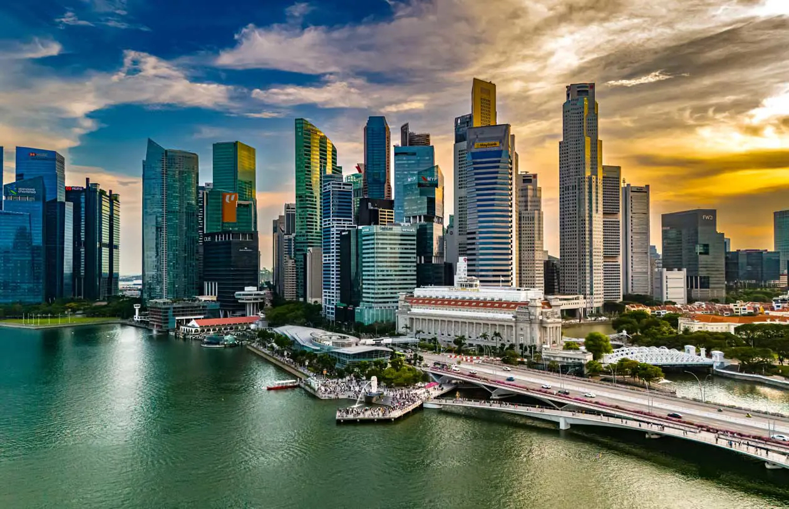

# Singaporean Cuisine

The hawker-stall food of a city-state where Cantonese, Hokkien, Teochew, Malay, Tamil, Peranakan and British colonial inheritance share the same coffee-shop counter. The national dish is Hainanese chicken rice; the showstopper is chilli crab; the soul is laksa, kaya toast, satay and the kopi-tea ritual that powers the morning kopitiam.
