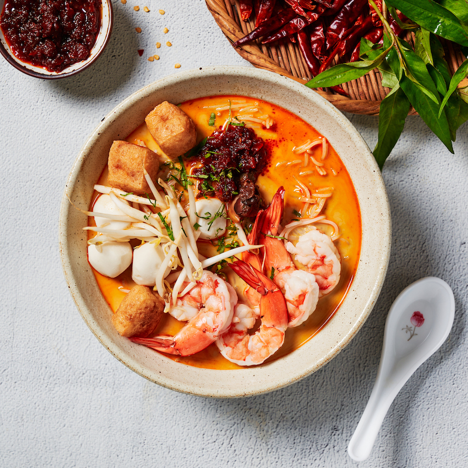

# Singapore Laksa

*Singapore laksa: thick rice noodles in a creamy coconut-and-prawn-stock broth coloured deep orange by sambal and turmeric, topped with prawns, fish cake, beansprouts and a generous handful of laksa leaf (Vietnamese mint). The hawker-stall staple.*

**Serves:** 4

**Prep Time:** 30 minutes (plus shrimp paste roasting)

**Cook Time:** 1 hour

## Overview
Laksa exists in many forms across Singapore, Malaysia and Indonesia; the Singapore version is "Katong laksa," named for the neighbourhood where its style was perfected - thick rice vermicelli noodles (cut short, eaten with just a spoon, no chopsticks needed) swimming in a coconut curry broth heavy with dried shrimp, prawn stock and a chilli-and-spice paste. Toppings: cooked prawns, sliced fishcake, beansprouts, a hard-boiled egg, and a fistful of laksa leaf (daun kesum) torn over the bowl just before eating. Bright, spicy, deeply savoury - the hawker bowl that defines morning Singapore.

## Ingredients

### Laksa paste
- 6 dried red chillies, soaked in hot water 20 min, drained
- 4 fresh red chillies (mild)
- 5 shallots, peeled
- 6 cloves garlic
- 2 lemongrass stalks, white parts only, sliced
- 1 thumb of ginger
- 1 thumb of galangal (sub ginger if unavailable)
- 1 tsp ground turmeric (or 1 thumb fresh)
- 3 candlenuts (sub macadamia nuts), crushed
- 2 tbsp dried shrimp, rinsed and rehydrated
- 1 tbsp belacan (Malaysian shrimp paste), toasted (or 1 tbsp Thai shrimp paste)
- 4 tbsp vegetable oil

### Broth
- 1.5 litres prawn or chicken stock (or use prawn shells from the prawns below)
- 400 ml coconut milk
- 1 tsp salt
- 2 tsp sugar

### Toppings
- 16 large raw prawns, peeled (keep shells for stock if making fresh)
- 200 g fish cake (Asian-style, sliced)
- 200 g cooked cockles or clams (optional)
- 4 hard-boiled eggs, halved
- 300 g bean sprouts
- 600 g thick rice vermicelli noodles
- 1 large bunch laksa leaf (daun kesum / Vietnamese mint), torn - substitute fresh mint + coriander
- 2 limes, quartered

## Method

### Stage 1 - Make the paste
1. Place all paste ingredients (except oil) in a food processor or blender.
2. Add 2 tbsp of the oil; blend to a smooth paste, scraping down the sides.

### Stage 2 - Fry the paste
1. Heat the remaining 2 tbsp oil in a heavy pot.
2. Tip in the paste; fry over medium-low heat for 8-10 minutes, stirring frequently, until the paste darkens and the oil separates.

### Stage 3 - Build the broth
1. Pour in the stock; bring to a simmer.
2. Add the coconut milk, salt and sugar.
3. Simmer 20 minutes for the flavours to meld.

### Stage 4 - Cook the prawns and fish cake
1. Drop the raw prawns into the simmering broth; cook 2-3 minutes until pink and just curled. Lift out.
2. Add the fish cake slices and cockles (if using); cook 1 minute. Lift out.

### Stage 5 - Cook the noodles
1. Bring a separate pot of water to a boil.
2. Soften the rice vermicelli in hot water 5 minutes (or per packet); drain.
3. Briefly blanch the bean sprouts in the same water 30 seconds.

### Stage 6 - Assemble
1. Divide the noodles between 4 bowls.
2. Top with prawns, fish cake, cockles, bean sprouts and half an egg.
3. Ladle the hot broth over.
4. Scatter torn laksa leaf over the top.
5. Serve with lime wedges.

## Notes
- **Shrimp paste (belacan):** Distinctly Malaysian-Singaporean; substitute Thai shrimp paste at half the quantity. The toasting step (briefly heated in a dry pan) intensifies the flavour.
- **Laksa leaf:** Also called daun kesum or Vietnamese coriander - available at Asian shops. Without it, the dish still works but loses a key signature.
- **Thick noodles:** Use the round rice vermicelli, not the thin angel-hair kind. Thick ones hold up in the broth.

## Serving
Serve very hot. A small dish of extra chilli sauce alongside for those who want more heat. A Tiger beer is the traditional Singapore pairing.

## Storage
- Best fresh. The broth refrigerates 3 days; cook noodles and prawns fresh.
- The paste freezes 3 months in small portions.
