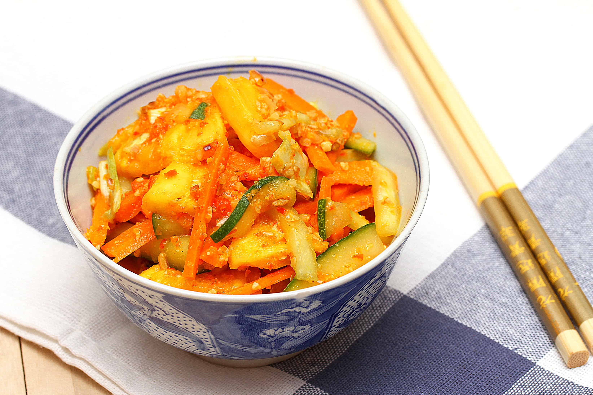

# Singapore Achar

*Singapore-Peranakan pickled vegetables: julienned carrot, cucumber, cabbage and pineapple tossed in a sweet-sour vinegar dressing with a fragrant spice paste of chilli, shallot, garlic and turmeric. The sharp-cold pickle that cuts through every rich Singapore main.*

**Serves:** 6 as a side

**Prep Time:** 30 minutes

**Cook Time:** 15 minutes

## Overview
Achar is the Indian-Malay-Peranakan pickled vegetable tradition adapted in Singapore to its sweet-sour-spicy local taste. Julienned vegetables (carrot, cucumber, cabbage, and the Singapore signature touch of fresh pineapple) are salted briefly to draw out moisture, then tossed in a vinegar dressing perfumed with a fried spice paste of chilli, shallot, garlic and turmeric. The result is sharp, hot, sweet and crunchy - the perfect counterpoint to the rich coconut-and-spice mains of Peranakan cooking. Sits on the table beside chilli crab, laksa, or any rice-and-meat plate.

## Ingredients

### Vegetables
- 1 medium cucumber, halved lengthways, seeded, cut into 6 cm batons
- 2 medium carrots, peeled and cut into 6 cm batons
- 1/4 small white cabbage, finely shredded
- 200 g fresh pineapple, cut into 1.5 cm pieces
- 2 tbsp sea salt
- 200 ml white vinegar

### Spice paste
- 4 dried red chillies, soaked in hot water 20 min, drained
- 2 fresh red chillies (mild)
- 4 shallots, peeled
- 4 cloves garlic
- 1 thumb fresh turmeric (or 1 tsp ground)
- 1 thumb of ginger
- 4 candlenuts (sub macadamia nuts)
- 2 tbsp vegetable oil

### Dressing
- 200 ml white vinegar
- 150 g caster sugar
- 1 tsp salt
- 3 tbsp toasted peanuts, crushed (optional)
- 2 tbsp toasted sesame seeds (optional)

## Method

### Stage 1 - Salt the vegetables
1. Combine the cucumber, carrot, cabbage and pineapple in a colander.
2. Sprinkle with 2 tbsp sea salt; toss.
3. Pour over the 200 ml vinegar; toss.
4. Rest 30 minutes - moisture draws out and the vegetables soften slightly.
5. Squeeze handfuls firmly to extract liquid; rinse briefly; squeeze dry. Set aside.

### Stage 2 - Make the spice paste
1. Place all paste ingredients (except oil) in a blender. Pulse to a coarse paste.
2. Heat the oil in a wide pan over medium-low heat.
3. Add the paste; fry 8-10 minutes, stirring, until it has darkened in colour and the oil separates at the edges.

### Stage 3 - Make the dressing
1. In a saucepan, combine the 200 ml vinegar, sugar and 1 tsp salt.
2. Heat over medium, stirring, until the sugar dissolves.
3. Simmer 5 minutes to reduce slightly.

### Stage 4 - Combine
1. Add the squeezed vegetables to the spice paste in the pan; toss thoroughly to coat.
2. Pour over the warm vinegar dressing.
3. Toss; cool to room temperature.

### Stage 5 - Mature
1. Transfer to clean glass jars.
2. Refrigerate at least 24 hours before eating; 48 hours is better.
3. Just before serving, sprinkle the crushed peanuts and sesame seeds over the top.

## Notes
- **Salting the vegetables:** Critical for the crunch - skipping it leaves a watery pickle. The salt-then-rinse-then-squeeze cycle is non-negotiable.
- **The spice paste fry:** 8-10 minutes is correct. Under-fried paste leaves a raw chilli-and-garlic edge.
- **Maturation:** Like all pickles, achar improves with time. After 48 hours the flavours have melded; eat over 2-3 weeks.

## Serving
Serve as a small dish alongside any rich Singaporean main. Particularly good with chilli crab, fried chicken, biryani.

## Storage
- Refrigerate 3 weeks in sealed glass jars.
- Add the peanuts and sesame just before serving - they go soggy in the brine.
