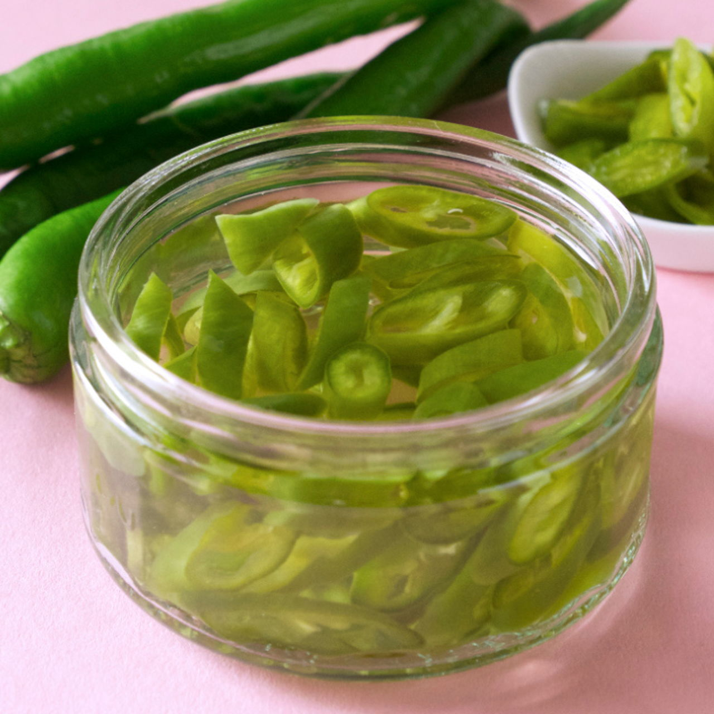

# Pickled Green Chilli

*Singapore-style pickled green chillies: sliced fresh green bird's-eye and finger chillies in a sweet-sour vinegar brine, served as the table condiment beside Hainanese chicken rice and most hawker dishes.*

**Serves:** 1 small jar (about 200 ml)

**Prep Time:** 10 minutes

**Cook Time:** 5 minutes

## Overview
Singapore's iconic pickled green chilli is the small bowl of green discs sitting on every chicken rice plate. Fresh long green chillies (the milder Asian ones, sometimes mixed with a few bird's-eye for heat) are sliced into thin rounds and submerged in a sweet-sour vinegar brine. After 24 hours the chillies have softened slightly, lost some of their raw bite, and taken on a sharply pickled tang that cuts through coconut-heavy sauces and rich poached chicken. A few rings on each spoon of chicken rice is the way. Lives on the table for months.

## Ingredients
- 6 fresh long green chillies (Asian-style, mild) - or use 4 long + 2 bird's-eye for more heat
- 200 ml white vinegar (rice vinegar or distilled white)
- 100 ml water
- 4 tbsp caster sugar
- 1 tsp salt
- 2 cloves garlic, smashed
- 1 small piece of ginger, sliced
- 1 bay leaf (optional)

## Method

### Stage 1 - Slice the chillies
1. Wash the chillies; trim the stem ends.
2. Slice into thin rounds (2-3 mm thick), discarding the stem cap.
3. Pack into a clean glass jar with the smashed garlic, ginger and bay.

### Stage 2 - Make the brine
1. Combine vinegar, water, sugar and salt in a small saucepan.
2. Heat over medium, stirring, until the sugar dissolves.
3. Bring to a gentle simmer 1 minute; remove from heat.
4. Cool to lukewarm (not boiling hot - this would cook the chillies).

### Stage 3 - Pour and mature
1. Pour the lukewarm brine over the packed chillies until fully submerged.
2. Press the chillies down if any float; weight with a clean small bowl or jar if needed.
3. Seal the jar.
4. Rest 24 hours at room temperature before first eating.

## Notes
- **Mild long chillies:** The Singapore standard is the milder long green chilli, not bird's-eye. The dish wants tangy pickle character, not blistering heat. Adjust the ratio of mild-to-hot to your preference.
- **Cool brine:** Pouring hot brine over the chillies softens them too much and dulls the green colour. Lukewarm is the standard.
- **Float issue:** The chillies want to float. Press them down with a glass weight or a small jar lid sitting on the surface.

## Serving
- Serve on every Singaporean plate, in a small dish. Spoon a few rings onto each mouthful of chicken rice, laksa, hokkien mee or any other hawker classic.

## Storage
- Refrigerate after the first 24 hours; keeps 2-3 months in the brine.
- The chillies soften over time; eat within a month for the best crunch.
