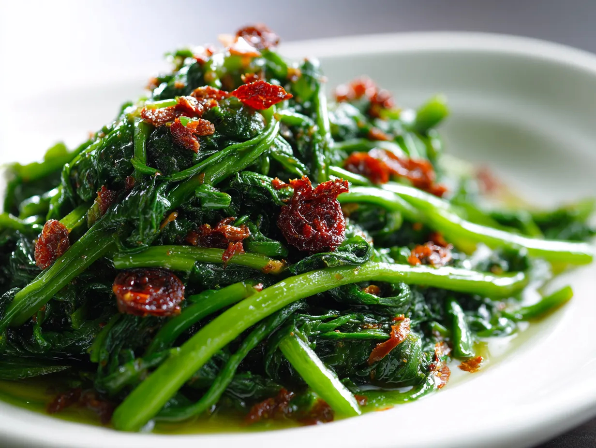

# Sambal Kangkung

*Singapore-style stir-fried water spinach: kangkung (water spinach) tossed in a hot wok with a sambal of dried shrimp, chilli, garlic and belacan. The hawker-stall green side that turns up beside almost every Singaporean meal.*

**Serves:** 4

**Prep Time:** 15 minutes

**Cook Time:** 8 minutes

## Overview
Kangkung (water spinach, also called morning glory or ong choy) grows in the wet ditches and waterways of Southeast Asia; in Singapore it's the everyday hawker green. The leaves are tender and slightly mucilaginous; the hollow stems stay crunchy. Stir-fried hard in a screaming-hot wok with a sambal of dried shrimp, chilli, garlic and belacan (Malaysian-Singaporean shrimp paste), the result is a fast wok-charred plate of bright green leaves and crunchy stems coated in a smoky-spicy paste. The umami of the belacan against the freshness of the greens is the signature.

## Ingredients
- 400 g kangkung (water spinach) - substitute morning glory, or spinach + water chestnuts for crunch
- 2 tbsp dried shrimp, rinsed and roughly chopped
- 2 fresh red chillies (mix mild long red + bird's eye), finely chopped
- 6 cloves garlic, minced
- 1 tbsp belacan (shrimp paste) - toasted briefly in foil before use to mellow it
- 3 tbsp vegetable oil
- 1 tbsp light soy sauce
- 1 tsp sugar
- 1 tbsp Shaoxing wine (or dry sherry)
- 1/4 tsp salt
- 1/2 tsp white pepper

## Method

### Stage 1 - Prep
1. Wash the kangkung thoroughly (water spinach grows in ditches; rinse well).
2. Trim off the thick lower stems (the bottom 4-5 cm).
3. Cut the remaining kangkung into 8 cm lengths, keeping leaves and stems together.

### Stage 2 - Make the sambal
1. In a small bowl or mortar, combine the chopped dried shrimp, chillies, garlic and toasted belacan. Pound or mash into a rough paste.

### Stage 3 - Stir-fry
1. Heat the wok over the highest possible heat until smoking.
2. Add the oil; swirl.
3. Tip in the sambal paste; stir-fry 30 seconds - it smells intense and slightly funky.
4. Add the kangkung stems first; toss 30 seconds.
5. Add the leaves; toss vigorously for 1-2 minutes - the leaves wilt fast.
6. Splash in the soy sauce, sugar, Shaoxing wine, salt and white pepper; toss for 30 seconds more.
7. The greens should be vibrant and slightly wilted, the stems still crunchy.

### Stage 4 - Serve
1. Tip onto a serving plate.
2. Eat immediately.

## Notes
- **Toasting belacan:** Wrap a small piece of belacan in foil and toast over a flame or in a dry pan for 30 seconds per side. This mellows the harsh raw shrimp flavour and intensifies the umami.
- **High heat:** This dish lives or dies on wok-hei. If the wok isn't smoking when the oil hits, the kangkung steams instead of stir-frying.
- **Don't overcook:** Kangkung leaves wilt in seconds. Total stir-fry time should be 2-3 minutes from when the greens hit the wok.

## Serving
Serve hot as a side alongside any Singaporean main - chilli crab, Hainanese chicken rice, laksa, or a simple bowl of plain rice.

## Storage
- Best the same hour. Reheated kangkung loses its bite.
- The sambal paste keeps refrigerated 1 week in a sealed jar.
