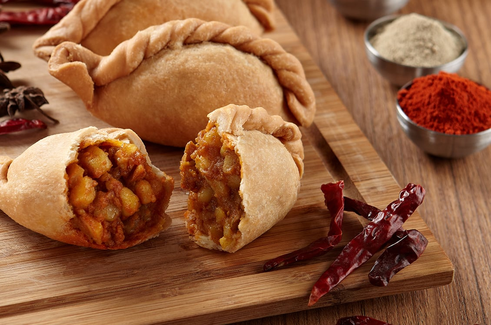

# Curry Puff

*Singapore curry puff: a fork-crimped pastry parcel of curried potato, chicken or sardine, deep-fried golden and eaten warm with the hands. The market-stall, kopitiam and roadside snack across Singapore.*

**Serves:** Makes 16 puffs

**Prep Time:** 45 minutes

**Cook Time:** 30 minutes (plus filling cool time)

## Overview
The curry puff (also called karipap in Malay) is Singapore's bite-sized samosa cousin - shorter, flakier, fork-crimped along the rim instead of folded into triangles, deep-fried until golden. The filling is curried diced potato with chicken or sardine, the curry mild-to-medium, with hard-boiled egg as the traditional inclusion that nobody quite agrees about. The pastry sits between a samosa wrapper and a Cornish pasty - shortcrust that's firm enough to crimp into the signature scalloped pattern. Eaten warm with the hands, ideally with a small cup of kopi or teh tarik.

## Ingredients

### Pastry
- 350 g plain flour
- 1 tsp salt
- 1 tsp sugar
- 90 g chilled unsalted butter, cubed
- 90 ml ice-cold water (approximately)

### Filling
- 2 tbsp vegetable oil
- 1 large onion, finely chopped
- 4 cloves garlic, minced
- 1 thumb of ginger, grated
- 1 small green chilli, finely chopped
- 2 tbsp Madras-style curry powder
- 1/2 tsp ground turmeric
- 1/2 tsp ground cumin
- 250 g chicken thigh, finely chopped (or 250 g tinned sardines, drained, mashed)
- 300 g potato, peeled and diced into 5 mm pieces
- 100 ml chicken stock
- 1 tsp salt
- 1/2 tsp sugar
- 2 hard-boiled eggs, chopped (optional)
- 2 tbsp chopped fresh coriander

### For frying
- 1 litre vegetable oil

## Method

### Stage 1 - Make the pastry
1. Combine flour, salt and sugar in a wide bowl. Whisk to distribute.
2. Rub in the chilled butter with the fingertips until the mixture looks like coarse breadcrumbs.
3. Gradually add the cold water, mixing with a butter knife, until a dough just comes together.
4. Bring together with the hands - don't overwork.
5. Wrap in cling film; refrigerate 30 minutes.

### Stage 2 - Make the filling
1. Heat the oil in a wide pan. Soften the onion 8 minutes.
2. Add garlic, ginger, chilli. Cook 1 minute.
3. Stir in the curry powder, turmeric and cumin. Cook 30 seconds until fragrant.
4. Add the chicken (or sardines). Brown 4 minutes.
5. Add the diced potato; toss to coat in the spices.
6. Pour in the stock, salt and sugar.
7. Reduce heat to low; cover; cook 15 minutes until the potato is tender and the liquid mostly absorbed.
8. Off heat, stir in chopped egg (if using) and coriander.
9. Cool fully before using - hot filling will melt the pastry.

### Stage 3 - Roll and fill
1. Divide the pastry into 16 portions.
2. Roll each into a ball; flatten with a rolling pin into a 10-11 cm disc.
3. Place 1 tbsp of filling in the centre of each disc.
4. Brush the rim with cold water; fold over to make a half-moon.
5. Press the edges to seal.

### Stage 4 - Crimp
1. With the edge of a fork, press the rim along the curved edge to make the signature scalloped pattern.
2. Or pinch with thumb and forefinger to make a twisted rope edge (the more traditional Malay style).

### Stage 5 - Fry
1. Heat the oil to 170 C in a deep heavy pan.
2. Fry 3-4 puffs at a time, 5-7 minutes, turning once, until deep golden brown.
3. Lift onto kitchen paper to drain briefly.

## Notes
- **Cool filling before sealing:** Hot filling melts the butter in the pastry, causing soggy crusts and burst seams when frying.
- **Don't overfill:** Each puff takes about 1 tbsp filling. Overfilled puffs burst at the seam during frying.
- **Crimping styles:** Fork-crimped is the Singapore-Chinese style; pinched-rope is the Malay style. Either is correct - regional preference.

## Serving
Serve warm in a basket lined with greaseproof paper. A small dish of kicap manis (Malay sweet soy sauce) or a sweet chilli sauce for dipping.

## Storage
- Best the same day, warm from the fryer.
- Refrigerate 2 days; refresh in a hot oven (190 C, 8 minutes).
- Freeze unfried puffs on a tray, then transfer to a bag, up to 2 months; fry from frozen, adding 2-3 minutes to the cooking time.
