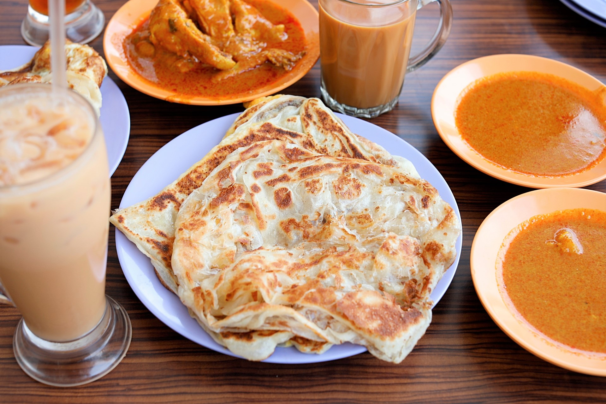

# Roti Prata

*Singapore-Indian flaky flatbread: a soft dough stretched paper-thin, folded into layers, pan-fried in ghee until golden and shatteringly crisp on the outside, soft and chewy inside. Eaten with a hot curry for breakfast or a dollop of sugar for kids' tea.*

**Serves:** Makes 6 prata

**Prep Time:** 30 minutes (plus 4-hour or overnight rest)

**Cook Time:** 25 minutes

## Overview
Roti prata is the Singapore-Indian version of the Indian paratha - same dough family, evolved in Singapore's hawker culture into a particular style. The dough is yeasted lightly and enriched with ghee, oil, milk and a touch of sugar; it's rested several hours so the gluten relaxes; then each portion is stretched out paper-thin on an oiled work surface (the "flipping" technique - some prata-makers throw and stretch overhead), folded into multiple layers, and pan-fried in ghee. The hot pan crisps the outside layers; the inside layers stay tender and chewy. Served with a hot fish or chicken curry for dipping at breakfast, or with plain sugar for the kid version.

## Ingredients

### Dough
- 500 g plain flour
- 1 tsp instant yeast
- 1 tsp salt
- 2 tbsp caster sugar
- 30 g ghee, melted (or vegetable oil)
- 1 large egg, beaten
- 150 ml warm milk
- 100 ml warm water (approximately)

### Cooking
- 100 g ghee, melted (for stretching the dough and frying)
- 4 tbsp neutral oil

### To serve
- 1 portion of fish or chicken curry (sub a thin yellow dhal)
- Granulated sugar (the kids' option)

## Method

### Stage 1 - Mix the dough
1. In a wide bowl, combine flour, yeast, salt and sugar. Whisk to distribute.
2. Add the melted ghee, egg, warm milk and gradually the warm water. Mix to a soft dough.
3. Knead 10 minutes on a lightly floured surface until smooth and elastic.

### Stage 2 - First rest
1. Coat the dough lightly in oil; place in a bowl. Cover with cling film.
2. Rest at room temperature 1 hour.

### Stage 3 - Portion and oil
1. Divide the dough into 6 equal balls.
2. Brush each ball generously with melted ghee.
3. Place on an oiled tray. Cover; rest a further 3 hours at room temperature (or refrigerate overnight).

### Stage 4 - Stretch each prata
1. Brush a wide work surface lightly with oil.
2. Place a dough ball on the surface; flatten with the palm.
3. Stretch the dough outward with both hands, working it into a paper-thin disc about 30-35 cm wide. (Some prata-makers throw and stretch overhead - this is theatrical, not necessary.)
4. The dough should be so thin you can almost see through it. Tears are fine.
5. Fold one side toward the centre, then the opposite side over the top, then the top and bottom edges, forming a layered square parcel about 12 cm across.

### Stage 5 - Pan-fry
1. Heat a wide flat pan or griddle over medium-high heat.
2. Brush with melted ghee.
3. Place a folded prata on the pan; cook 1.5-2 minutes per side until deeply golden and the layers are visible.
4. Press gently with a spatula to help the layers crisp.
5. Lift onto a board.

### Stage 6 - Fluff
1. Slap the cooked prata between your palms (or scrunch with two spatulas) - this loosens the layers and reveals the flaky internal structure.

## Notes
- **The long rest:** 3-4 hours minimum, overnight is better. The gluten needs to relax for the dough to stretch paper-thin without tearing.
- **The stretch:** Paper-thin is the goal. The thinner the stretch, the more layers when folded, the flakier the final prata.
- **Ghee not butter:** Ghee has a higher smoke point and the authentic flavour. Vegetable oil works but loses character.

## Serving
- Serve hot with a fish or chicken curry on the side for the proper breakfast version, or with granulated sugar in a small dish for the kids' tea-time version. Tearing the prata with the hands and dipping into the curry is the right way.

## Storage
- Best fresh and hot. Stretched-and-folded prata can be frozen between sheets of greaseproof paper for up to 1 month; cook from frozen, adding 30-60 seconds per side.
- Cooked prata refrigerates 2 days; refresh briefly in a hot dry pan.
