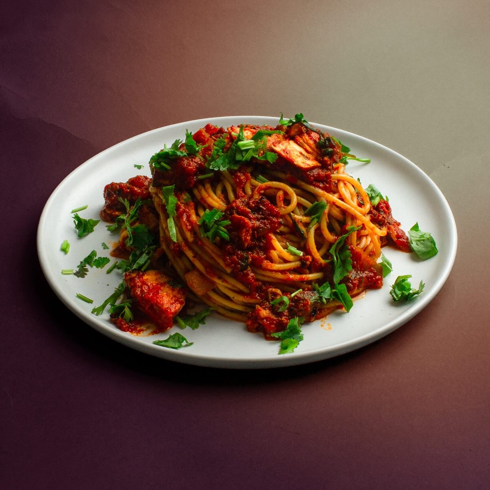

# Baasto iyo Suugo

*Somalia's Italian-influenced pasta: spaghetti tossed with a thick spiced tomato-and-beef sauce of xawaash, garlic, cardamom and cumin. The Italian colonial inheritance turned thoroughly Somali, eaten with sliced banana on the side at every Mogadishu family lunch.*

**Serves:** 4-6

**Prep Time:** 15 minutes

**Cook Time:** 50 minutes

## Overview
Baasto iyo suugo is Somalia's everyday Italian-Somali fusion pasta, the dish that emerged from the 60-year Italian colonial presence in the Horn of Africa and stayed long after independence to become a permanent fixture in the Somali kitchen: long spaghetti tossed with a thick spiced tomato-and-beef sauce that is recognisably built on the Italian ragù alla bolognese but reseasoned with xawaash (the Somali spice blend), cardamom, cumin and a fresh green chilli, finished with chopped coriander rather than basil. The name translates as "pasta and sauce" (baasto from pasta, suugo from sugo); the words carry the colonial inheritance plainly. Where the Italian ragù relies on oregano, bay and basil, the Somali suugo uses xawaash, cardamom, cinnamon and cumin. One spoonful and you know you're not in Italy. The proper Somali touch is sliced ripe banana on the side: the sweet counter to the spiced savoury sauce. Italians find this combination scandalous; Somalis insist on it.

## Ingredients

### Pasta
- 500 g spaghetti (or any long pasta; bucatini works too)
- 4 litres water (for boiling)
- 2 tablespoons fine sea salt (for the pasta water)

### Sauce
- 3 tablespoons vegetable oil (or olive oil)
- 1 large onion (finely chopped)
- 6 garlic cloves (crushed)
- 1 thumb (3 cm) fresh ginger (finely grated)
- 1 large carrot (finely diced)
- 500 g minced beef (or beef + lamb mince, 50/50)
- 1 teaspoon fine sea salt (for the beef)
- 2 tablespoons tomato purée
- 1 (400 g) tin chopped tomatoes
- 1 (400 g) tin chopped tomatoes (second tin; this dish wants a properly thick tomato sauce)

### Spices
- 2 tablespoons xawaash (Somali spice blend; see maraq-digaag for the recipe)
- 1 teaspoon ground turmeric
- 2 whole cardamom pods (lightly crushed)
- 1 small cinnamon stick
- 1 bay leaf
- 1 fresh green chilli (deseeded and finely chopped)

### Seasoning
- 1 teaspoon fine sea salt
- ½ teaspoon ground black pepper
- 1 teaspoon caster sugar (to balance acidity)
- 200 ml beef stock (or water)

### To finish
- 3 tablespoons fresh coriander (chopped)
- 1 tablespoon olive oil (drizzled at the end)

### To serve
- Grated Parmesan (the small Italian survival on the Somali plate; optional)
- Sliced banana (the proper Somali accompaniment; not optional in tradition)
- [Bisbaas](side-dishes/bisbaas.md)

## Method

### Stage 1 - Build the aromatic base
1. Heat the vegetable oil in a wide heavy saucepan over medium heat.
2. Add the chopped onion and sweat 7-8 minutes till soft and just starting to colour at the edges.
3. Stir in the crushed garlic and grated ginger; cook 30 seconds.
4. Add the diced carrot; cook 3-4 minutes till softened.

### Stage 2 - Brown the mince
1. Push the vegetables to one side of the pan and add the beef mince to the cleared space.
2. Season with the teaspoon of salt for the beef.
3. Break up the mince with a wooden spoon and let it brown undisturbed for 3-4 minutes so the underside caramelises.
4. Then mix everything together and continue cooking 3-4 minutes till most of the mince has lost its pink colour and is showing some brown patches.

### Stage 3 - Bloom the spices
1. Stir in the tomato purée; cook 2 minutes till it darkens.
2. Add the xawaash, turmeric, crushed cardamom pods, cinnamon stick and bay leaf.
3. Cook 30 seconds, stirring constantly, till the spices darken the oil and the kitchen smells deeply aromatic.

### Stage 4 - Build the tomato sauce
1. Add both tins of chopped tomatoes.
2. Stir in the chopped green chilli, salt, black pepper and sugar.
3. Pour in the beef stock.
4. Bring to a gentle simmer.

### Stage 5 - Slow simmer
1. Reduce the heat to low.
2. Simmer uncovered for 25-30 minutes, stirring every 5 minutes, till the sauce reduces and thickens to a properly ragù-like consistency: thick, deep red, with the oil starting to separate at the edges.
3. Taste; adjust salt, pepper, sugar.
4. The finished sauce should cling to a wooden spoon without dripping.

### Stage 6 - Cook the pasta
1. Meanwhile, bring the 4 litres of water to a rolling boil in a large pan.
2. Add the salt to the boiling water (it should taste like seawater).
3. Add the spaghetti; cook till just al dente (usually 1 minute less than the packet says, since the pasta will continue cooking briefly when tossed in the sauce).
4. Reserve about 200 ml of the pasta cooking water, then drain the pasta.

### Stage 7 - Combine
1. Remove the cinnamon stick, bay leaf and cardamom pods from the sauce.
2. Add the drained pasta to the sauce pan (or transfer the sauce to the pasta pan if the sauce pan is too small).
3. Toss thoroughly so every strand is coated in the spiced sauce, adding splashes of the reserved pasta water if the mixture seems too thick.
4. Stir in the chopped coriander.

### Stage 8 - Serve
1. Divide between warm bowls.
2. Drizzle a little olive oil over each portion.
3. Top with grated Parmesan if using (the Italian survival).
4. Place sliced banana on the side of each plate (the Somali signature; don't skip).
5. Bisbaas in a small dish for those who want heat.
6. Serve immediately.

## Notes
- **Xawaash makes it Somali:** the spice blend is what transforms Italian ragù into Somali baasto iyo suugo. Without xawaash, you've made spaghetti bolognese. With it, you've made an everyday Mogadishu lunch.
- **Two tins of tomato is right:** the sauce wants to be properly thick after the long simmer. One tin would give a watery sauce; two tins reduce down to the proper thick ragù consistency.
- **The banana is non-negotiable in tradition:** sliced banana alongside the pasta is the Somali signature. Try it before judging; the sweet-acid banana cuts through the rich spiced tomato beautifully. If you absolutely can't stomach it, the dish still works without, but it's not properly Somali.
- **Long simmer for proper depth:** the 25-30 minutes of slow simmering is what gives the sauce its proper rich character. Rushing it (10-15 minutes) gives a thin-tasting sauce.
- **Pasta water is your friend:** the starchy reserved pasta water helps the sauce cling to the pasta when you toss them together. Splash in 2-3 tablespoons; you can always add more.

## Variations
**Baasto iyo suugo with vegetables:** add 100 g of peas and 100 g of small diced courgette in the last 5 minutes of the sauce simmer for a vegetable-rich version.
**Baasto iyo suugo digaag (with chicken):** swap minced beef for 500 g of diced chicken thigh; brown briefly before adding the tomato and reduce simmer time to 20 minutes. The lighter version.
**Suugo suqaar (sauce with cubed meat):** use 600 g of cubed beef shin instead of mince; simmer 45-60 minutes for tenderness, then toss with pasta. The Sunday-lunch version.
**Vegetarian suugo:** swap meat for 200 g of mushrooms diced fine and 150 g of green lentils; cook the lentils into the sauce till tender. Less traditional but works for fasting days.

## Serving
In wide bowls, with sliced banana on the side of each plate (the Somali touch). Bisbaas in a small dish for heat. Grated Parmesan optional. Drink: cold water or laban (cultured milk drink) traditionally; a glass of Italian wine if you want to embrace the colonial inheritance fully.

## Storage
- Sauce keeps refrigerated 4 days; freezes 3 months. Day-after suugo is excellent on fresh pasta.
- The combined pasta-and-sauce keeps refrigerated 2 days but the pasta absorbs the sauce and goes drier. Better to store sauce separately and cook fresh pasta to serve.
- Don't microwave the combined dish; the pasta goes mushy and the sauce splits.
