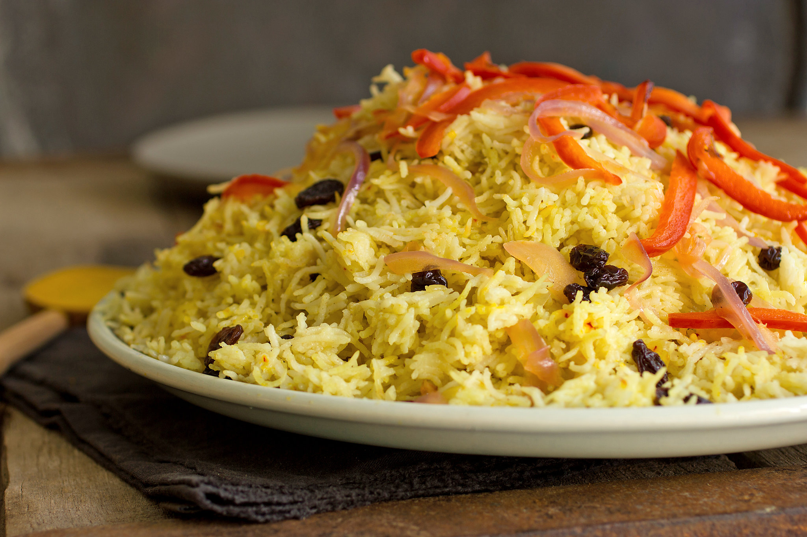

# Bariis Iskukaris

*Somalia's celebration rice: long-grain basmati cooked with browned beef or lamb in a fragrant base of xawaash (Somali spice blend), tomato, onion, raisins and ghee. The dish that turns up at every Somali wedding, Eid table and family gathering.*

**Serves:** 6

**Prep Time:** 20 minutes

**Cook Time:** 1 hour 15 minutes

## Overview
Bariis iskukaris is Somalia's celebration rice dish, the one-pot fragrant basmati pilaf that turns up at every Somali wedding, Eid table and family gathering: long-grain basmati cooked with browned cubed beef or lamb in a thick base of caramelised onion, tomato, garlic, ginger and xawaash, enriched with ghee and finished with raisins and fried onions. The name translates as "rice cooked together" (bariis = rice, iskukaris = self-cooked / mixed). The dish is the Somali cousin to the wider Indian Ocean rice family (Indian biryani, Yemeni mandi, East African pilau): gentler spicing than biryani, technique closer to a one-pot pilaf than a layered bake, carrying the African, Arabian and South Asian trade history of the Horn. Xawaash is the soul of the dish; the canonical mix is cumin, coriander, black pepper, cardamom, cinnamon and clove. The Somali finishing trick is a clean tea towel under the lid for the final ten minutes; the towel catches rising steam so the rice stays fluffy rather than sticky.

## Ingredients

### Meat
- 700 g beef chuck or lamb shoulder (cut into 3 cm cubes)
- 1 ½ teaspoons fine sea salt
- 1 teaspoon ground black pepper

### Sauté and aromatic base
- 4 tablespoons ghee (or vegetable oil)
- 3 large onions (1 cut into very thin slices for the fried-onion garnish, 2 finely chopped for the base)
- 8 garlic cloves (crushed)
- 1 thumb (4 cm) fresh ginger (finely grated)
- 4 large tomatoes (chopped, or 1 (400 g) tin chopped tomatoes)
- 2 tablespoons tomato purée

### Xawaash spice blend
- 2 tablespoons xawaash (homemade if possible: equal parts ground cumin, ground coriander, freshly ground black pepper, ground cardamom; with a third part ground cinnamon and a sixth part ground clove)
- 1 teaspoon ground turmeric
- 1 teaspoon ground cinnamon (additional)
- 4 whole cardamom pods (lightly crushed)
- 4 whole cloves
- 1 small cinnamon stick
- 1 bay leaf

### Rice
- 600 g long-grain basmati rice (rinsed in cold water till the water runs clear)

### Liquid
- 1.2 litres hot beef stock (or chicken stock; or water with 2 stock cubes)

### Finishing
- 80 g raisins (soaked in 100 ml warm water for 10 minutes, drained)
- 1 small potato (peeled, cut into 2 cm cubes; optional traditional addition)

### To serve
- Chopped fresh coriander
- [Bisbaas](side-dishes/bisbaas.md) (Somali green chilli relish)
- Banana slices (the traditional accompaniment on the side of the plate)

## Method

### Stage 1 - Make the fried onion garnish
1. Heat half of the ghee (2 tablespoons) in a small pan over medium heat.
2. Add the thinly sliced onion (the first onion) and fry, stirring frequently, for 12-15 minutes till deep golden brown and crisp at the edges.
3. Watch carefully in the last 3-4 minutes; the line between crisp golden and burnt black is narrow.
4. Lift onto kitchen paper to drain.
5. Set aside; this is the finishing garnish.

### Stage 2 - Brown the meat
1. Pat the cubed meat dry with kitchen paper.
2. Season with the salt and pepper.
3. Heat the remaining 2 tablespoons of ghee in a wide heavy lidded casserole (a Dutch oven or a deep heavy saucepan with a tight-fitting lid) over high heat till the ghee shimmers.
4. Add the meat in batches (don't crowd; the temperature drops and meat steams instead of sears).
5. Brown each batch hard for 4-5 minutes, turning once, till deeply caramelised on most sides.
6. Tip browned meat into a bowl.

### Stage 3 - Build the aromatic base
1. Reduce the heat to medium. Add the 2 chopped onions (not the fried-onion garnish ones) to the residual ghee in the pan.
2. Sweat 6-8 minutes till soft and golden, scraping up any caramelised bits from the meat browning.
3. Stir in the crushed garlic and grated ginger; cook 30 seconds.
4. Add the tomato purée; cook 2 minutes till it darkens.
5. Add the chopped tomatoes; cook 5-6 minutes till they break down into a thick pulp and the oil starts to separate.

### Stage 4 - Bloom the xawaash
1. Stir in the xawaash, turmeric and additional ground cinnamon. Add the cardamom pods, cloves, cinnamon stick and bay leaf.
2. Cook for 1 minute, stirring constantly, till the oil takes on the deep brown-red colour of the spices and the kitchen smells deeply aromatic. The blooming step is critical; raw xawaash stirred into liquid tastes dusty.

### Stage 5 - Combine meat and braise
1. Return the browned meat (with its resting juices) to the pan.
2. Stir to coat in the spiced tomato base.
3. Pour in enough hot stock to just cover the meat (about 400 ml).
4. Bring to a simmer, cover with the lid slightly ajar, and cook 40-45 minutes on low heat till the meat is tender. Check halfway; if the sauce is reducing too fast, add a splash of stock.

### Stage 6 - Add the rice
1. Stir in the rinsed basmati rice (and the diced potato if using).
2. Pour in the remaining hot stock; the liquid should be about 2 cm above the rice.
3. Stir to distribute the rice evenly through the meat.
4. Stir in the soaked drained raisins.

### Stage 7 - Cook the rice
1. Bring to a gentle boil, then reduce to the lowest heat.
2. Cover the pan with a clean folded tea towel laid over the top, then place the lid on tightly over the towel (the towel absorbs condensation; this is the Somali technique that gives proper fluffy rice).
3. Cook 18-20 minutes without lifting the lid. The rice absorbs the stock and turns tender.

### Stage 8 - Rest and fluff
1. Remove from the heat, leave the towel-and-lid in place, and rest 10 minutes for the rice to finish steaming.
2. Lift the lid and tea towel; the rice should be cooked through and the liquid absorbed.
3. Fluff gently with a fork, lifting from the bottom so the meat and rice mix evenly.

### Stage 9 - Serve
1. Pile the bariis iskukaris onto a wide serving platter.
2. Scatter the fried crisp onion garnish over the top.
3. Scatter chopped fresh coriander.
4. Place a small bowl of bisbaas (green chilli relish) on the side, and a small dish of sliced banana (the traditional Somali accompaniment that cuts the spice).
5. Diners help themselves, eating from a shared platter with the right hand.

## Notes
- **Xawaash is the soul:** the Somali household spice blend is what makes this dish properly Somali rather than a generic spiced rice. If you don't have it, the recipe in the ingredient list is the canonical mix: cumin, coriander, black pepper, cardamom (equal parts) plus cinnamon (one-third) and clove (one-sixth). Grind fresh in a mortar or coffee grinder. Make extra and keep in a jar; it lasts months.
- **The towel-under-the-lid technique:** this is the Somali rice-cooking signature. The towel absorbs steam that would otherwise condense on the lid and drip back onto the rice, making it sticky. The trapped dry heat steams the rice properly fluffy. Use a clean dry tea towel.
- **Brown the meat properly:** the deep caramelisation on the cubed meat during the searing stage is what builds the fond on the pan bottom, which becomes the base of the sauce. Pale browned meat gives a pale-tasting dish.
- **Don't lift the lid during rice cooking:** every time you lift the lid, you lose steam and the rice cooks unevenly. Trust the 18-20 minute timing plus the 10-minute rest.
- **The banana garnish is real:** sliced banana on the side of a plate of bariis iskukaris is the Somali way; the sweetness of the banana cuts the spice and the richness of the rice. Don't skip if you can get a ripe banana.

## Variations
**Bariis with chicken:** swap beef/lamb for bone-in chicken thighs; reduce simmer time to 25 minutes. The weeknight version.
**Bariis with goat:** the most prestigious version; goat shoulder cubed and simmered 60 minutes before the rice goes in. Wedding banquet version.
**Suugo bariis:** the simpler everyday version, where the rice is cooked plain and a separate tomato-meat sauce is spooned over at serving. Less fancy; quicker.
**Vegetarian bariis:** swap meat for 600 g of mixed vegetables (carrot, potato, peas, green beans) browned briefly; cook the rice with the spiced tomato base and vegetable stock. Common during Ramadan iftars.

## Serving
On a wide platter at the centre of the table; diners eat from the shared platter with the right hand or with forks. Bisbaas (the green chilli relish) is essential on the side for those who want heat. A side dish of sliced banana is the traditional Somali touch. Drink: cold water, shaah (Somali spiced tea), or fresh laban (cultured milk).

## Storage
- Keeps refrigerated 3 days; the flavour deepens overnight.
- Freezes 2 months. Defrost in the fridge and reheat in a covered pan over low heat with a splash of stock.
- Don't microwave; the rice goes gluey and the meat dries out.
