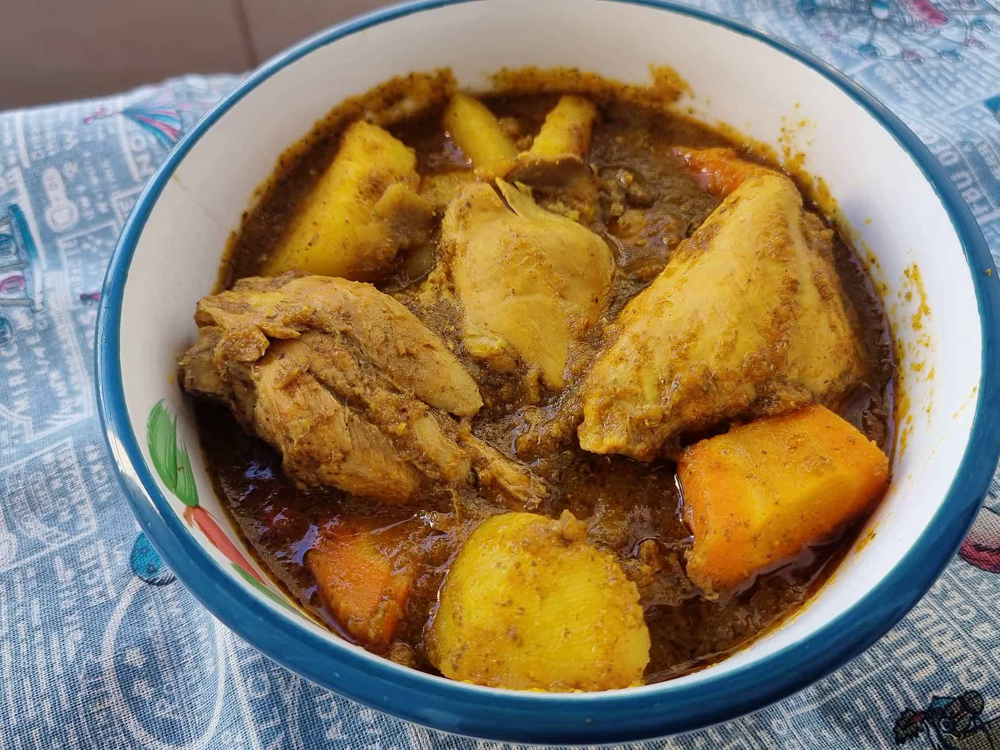

# Maraq Digaag

*Somalia's chicken stew: bone-in chicken pieces simmered in a fragrant broth of xawaash, tomato, onion, garlic and ginger, finished with chopped coriander and lemon. Eat with anjero or basmati rice, the everyday Somali main that turns up in every household kitchen.*

**Serves:** 4-6

**Prep Time:** 20 minutes

**Cook Time:** 1 hour

## Overview
Maraq digaag is the everyday Somali chicken stew (maraq = stew or soup; digaag = chicken), the household weeknight main that turns up across Somalia and the diaspora as the most-cooked dish after rice and pasta: bone-in chicken simmered in a deeply fragrant broth of xawaash, tomato, onion, garlic, ginger and a fresh green chilli, finished with chopped coriander and a generous squeeze of lemon. The dish reflects the broader Horn-of-Africa stew tradition, where the same maraq technique applies to beef, lamb or goat; chicken is the lightest and quickest of the family. Xawaash is what makes the stew Somali rather than generic; a household blend ground fresh in a mortar beats supermarket curry powder. The slow tomato-onion base is the second key: onions sweated low and slow till golden, then tomato reduced till the oil splits at the edges. Bone-in chicken gives the broth depth from the gelatin in the bones. Served over rice or with anjero to scoop.

## Ingredients

### Chicken
- 1.5 kg bone-in chicken pieces (thighs, drumsticks, breasts cut in half; skin on or off as preferred)
- 1 ½ teaspoons fine sea salt
- 1 teaspoon ground black pepper

### Sauté base
- 4 tablespoons vegetable oil (or ghee for a richer version)
- 2 large onions (finely chopped)
- 6 garlic cloves (crushed)
- 1 thumb (3 cm) fresh ginger (finely grated)
- 4 large tomatoes (chopped; or 1 (400 g) tin chopped tomatoes)
- 2 tablespoons tomato purée
- 1 fresh green chilli (deseeded and finely chopped; or 1 whole Scotch bonnet unpierced for serious heat)

### Spice blend
- 2 tablespoons xawaash (Somali spice blend; see Notes for the recipe)
- 1 teaspoon ground turmeric
- 2 whole cardamom pods (lightly crushed)
- 2 whole cloves
- 1 small cinnamon stick
- 1 bay leaf

### Liquid
- 600 ml chicken stock (or water)

### To finish
- 3 tablespoons fresh coriander (chopped)
- ½ lemon (juice)
- 2 tablespoons fresh parsley (chopped, optional)

### To serve
- Basmati rice or [anjero](anjero.md)
- [Bisbaas](side-dishes/bisbaas.md)
- Sliced banana (optional, traditional)

## Method

### Stage 1 - Season the chicken
1. Pat the chicken pieces dry with kitchen paper.
2. Season all over with the salt and pepper.
3. Set aside while you build the base.

### Stage 2 - Build the aromatic base
1. Heat the oil in a wide heavy lidded casserole over medium heat.
2. Add the chopped onions; sweat 10-12 minutes till soft and properly gold. Don't rush this stage; the slow onion cook is the foundation of the dish.
3. Stir in the crushed garlic and grated ginger; cook 1 minute till the raw smell goes.

### Stage 3 - Bloom the xawaash
1. Stir in the tomato purée; cook 2 minutes till it darkens.
2. Add the xawaash, turmeric, crushed cardamom, cloves, cinnamon stick and bay leaf.
3. Cook 30 seconds, stirring constantly, till the spices darken the oil and the kitchen smells deeply aromatic.

### Stage 4 - Build the tomato base
1. Add the chopped tomatoes; cook 5-6 minutes till they break down into a thick pulp and the oil splits at the edges of the pan.
2. Add the chopped green chilli (or tuck in the whole Scotch bonnet).

### Stage 5 - Add the chicken
1. Nestle the seasoned chicken pieces into the spiced tomato base.
2. Turn each piece to coat in the sauce on both sides.
3. Pour in the chicken stock; the liquid should come about two-thirds up the chicken pieces.
4. Bring to a gentle simmer.

### Stage 6 - Cook
1. Cover with the lid slightly ajar.
2. Simmer on low heat for 35-40 minutes, turning the chicken halfway, till the chicken is properly cooked through (juices run clear when pierced at the thickest part) and tender enough to pull from the bone.

### Stage 7 - Reduce
1. Lift the lid off entirely.
2. Continue simmering 10-15 minutes more to reduce the sauce by about a third till it thickens to a glossy coating consistency rather than a thin broth.
3. Spoon sauce over the chicken pieces as it reduces.

### Stage 8 - Finish
1. Remove the whole Scotch bonnet (if used), bay leaf and cinnamon stick.
2. Stir in the chopped fresh coriander.
3. Squeeze in the lemon juice.
4. Taste; adjust salt.

### Stage 9 - Serve
1. Spoon a portion of cooked basmati rice or place a folded anjero on each plate.
2. Lay 2-3 pieces of chicken alongside.
3. Spoon generous amounts of the spiced sauce over both the rice and the chicken.
4. Scatter parsley over (if using).
5. Bisbaas on the side for heat; sliced banana for the proper Somali touch.

## Notes
- **Xawaash recipe:** the Somali household spice blend. Mix 2 parts ground cumin, 2 parts ground coriander, 2 parts ground black pepper, 1 part ground cardamom, 1 part ground cinnamon, ½ part ground clove. Grind whole spices fresh if possible. Keeps months in a sealed jar.
- **Bone-in chicken matters:** the bones add gelatin and flavour to the broth; boneless chicken gives a thinner-tasting maraq. Skin on or off depends on preference; skin on gives a richer sauce but more fat to skim. Skin off works fine.
- **The slow onion cook:** 10-12 minutes of low-medium heat is the proper Somali approach. The onions should be soft, sweet and gold, not just translucent. This base flavour is what makes the dish.
- **Bloom the spices:** the 30 seconds of cooking xawaash in the hot oil before liquid goes in is what extracts the aromatic compounds from the spice. Skipping it leaves a raw-spice flavour.
- **Reduce uncovered at the end:** the covered simmer cooks the chicken; the uncovered reduction thickens the sauce. Don't skip the second stage; a thin broth instead of a coating sauce is the most common home-cook mistake.

## Variations
**Maraq lo'aad (beef):** swap chicken for diced beef shin; brown the beef hard first, then proceed with the same technique but simmer 90 minutes for tender beef.
**Maraq ari (lamb):** lamb shoulder cubed; same technique, 75 minutes simmer.
**Maraq with vegetables:** add 1 large carrot, 2 small potatoes (diced) and 100 g of green beans in the last 25 minutes; turns the maraq into a hearty one-pot vegetable-and-chicken meal.
**Maraq jellab (the leaner version):** less oil, more tomato, more liquid; gives a soupier broth-like maraq closer to a stew-soup, served over rice with the broth spooned generously.

## Serving
Over basmati rice or with anjero to scoop. Bisbaas on the side. Sliced banana on the plate (the proper Somali sweet counter to the spice). Drink: cold water, shaah (Somali tea spiced with cardamom and cinnamon), or fresh laban (cultured milk).

## Storage
- Keeps refrigerated 3 days. The flavour deepens overnight; day-after maraq is excellent.
- Freezes 2 months. Defrost in the fridge and reheat over low heat with a splash of water.
- Don't microwave; the chicken goes rubbery and the sauce splits.
