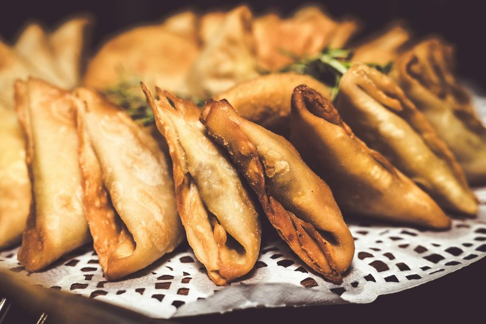

# Sambusa

*Somali samosas: triangular fried pastries filled with spiced lentils, peas and onion, eaten constantly during Ramadan and as a snack year-round. Smaller than Indian samosas; the wrapper is closer to a spring-roll skin than shortcrust. Served with green chilli sauce or chutney.*

**Makes:** 16 sambusas

**Prep Time:** 30 minutes

**Cook Time:** 25 minutes

## Overview
Sambusa is Somalia's triangular fried pastry, the snack you find on every iftar table during Ramadan and on tea trays year-round, smaller than its Indian samosa cousin with a thinner crisper wrapper closer to a spring-roll skin than shortcrust. The filling is a quietly aromatic mix of cooked brown lentils, frozen peas, onion, garlic, ginger and the Somali spice mix xawaash (cumin, coriander, cardamom and cinnamon in roughly equal parts, the four spices that say Somali cooking). Simmer rinsed lentils in water for 18 to 20 minutes till tender but still holding shape, drain. Soften an onion in oil for six minutes, add garlic, ginger and chopped green chilli for a minute, then in go the spices and salt for thirty seconds before the lentils and peas join and cook two or three minutes till the mixture is dry-ish (a wet filling tears the wrappers). Off the heat with chopped fresh coriander, cool fully (warm filling melts the spring roll skins and you can't fold them cleanly). Cut spring roll wrappers diagonally into triangles, fold one corner over to form a cone and seal the seam with flour-water paste, spoon in a tablespoon of cooled filling, then fold the open edge down over itself and seal closed into a tidy triangle. Cover finished sambusas under a damp cloth as you go (loose folds open in the oil; tight ones stay shut, so use enough paste and press every seam). Heat 4 cm of oil to 180°C in a deep pan and fry in batches of four or five for three or four minutes turning till deep golden, drain on paper. Eat hot with green chilli sauce, a sharp coriander chutney, or simply a wedge of lemon.

## Ingredients

### Filling
- 200 g brown lentils (rinsed)
- 600 ml water
- 3 tablespoons vegetable oil
- 1 onion (large, finely chopped)
- 4 garlic cloves (crushed)
- 2 cm fresh ginger (grated)
- 1 long green chilli (finely chopped)
- 200 g frozen peas (thawed)
- 2 teaspoons ground cumin
- 1 teaspoon ground coriander
- ½ teaspoon ground cardamom
- ½ teaspoon ground cinnamon
- ½ teaspoon ground turmeric
- 1 teaspoon salt
- A small bunch of coriander (chopped)

### Wrappers and frying
- 16 spring roll wrappers (22 cm; cut diagonally in half - you want triangles)
- 4 tablespoons plain flour mixed with 4 tablespoons water (sealing paste)
- Vegetable oil for deep-frying

## Method

### Stage 1 - Lentils
1. Cover the lentils with the 600 ml water; bring to the boil; reduce to a simmer.
1. Cook 18-20 minutes until tender but still holding shape; drain.

### Stage 2 - Filling
1. Heat the oil in a wide pan over medium heat.
1. Cook the onion 6 minutes until soft.
1. Add the garlic, ginger and chilli; cook 1 minute.
1. Stir in all the spices and salt; cook 1 minute.
1. Add the lentils and peas; cook 2-3 minutes until the mixture is dry-ish.
1. Off the heat, stir in the fresh coriander.
1. Cool fully before filling - warm filling tears the wrappers.

### Stage 3 - Fold
1. Cut spring roll wrappers diagonally to make triangles.
1. Take one triangle; fold one corner over to make a cone shape; seal the seam with paste.
1. Spoon a tablespoon of filling into the cone.
1. Fold the open edge down over itself; seal closed with paste - making a tidy triangle.
1. Repeat for all wrappers; cover finished sambusas with a damp cloth.

### Stage 4 - Fry
1. Heat 4 cm of oil in a deep pan to 180°C.
1. Fry in batches of 4-5 for 3-4 minutes, turning, until deep golden.
1. Drain on kitchen paper.

### Stage 5 - Serve
1. Eat hot with green chilli sauce, chutney, or simply a wedge of lemon.

## Notes
- **Spring roll wrappers are non-traditional but easier:** Real Somali sambusa wrappers (lakhsuus) are hand-rolled. Spring roll skins are widely available and fry well.
- **Fold tight:** Loose folds open in the oil; tight ones stay shut. Use enough paste to seal every seam.
- **Cool the filling:** Warm filling melts wrappers; cold filling means clean folding.

## Storage
- Best fresh; re-crisp leftovers at 200°C for 5 minutes.
- Freezes well unfried for 2 months; fry from frozen, adding 1 minute.
