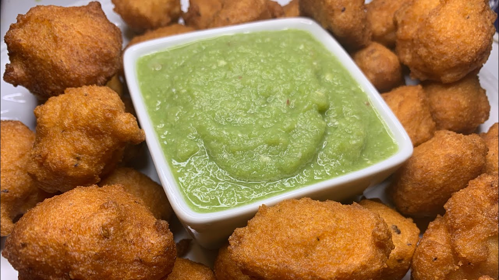

# Bisbaas

*Somalia's green chilli relish: fresh green chillies, garlic, fresh coriander and a generous squeeze of lime blitzed into a brilliant green sauce. The small bowl that appears beside every Somali meal, providing heat and brightness in equal measure.*

**Serves:** Makes about 200 ml (8-12 servings as a condiment)

**Prep Time:** 10 minutes

**Cook Time:** 0 minutes

## Overview
Bisbaas is Somalia's table relish, the bright vivid-green chilli-and-herb sauce that appears in a small bowl beside almost every Somali meal: fresh green chillies (jalapeño or serrano), garlic, a generous bunch of fresh coriander, lime juice, salt and a small amount of vinegar blitzed into a vivid green sauce that diners spoon over rice, drizzle over maraq stews, smear inside sambusas or scoop with anjero. The flavour is fresh herbal heat with a citrus brightness, closer to chimichurri territory than to Tabasco. Fresh chillies, not dried; bisbaas is uncooked and lives or dies on the freshness of its green chillies. Coriander is generous, not garnish: a full bunch goes into a small batch, and the sauce should look more like a pesto than a chilli paste. Best on the day of making; the colour fades and the heat builds, so by day 3 it has lost its brightness. Small batches, often.

## Ingredients

- 6-8 fresh green chillies (jalapeño, serrano, or a mix; deseed if you want milder, leave seeds for fierce)
- 4 garlic cloves (peeled)
- 1 large bunch fresh coriander (about 30 g, stems and leaves; rinse and shake dry; tough lower stems removed)
- 1 small bunch fresh flat-leaf parsley (about 15 g, stems and leaves; optional but traditional)
- ¼ small onion (or 2 spring onion whites; peeled and roughly chopped)
- 3 tablespoons fresh lime juice (from about 2 limes)
- 1 tablespoon white wine vinegar (or apple cider vinegar)
- 4 tablespoons vegetable oil (or olive oil)
- 1 teaspoon fine sea salt
- ½ teaspoon ground black pepper
- ½ teaspoon ground cumin (optional)

## Method

### Stage 1 - Prepare the chillies
1. Remove the stems from the chillies.
2. For mild bisbaas: slit each chilli in half lengthwise and scrape out the seeds and white pith. Roughly chop the deseeded flesh.
3. For fierce bisbaas: leave the chillies whole with all seeds; just roughly chop.
4. Use gloves if handling hot chillies; capsaicin oils sting hands for hours.

### Stage 2 - Prepare the herbs
1. Rinse the coriander and parsley (if using) thoroughly and shake dry.
2. Trim off the tough lower stems but keep the upper tender stems (they have plenty of flavour).
3. Roughly chop everything; doesn't need to be fine since the processor or blender will sort it out.

### Stage 3 - Blitz
1. Tip the chillies, garlic, coriander, parsley and chopped onion into a small food processor.
2. Pulse 5-6 times to break everything down into a coarse mince.
3. Scrape down the sides with a spatula.
4. Add the lime juice, vinegar, vegetable oil, salt, black pepper and cumin (if using).
5. Pulse again 8-10 times till you have a sauce with some texture; small visible pieces of chilli and herb should remain. Don't blitz to fully smooth; bisbaas wants a little bite.
6. If you only have a blender, add an extra tablespoon of water to help it blend, and use the pulse function.

### Stage 4 - Taste and adjust
1. Taste a small spoonful (carefully; if you used fierce chillies, it'll bite).
2. Adjust:
   - More salt if it tastes flat
   - More lime juice if you want it brighter
   - More chilli if you want it hotter
   - More oil if it seems too dry or too sharp
3. Blitz briefly to mix in any adjustments.

### Stage 5 - Serve
1. Transfer to a small serving bowl.
2. Drizzle a thread of extra oil over the surface (the oil protects the herbs from oxidising and keeps the green colour bright).
3. Place at the centre of the table alongside the main meal.
4. Diners help themselves with a small spoon; a half-teaspoon per bite is usually enough.

## Notes
- **Fresh chillies are non-negotiable:** dried chilli flakes or chilli powder won't make proper bisbaas. The fresh chilli flavour profile (grassy, fruity, vegetal) is the heart of the sauce. Jalapeño is the most common; serrano gives a slightly hotter version; Thai bird's eye chillies give serious heat.
- **Coriander generously:** a full bunch (30 g) per small batch isn't a typo; the herb is the major flavour component, not a garnish. The finished sauce should be vivid green from the herbs, not red-orange from the chillies.
- **Don't over-blitz:** bisbaas wants a little texture. Visible pieces of chilli, herb and garlic give the sauce its character. A completely smooth blitz turns it into a paste that loses interest.
- **Best on day of making:** the herbs oxidise and the colour dulls within 24 hours. The flavour deepens but the brightness fades. Make in small batches and use fresh.
- **Use gloves when handling hot chillies:** capsaicin oils on bare hands cause hours of stinging; nightmare if you then rub your eyes. Wear thin disposable gloves if you're using fierce chillies.

## Variations
- **Red bisbaas:** swap green chillies for red chillies (red jalapeño, Fresno or red Thai chillies). The colour shifts to brick-red rather than vivid green; the flavour is slightly sweeter due to the riper chillies.
- **Bisbaas with mint:** add 10 g of fresh mint leaves to the herbs; gives a brighter herbal note. Common Somali variation.
- **Spicier bisbaas:** add a Scotch bonnet or habanero alongside the green chillies; takes the heat up significantly. Approach with caution.
- **Long-keeping bisbaas:** add an extra tablespoon of vinegar and a teaspoon of salt; pack into a sterilised jar with a layer of oil on top; keeps refrigerated 2 weeks. The brighter flavour fades but it survives longer.

## Serving
- A small bowl on the side of every Somali meal: alongside bariis iskukaris, with maraq stews, dolloped onto sambusas before eating, scooped with anjero or muufo, or drizzled over rice and digir. A half-teaspoon per bite is usually enough for moderate heat tolerance; serious bisbaas lovers go further.

## Storage
- Best on the day of making; the bright green colour fades within 24 hours.
- Keeps refrigerated 3-4 days; the colour goes from vivid to drab green but the flavour still works. Stir before serving.
- Don't freeze; the herbs go off and the texture suffers.
- For longer storage, see the variation with extra vinegar and salt; that version keeps 2 weeks refrigerated.
