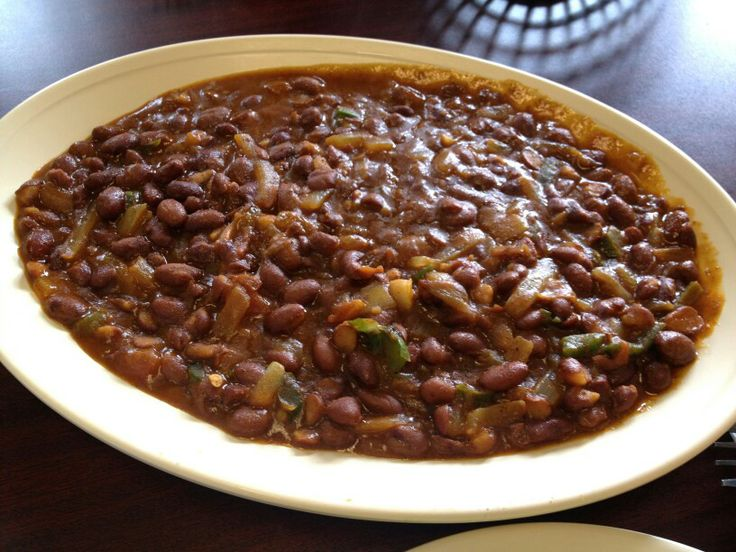

# Digir

*Somalia's breakfast bean stew: dried adzuki or red kidney beans simmered with onion, tomato, garlic, cardamom and xawaash till soft and savoury, then finished with a drizzle of sesame oil. The proper Somali breakfast eaten with muufo or anjero, also a hearty lunch side.*

**Serves:** 6

**Prep Time:** 15 minutes (plus overnight soaking)

**Cook Time:** 1 hour 30 minutes

## Overview
Digir is Somalia's everyday bean stew, the dish that turns up as the proper Somali breakfast (eaten with warm muufo or anjero to scoop) and as a hearty lunch side: dried adzuki beans slow-cooked with onion, tomato, garlic, cardamom and xawaash till the beans go properly soft and silky, the sauce turns deep rust-red and the flavours marry into a quietly aromatic stew. Real digir uses small adzuki beans, common across East Africa, the Horn and East Asia, which give the dish its slightly sweet, slightly grainy character. Red kidney or borlotti substitute acceptably but the texture and flavour shift. Xawaash blooms in oil with the onion and garlic at the start, and the beans absorb the spice through the long cook. Finished with a drizzle of sesame oil (the Somali touch borrowed from Yemen across the Gulf of Aden) and chopped coriander.

## Ingredients

### Beans
- 350 g dried adzuki beans (or red kidney beans or borlotti as substitute)
- 1.5 litres water (for cooking the beans)
- 1 teaspoon fine sea salt

### Aromatic base
- 3 tablespoons vegetable oil
- 1 large onion (finely chopped)
- 4 garlic cloves (crushed)
- 1 thumb (3 cm) fresh ginger (finely grated)
- 3 large tomatoes (chopped; or 1 (400 g) tin chopped tomatoes)
- 2 tablespoons tomato purée

### Spice blend
- 1 ½ tablespoons xawaash (Somali spice blend)
- 1 teaspoon ground turmeric
- 2 whole cardamom pods (lightly crushed)
- 1 small cinnamon stick
- 1 bay leaf
- 1 fresh green chilli (deseeded and finely chopped, optional)

### Seasoning
- 1 teaspoon fine sea salt
- ½ teaspoon ground black pepper
- 1 tablespoon sesame oil (Somali finishing touch; toasted sesame oil)

### To finish
- 3 tablespoons fresh coriander (chopped)
- 1 lime or ½ lemon (juice)

### To serve
- [Muufo](muufo.md) or anjero (Somali breads, for scooping)
- Sweet shaah tea for breakfast
- [Bisbaas](bisbaas.md) for heat

## Method

### Stage 1 - Soak the beans (do this the day before)
1. Rinse the dried adzuki beans and tip into a wide bowl.
2. Cover with cold water by 10 cm.
3. Leave to soak overnight (12-24 hours). The beans should at least double in size.
4. Drain and rinse just before cooking.

### Stage 2 - Cook the beans
1. Tip the soaked beans into a wide saucepan and cover with the 1.5 litres of water.
2. Bring to the boil over high heat, skimming any scum that rises.
3. Reduce to a low simmer and cook 50-60 minutes till the beans are tender (squashable between thumb and forefinger but still holding shape).
4. Add the teaspoon of salt in the last 10 minutes.
5. Drain through a sieve set over a measuring jug, reserving the bean liquor. Set the cooked beans aside.

### Stage 3 - Build the aromatic base
1. Heat the vegetable oil in a wide heavy casserole over medium heat.
2. Add the chopped onion and sweat 8-10 minutes till soft and gold.
3. Stir in the crushed garlic and grated ginger; cook 30 seconds.
4. Add the tomato purée; cook 2 minutes till it darkens.

### Stage 4 - Bloom the xawaash
1. Stir in the xawaash, turmeric, crushed cardamom pods, cinnamon stick and bay leaf.
2. Cook 30 seconds, stirring constantly, till the spices darken the oil and the kitchen smells deeply aromatic.

### Stage 5 - Add the tomatoes
1. Add the chopped tomatoes and the green chilli (if using).
2. Cook 6-7 minutes till the tomatoes break down and the oil starts to separate at the edges.

### Stage 6 - Combine and simmer
1. Add the cooked beans to the spiced tomato base.
2. Pour in about 350 ml of the reserved bean liquor; the beans should be just submerged.
3. Add the additional salt and black pepper.
4. Stir gently; bring to a simmer.
5. Cook uncovered on low heat for 20 minutes, stirring every 5 minutes, till the sauce reduces and thickens to a properly stew-like consistency. If the sauce thickens too fast and the beans look dry, add another splash of bean liquor.

### Stage 7 - Finish
1. Remove the cinnamon stick, bay leaf and cardamom pods.
2. Drizzle the sesame oil over the top; stir through gently.
3. Squeeze in the lime juice (or lemon).
4. Taste; adjust salt.
5. Stir most of the chopped coriander through, reserving a small amount for garnish.

### Stage 8 - Serve
1. Spoon into wide bowls; the digir should be thick and saucy, beans suspended in a glossy rust-red gravy.
2. Scatter remaining coriander over the top.
3. Serve hot with warm muufo or anjero for scooping.
4. Sweet shaah tea on the side for breakfast; cold water with lime for lunch.
5. Bisbaas in a small dish for those who want heat.

## Notes
- **Adzuki beans if possible:** the small dark red adzuki bean is the proper Somali digir bean. Red kidney beans substitute acceptably; borlotti or pinto beans also work; cannellini are too soft and not the right flavour profile. Adzuki are available at African, Indian and Asian grocers and increasingly at health-food stores.
- **Soak overnight:** dried beans need 12-24 hours of soaking; quick-soak methods give patchy results. Plan ahead.
- **Salt beans at the end of bean cooking, not at the start:** early salt slows the cook and toughens skins.
- **Sesame oil at the end is the Somali touch:** the drizzle of toasted sesame oil is borrowed from Yemen across the Gulf, common in Somali coastal cooking. It gives a distinctive nutty finish that elevates the dish above generic bean stew.
- **Bloom the xawaash:** the 30 seconds of cooking the spice in hot oil is what extracts the aromatic compounds. Skipping it leaves a raw-spice flavour.

## Variations
- **Digir with smoked meat:** add 100 g of smoked beef or lamb to the aromatic base; gives extra depth.
- **Digir aniseed (sweet version):** add 1 teaspoon of fennel seeds with the xawaash and 1 tablespoon of sugar to the sauce; the breakfast-leaning version, eaten with sweet bread.
- **Digir iyo bariis (with rice):** serve digir over plain basmati rice rather than with flatbread; a hearty lunch or dinner.
- **Vegetarian digir farsi:** add 100 g of diced potato and 1 carrot diced to the cook with the beans; turns digir into a more substantial vegetable stew.

## Serving
- **For breakfast:** in a wide bowl with warm muufo or anjero alongside for scooping; sweet shaah tea with cardamom on the side. For lunch: over plain basmati rice as a side or main; bisbaas for heat.

## Storage
- Keeps refrigerated 4 days; the flavour deepens overnight, and day-after digir is excellent for breakfast.
- Freezes 3 months. Defrost in the fridge and reheat gently with a splash of water.
- Don't microwave; the sesame oil splits and the bean texture suffers.
