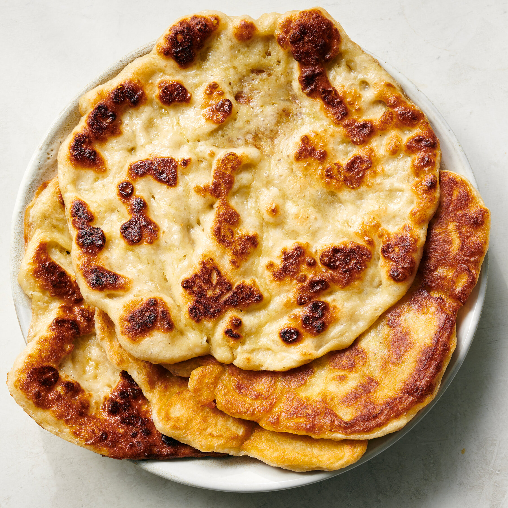

# Muufo

*Somalia's cornmeal flatbread: coarse maize meal mixed with flour and salt, kneaded into a dough, slapped onto the inside of a hot clay or iron oven and baked till the outside crisps and the inside stays soft. The everyday Baraawe-coast bread, eaten with stews and sweet tea.*

**Serves:** Makes 6 flatbreads

**Prep Time:** 20 minutes (plus 1 hour resting)

**Cook Time:** 25 minutes

## Overview
Muufo is the cornmeal flatbread of the Somali coastal Baraawe (Brava) region, distinct from the sourdough anjero of the rest of Somalia: a yeasted dough made from a blend of coarse maize meal and wheat flour, baked the traditional way by slapping the dough onto the inside wall of a hot tandoor-style clay oven. Home cooks outside Somalia approximate the result with a hot heavy iron pan and a closed lid to mimic the oven cavity. The finished bread has a thicker crisp gold outside and a soft slightly grainy interior; the cornmeal gives a faint sweetness and a yellow-tinted crumb. Traditionally eaten with maraq stews (especially the coastal fish stews), with sweet shaah tea for breakfast, or pulled apart and dipped into bisbaas. About 60% cornmeal to 40% flour by weight is the proper ratio. Use medium-coarse cornmeal (polenta-grade) rather than fine. The dough needs 60 to 90 minutes to prove; this is not a quick flatbread.

## Ingredients

### Dough
- 300 g medium-coarse cornmeal (muufo flour or polenta-grade)
- 200 g strong white bread flour (or plain flour at a push)
- 1 teaspoon fine sea salt
- 1 teaspoon caster sugar (helps activate the yeast)
- 1 teaspoon dried yeast (or 7 g instant yeast)
- 350 ml warm water (around 40 C; comfortably warm to touch)
- 2 tablespoons vegetable oil (plus extra for shaping)

### For shaping and cooking
- Extra flour or cornmeal (for dusting)
- 1 tablespoon vegetable oil (for the pan)

## Method

### Stage 1 - Build the dough
1. In a small bowl or jug, combine the warm water, sugar and dried yeast. Stir gently to dissolve. Set aside for 10 minutes till the surface goes foamy (this proves the yeast is alive).
2. In a wide mixing bowl, combine the cornmeal, bread flour and salt. Whisk through to distribute the salt and break up any cornmeal clumps.
3. Pour the activated yeast water into the dry ingredients along with the 2 tablespoons of vegetable oil.
4. Mix together with a wooden spoon till everything comes together as a rough dough.

### Stage 2 - Knead
1. Tip the dough onto a lightly floured surface.
2. Knead for 8-10 minutes till the dough turns smooth and elastic. The cornmeal won't give the dough the same stretchy quality as a pure wheat dough; expect a slightly grainier feel. The dough should be soft and pliable, not sticky.
3. If the dough feels too dry, add a tablespoon more warm water. If too sticky, dust with a little extra flour.

### Stage 3 - First prove
1. Place the kneaded dough in a lightly oiled bowl.
2. Cover with a damp clean cloth.
3. Leave in a warm spot (kitchen counter, somewhere around 22-25 C) for 60-90 minutes till the dough has roughly doubled in size.

### Stage 4 - Divide and shape
1. Tip the proved dough back onto a lightly floured surface.
2. Knock the air out gently with the heel of your hand.
3. Divide into 6 equal portions.
4. Roll each portion into a smooth ball, then flatten with the palm of your hand into a disc about 1.5 cm thick and 15 cm across. The discs should look like proper flatbreads, thicker than a chapati but thinner than a pizza base.
5. Lay the shaped flatbreads on a lightly floured tray and cover loosely with a clean cloth.

### Stage 5 - Second prove
1. Let the shaped flatbreads rest 20 minutes for the dough to relax (this is a short second prove; it gives the bread a lighter texture).

### Stage 6 - Cook
1. Heat a wide heavy frying pan or a flat griddle over medium heat for 3-4 minutes till properly hot.
2. Brush the pan very lightly with vegetable oil.
3. Lay one flatbread into the hot pan.
4. Cover the pan with a tight-fitting lid (this approximates the oven environment of a traditional muufo oven, trapping heat and creating a steam-and-radiant-heat cooking effect).
5. Cook for 3-4 minutes till the underside is deep gold with brown spots and the top has set and looks dry.
6. Flip the flatbread with a spatula, replace the lid, and cook 2-3 minutes on the second side.
7. Lift onto a plate; cover with a clean cloth to keep warm and soft.
8. Repeat with the remaining flatbreads, oiling the pan very lightly between each one.

### Stage 7 - Serve
1. Eat warm. Tear pieces by hand and use to scoop maraq stews, dip into bisbaas, or smear with a little butter for breakfast.
2. Serve alongside the main dish, piled in a bread basket lined with a cloth to keep warm.

## Notes
- **Cornmeal-to-flour ratio:** 60/40 cornmeal/wheat-flour gives the right balance. Going heavier on cornmeal (70/30) gives crumblier dough that's harder to handle but more flavour; going lighter (50/50) gives easier-to-handle dough that tastes less muufo and more like generic flatbread.
- **Use medium-coarse cornmeal, not fine:** fine cornmeal or polenta meal gives a too-smooth dough; the slight graininess from medium-coarse meal is part of the bread's character. If you can find Somali muufo flour at an African grocer, that's the traditional choice; otherwise polenta-grade cornmeal substitutes well.
- **Lidded pan approximates the oven:** real muufo is baked in a tandoor-style clay oven with curved walls. The lidded-pan technique on a hot stovetop is the home substitute that gives reasonable results; the lid traps heat and creates the dry-radiant-heat environment the bread needs.
- **Don't skip the prove:** the 60-90 minutes of first proving is what gives muufo its proper lightness. A no-prove cornmeal flatbread comes out dense and heavy.
- **Eat warm or warm them up:** muufo is at its best fresh from the pan. Day-old muufo can be reheated in a hot dry pan for 30 seconds a side to revive.

## Variations
- **Muufo Baraawe (the proper coastal version):** add 2 tablespoons of grated fresh coconut to the dough; the coastal Baraawe style includes coconut for a subtle sweetness and richness. The most traditional regional version.
- **Sweet muufo:** add 3 tablespoons of sugar and a pinch of ground cardamom to the dough; a breakfast bread served with shaah tea.
- **Whole-wheat muufo:** swap the bread flour for whole-wheat flour for a denser more rustic version.
- **Muufo with sesame:** scatter 2 tablespoons of sesame seeds over the dough discs before cooking; they toast against the hot pan as the bread cooks.

## Serving
- Warm, torn by hand, used to scoop maraq stews or dipped into bisbaas. Breakfast with sweet shaah tea and a piece of warm muufo is a classic Somali coastal morning. Also wonderful with a smear of butter or honey for a sweet snack.

## Storage
- Best eaten warm from the pan.
- Keeps in a clean cloth or sealed bag for 24 hours at room temperature; reheat briefly in a hot dry pan to revive.
- Freezes 1 month wrapped well; defrost at room temperature and reheat in a hot pan or briefly in a low oven.
- After 24 hours the bread goes drier; soak briefly in milk or stock to revive, or tear into pieces and toast as croutons for a salad.
