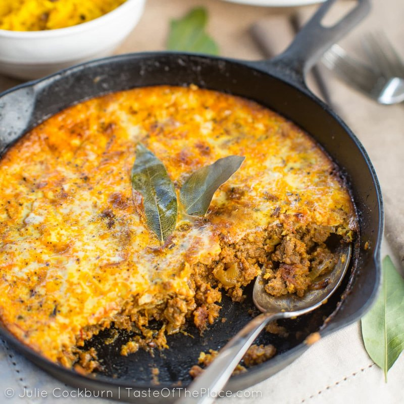

# Bobotie

*South Africa's national dish: spiced minced beef baked under a savoury egg-and-milk topping, with bay leaves stuck on top to perfume the surface.*

**Serves:** 6

**Prep Time:** 25 minutes

**Cook Time:** 1 hour

## Overview
Bobotie is South Africa's national dish, the Cape Malay legacy made over generations into a savoury-sweet baked mince with curry warmth, raisins, almonds and a delicate egg-and-milk custard set on top, finished with fresh bay leaves stuck into the surface like little flags. The flavour balance is the whole point: slightly sweet from apricot jam, raisins and Mrs Ball's chutney, sour from vinegar and lemon, warm from curry powder, turmeric, cinnamon, cloves and cardamom (don't reduce the sweet element thinking it makes the dish more savoury, it loses its character). Tear stale white bread into a small bowl and soak in milk for ten minutes, then squeeze the bread and reserve the milk for the topping. Soften two big onions in oil for ten minutes till golden, add garlic, ginger and the spice mix to bloom, then a kilo of beef mince broken up and browned for eight minutes. In go the apricot jam, mango chutney, vinegar, lemon juice, salt and pepper, cooked another few minutes till the pan is dry. Off the heat, fold through the soaked bread, raisins and toasted flaked almonds, then press the mixture flat into a wide baking dish. Whisk three eggs with the reserved soaking milk plus another 250 ml of fresh milk, season with salt and a grating of nutmeg, pour over the mince. Stick six or eight fresh bay leaves vertically into the surface (this is the visual signature of bobotie and the leaves release oil into the topping as they roast), scatter more flaked almonds, and bake at 180°C for 40 to 45 minutes till the custard is golden and just set with a faint wobble. Rest five minutes, serve scooped onto plates with yellow rice (basmati cooked with turmeric and a cinnamon stick), tomato-and-onion sambal and extra mango chutney on the side.

## Ingredients

### Mince mixture
- 1 kg minced beef (or lamb; 15-20% fat)
- 3 tablespoons vegetable oil
- 2 onions (large, finely chopped)
- 6 garlic cloves (crushed)
- 4 cm ginger (grated)
- 2 tablespoons mild [Curry Powder](../indian/Spice-Mixes/curry-powder.md)
- 1 teaspoon ground turmeric
- 1 teaspoon ground cumin
- 1 teaspoon ground coriander
- ½ teaspoon ground cinnamon
- ½ teaspoon ground cloves
- ½ teaspoon ground cardamom
- 2 bay leaves (for the cooking)
- 80 g raisins (or sultanas)
- 50 g flaked almonds (toasted, plus more for topping)
- 3 tablespoons apricot jam
- 2 tablespoons [Mango Chutney](../indian/sauces-pickles/mango-chutney.md) (Mrs Ball's if you can get it)
- 2 tablespoons cider vinegar
- 1 lemon (juice)
- 1 ½ teaspoons salt
- ½ teaspoon black pepper

### Bread
- 80 g stale white bread (crusts off)
- 200 ml whole milk

### Topping
- 3 eggs (large)
- 250 ml whole milk
- ½ teaspoon salt
- A grating of nutmeg
- 6-8 fresh bay leaves (for sticking into the top)

## Method

### Stage 1 - Soak the bread
1. Tear the bread into pieces and soak in the 200 ml milk in a small bowl 10 minutes.
1. Squeeze the bread; reserve the milk for the topping.

### Stage 2 - Mince mixture
1. Heat the oil in a wide heavy pan over medium heat.
1. Cook the onions 8-10 minutes until soft and golden.
1. Add the garlic and ginger; cook 1 minute.
1. Stir in the curry powder, turmeric, cumin, coriander, cinnamon, cloves, cardamom and bay leaves; cook 1 minute.
1. Add the mince; cook 8 minutes, breaking it up, until well-browned.
1. Stir in the apricot jam, mango chutney, vinegar, lemon juice, salt and pepper.
1. Cook 3-4 minutes more until any pan liquid has reduced.

### Stage 3 - Combine
1. Off the heat, stir in the soaked bread, raisins and 50 g almonds.
1. Discard the cooking bay leaves.
1. Tip into a 23 x 30 cm baking dish; press flat with the back of a spoon.

### Stage 4 - Topping
1. Heat the oven to 180°C (160°C fan).
1. Whisk the eggs with the reserved soaking milk, the additional 250 ml milk, salt and nutmeg.
1. Pour over the mince mixture.
1. Stick the fresh bay leaves into the top - vertically, like little flags - spaced across the dish.
1. Sprinkle with extra flaked almonds.

### Stage 5 - Bake
1. Bake 40-45 minutes until the topping is set with a faint wobble in the centre and golden on top.

### Stage 6 - Rest and serve
1. Rest 5 minutes (the topping firms slightly).
1. Serve scooped onto plates with yellow rice (basmati cooked with turmeric and cinnamon), tomato-and-onion sambal, and extra mango chutney.

## Notes
- **Mrs Ball's chutney is canonical:** South Africa's beloved fruit chutney; an alternative is Major Grey's mango chutney or any sweet fruit chutney.
- **Bay leaves on top:** Aesthetic and aromatic. They roast slightly during baking, releasing oil into the topping. Don't skip - they're part of bobotie's identity.
- **Sweet-savoury balance:** Bobotie is meant to be slightly sweet (jam, chutney, raisins) against the curry warmth. If you reduce sugar, the dish loses its character.

## Storage
- Keeps 4 days refrigerated; tastes better day 2. Reheat covered at 160°C for 20 minutes.
- Freezes 2 months.
