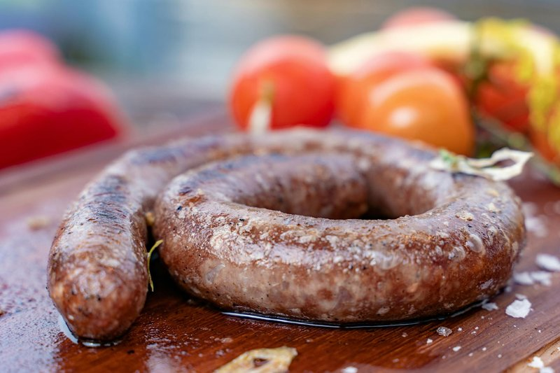

# Boerewors

*South Africa's braai sausage: a long coil of coarse-ground beef and pork, generously spiced with toasted coriander, grilled over coals.*

**Serves:** 6

**Prep Time:** 10 minutes

**Cook Time:** 25 minutes

## Overview
Boerewors, literally "farmer's sausage" in Afrikaans, is the national sausage of South Africa and the obligatory centrepiece of any braai. South African law actually defines it: minimum 90 per cent meat (beef the dominant component, often with pork or lamb for fat), no more than 30 per cent fat overall, no offal, and a defined spice profile led by toasted ground coriander. That coriander is the signature; combined with clove, nutmeg, allspice and black pepper, and brought together with a splash of malt or brown vinegar, it produces a flavour quite unlike any European sausage. The sausage is always coiled rather than linked, and grilled in a single long spiral that can be turned in one piece with a pair of long forks. Difficulty for the home cook is very low if you can buy ready-made boerewors from a South African butcher, deli or online supplier, which is the practical route for most. Making it from scratch needs a meat grinder and sausage stuffer but the spicing is straightforward. Cooking is the part everyone gets wrong: boerewors is a coarse-ground sausage with chunks of fat in the meat, and it cooks at medium heat, never high. Too hot and the casing splits, fat renders out and the sausage shrivels; just right and it stays plump, juicy, with a deep mahogany crust. The classic accompaniments are pap (a stiff white maize porridge), tomato-and-onion relish (sous), or stuffed into a fresh bread roll with tomato chutney and crispy fried onions as a boerie roll.

## Ingredients

### Boerewors mix (for homemade, makes about 1 ½ kg)
- 900 g beef chuck (coarsely ground)
- 400 g pork shoulder (coarsely ground)
- 200 g pork back fat (diced small)
- 25 g coriander seeds (toasted and ground)
- 12 g salt
- 5 g ground black pepper
- 3 g ground clove
- 3 g ground nutmeg
- 3 g ground allspice
- 60 ml malt vinegar (or brown vinegar)
- 60 ml ice water
- 1 ½ m natural hog casings (rinsed)

### To grill (per coil)
- 1.2-1 ½ kg fresh boerewors coil (homemade or shop-bought)

### To serve
- Fresh white bread rolls (or pap)
- Tomato-and-onion relish (sous)
- Mrs Ball's chutney (or other South African chutney)
- Crispy fried onions

## Method

### Stage 1 - Make the sausage (skip if using shop-bought)
1. Toast the coriander seeds in a dry pan over medium heat 2-3 minutes until fragrant; cool and grind.
1. Combine ground beef, pork, diced fat, all spices, salt and vinegar in a chilled bowl.
1. Mix thoroughly by hand for 1-2 minutes until the mix becomes slightly tacky.
1. Add the ice water; mix briefly to combine.
1. Soak hog casings in cool water 30 minutes; rinse the inside by running water through them.
1. Stuff the casings, keeping the filling even but not too tight (over-stuffed sausage splits).
1. Form one long coil; refrigerate at least 2 hours to set, ideally overnight.

### Stage 2 - Prepare the braai
1. Build a medium charcoal or wood fire and let it burn down to glowing embers; the fire should not have visible flames.
1. Test by holding a hand 15 cm above the grate: you should be able to hold it there 4-5 seconds.
1. Oil the grate.

### Stage 3 - Grill
1. Lay the boerewors coil flat on the grate over the embers.
1. Cook 6-8 minutes on the first side until the casing is browned and beginning to render.
1. Slide two long forks or a wide spatula under opposite sides of the coil; flip in one piece.
1. Cook another 6-8 minutes on the second side.
1. The sausage is ready when the casing is glossy mahogany, fat is rendered but not running freely, and the internal temperature reads 72°C.
1. Total time about 18-25 minutes depending on thickness.

### Stage 4 - Rest and serve
1. Lift the whole coil onto a board; rest 5 minutes.
1. Cut into 12-15 cm lengths.
1. Serve in fresh rolls with tomato relish, chutney and crispy fried onions, or alongside pap.

## Notes
- **Heat control is everything:** medium embers, not raging flames. High heat splits the casing and renders out the fat that gives boerewors its juice.
- **Don't prick:** never pierce the casing. Tongs only, gentle handling.
- **One coil, one flip:** flipping the coil in one piece keeps it cooking evenly. Cut it into lengths only after cooking.
- **Toast the coriander:** untoasted coriander is grassy; toasting is what gives boerewors its warm citrus-pine perfume.

## Storage
- Raw boerewors keeps 2 days refrigerated or freezes well up to 3 months.
- Cooked sausage keeps 3 days; slice and reheat in a covered pan.
- Leftover sliced boerewors is excellent in a breakfast roll with fried egg.
