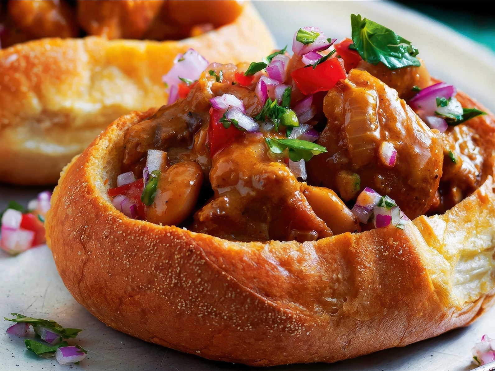

# Bunny Chow

*Durban's iconic Indian-South-African street food: a quarter loaf of white bread hollowed out and filled with a fiery curry of lamb, chicken or beans, the bread crumb torn off and used as a scoop. Born in the cane fields of KwaZulu-Natal and now eaten across South Africa.*

**Serves:** 4

**Prep Time:** 25 minutes

**Cook Time:** 1 hour 30 minutes

## Overview
Bunny chow is Durban's most iconic street food and the proudest contribution of the South African Indian community to the country's cuisine: a quarter loaf of white bread (often called a "bunny", from the Indian word "bania" meaning trader) hollowed out from the cut face, filled with a fiery curry of lamb, chicken, beans or vegetables, with the torn-out bread crumb used as a scoop and finally eaten as the curry-soaked finale. The dish was born in the cane fields and Indian markets of KwaZulu-Natal in the early 20th century, originally as a portable lunch for migrant labourers who needed something they could eat with their hands without plates or cutlery, and it's grown from utilitarian street food into a national institution sold from cafés in Durban, Johannesburg and Cape Town. Three details define a proper bunny chow. First, the bread. A proper Durban bunny uses a soft white "pap" loaf (the local everyday white bread, similar to a UK milk loaf or a US white sandwich loaf); the crumb has to be soft enough to scoop with but firm enough to hold the curry. Crusty artisan loaves don't work because the crust is too tough to bite through neatly and the crumb dissolves into the curry. Second, the hollowing. Cut the loaf into quarters, then hollow each quarter from the cut face with your fingers, pulling out the soft white crumb (the "virgin") in chunks and reserving it. The crumb gets perched on top of the filled curry-cup as the lid; diners use it as a scoop, then eat it last as the curry-soaked best bit. Third, the curry itself must be properly fiery. Bunny chow without serious heat is missing the point. The Durban curry tradition uses fresh ginger, garlic, fresh green chillies, ground spices (cumin, coriander, turmeric, garam masala), tomato and a generous amount of curry leaves and Scotch bonnet or bird's eye chillies. Make the curry properly long-cooked (90 minutes for lamb), let the flavours marry, and fill the bunnies just before serving so the bread doesn't go entirely soggy. Bunny chow is eaten by hand, no cutlery, with the carrot-onion sambals and a bowl of grated carrot atchar on the side.

## Ingredients

### Lamb curry filling
- 800 g boneless lamb shoulder (cut into 3 cm cubes)
- 1 ½ teaspoons fine sea salt
- 1 teaspoon ground black pepper
- 3 tablespoons vegetable oil

### Aromatic base
- 2 large onions (finely chopped)
- 8 garlic cloves (crushed)
- 1 thumb (5 cm) fresh ginger (finely grated)
- 2 fresh green chillies (deseeded for milder, seeds in for hotter, finely chopped)
- 1 (400 g) tin chopped tomatoes
- 2 tablespoons tomato purée

### Spices
- 2 tablespoons Durban masala (a fiery red curry powder; if unavailable, substitute 1 tbsp hot Madras + 1 tbsp Kashmiri chilli powder)
- 1 teaspoon ground cumin
- 1 teaspoon ground coriander
- 1 teaspoon ground turmeric
- 1 teaspoon garam masala
- 4 whole cardamom pods (lightly crushed)
- 1 small cinnamon stick
- 4 cloves
- 2 bay leaves
- 15-20 fresh curry leaves (essential; from an Asian grocer)

### Liquid
- 500 ml beef stock (or water)
- 2 large potatoes (peeled and cut into 3 cm cubes)

### To finish
- 3 tablespoons fresh coriander (chopped)
- 1 lemon (juice)

### For assembly
- 2 large unsliced white loaves (soft pap loaves; standard UK milk loaf works)

### To serve
- Grated carrot (about 200 g; tossed with a squeeze of lemon and a pinch of salt)
- 1 lemon (cut into wedges)
- Sliced onion (for the side relish)
- Atchar (mango pickle, if available)

## Method

### Stage 1 - Brown the lamb
1. Pat the lamb cubes dry. Season with the salt and pepper.
2. Heat the vegetable oil in a wide heavy lidded casserole over high heat till shimmering.
3. Brown the lamb in 2 batches for 4-5 minutes per batch, turning once, till deeply caramelised on most sides.
4. Tip the browned lamb into a bowl.

### Stage 2 - Build the aromatic base
1. Reduce the heat to medium.
2. Add the chopped onions to the remaining oil; sweat 8-10 minutes till soft and starting to colour.
3. Stir in the crushed garlic, grated ginger and chopped green chillies; cook 1 minute.

### Stage 3 - Bloom the spices
1. Add the tomato purée; cook 1 minute till it darkens.
2. Add the Durban masala, ground cumin, ground coriander, turmeric and garam masala.
3. Add the crushed cardamom, cinnamon stick, cloves, bay leaves and curry leaves.
4. Cook 1 minute, stirring constantly, till the oil turns deep red and the kitchen smells deeply spiced.

### Stage 4 - Build the curry
1. Add the tinned tomatoes; cook 5-6 minutes till the tomatoes break down and the oil starts to separate.
2. Return the browned lamb and any resting juices to the pan.
3. Pour in the beef stock; stir to combine.
4. Bring to a simmer, cover with the lid slightly ajar, and cook 60 minutes on low heat.

### Stage 5 - Add the potatoes
1. After 60 minutes, the lamb should be approaching tender.
2. Add the cubed potatoes.
3. Stir to distribute; cover and continue simmering for another 25-30 minutes till the potatoes are tender and the lamb falls apart easily under a fork.

### Stage 6 - Finish the curry
1. Lift the lid; if the sauce is too thin, simmer uncovered for 5-10 minutes more to thicken.
2. The proper bunny chow filling is a thick gravy that clings to the spoon, not a thin soup.
3. Remove the cinnamon stick and bay leaves.
4. Squeeze in the lemon juice; stir.
5. Stir in most of the chopped coriander.
6. Taste; adjust salt.

### Stage 7 - Prepare the bread
1. Cut each loaf in half (so you have 4 quarters total; one quarter per person).
2. From the cut face, use your fingers to hollow out the soft white crumb from each quarter, leaving a 1.5 cm wall and base intact. Reserve the torn-out crumb chunks.
3. The bread should look like a hollow cube with one open face.

### Stage 8 - Assemble
1. Place each hollowed bread quarter on a plate, open face up.
2. Spoon the hot lamb curry generously into each cavity, filling it to the top and slightly overflowing.
3. Perch the reserved crumb chunks on top like a lid.
4. Place the serving plates in front of each diner immediately.

### Stage 9 - Serve
1. Bunny chow is eaten with the hands, no cutlery.
2. Place small bowls of grated carrot salad, sliced raw onion, lemon wedges and atchar (if available) on the table.
3. Diners pick up the bread, tear off pieces of the lid, use them to scoop the curry, then eat the curry-soaked bread base last.
4. Provide plenty of napkins; this is properly messy food.

## Notes
- **Pap loaf, not artisan bread:** the proper bread is a soft white sandwich-style loaf. Crusty artisan loaves don't work because the crust is too tough and the crumb dissolves into the curry too quickly. UK milk loaf or US white sandwich loaf is the right substitute.
- **Curry must be properly fiery:** bunny chow is a Durban Indian dish, and proper Durban curries are hot. If you make a mild curry you've missed the dish. Build heat with green chillies in the cook plus serious masala; diners can pull back at the table with the cooling carrot salad.
- **Durban masala if you can find it:** Indian-South-African shops sell Durban masala (sometimes called "mother-in-law's curry powder"); it's the fiery red curry powder built specifically for Durban-style curries. The substitute (Madras + Kashmiri chilli powder) approximates the flavour but the proper article is better.
- **Curry leaves are non-negotiable:** the dish requires fresh curry leaves; dried curry leaves are a poor substitute. Available at Indian grocers; freeze any leftover leaves.
- **Eat by hand:** bunny chow is street food. Cutlery is wrong; the experience is tearing crumb, scooping curry, eating the gravy-soaked bread. Embrace the mess.

## Variations
**Bean bunny chow:** swap lamb for a curry of sugar beans (small white beans) cooked in the same masala; the vegetarian classic, common at Indian temples and as fasting-day food.
**Chicken bunny chow:** swap lamb for bone-in chicken pieces; reduce simmer time to 35 minutes. Lighter version, popular for weeknight family meals.
**Mince bunny chow:** swap lamb for 500 g of beef mince; quicker version, ready in 45 minutes. Common in Johannesburg cafés.
**Vegetable bunny chow:** swap lamb for 600 g of mixed vegetables (potato, carrot, cauliflower, peas) cooked in the same masala for 25-30 minutes; vegetarian and quicker.

## Serving
By hand, from the bread, with grated carrot salad and sliced onion on the side. Beer is the traditional accompaniment (a cold Castle or Black Label lager from South Africa); cold water with extra lemon if you don't drink. Plenty of napkins.

## Storage
- The curry filling keeps refrigerated 4 days; the flavour deepens overnight. Reheat in a covered pan with a splash of water.
- Freezes 3 months. Defrost in the fridge and reheat gently.
- Hollow the bread to order; pre-hollowed bread goes stale. The bread crumb you remove can be saved for stuffings, breadcrumbs or French toast.
- Don't assemble the bunny chows ahead; the bread goes soggy within 30 minutes. Fill just before serving.
