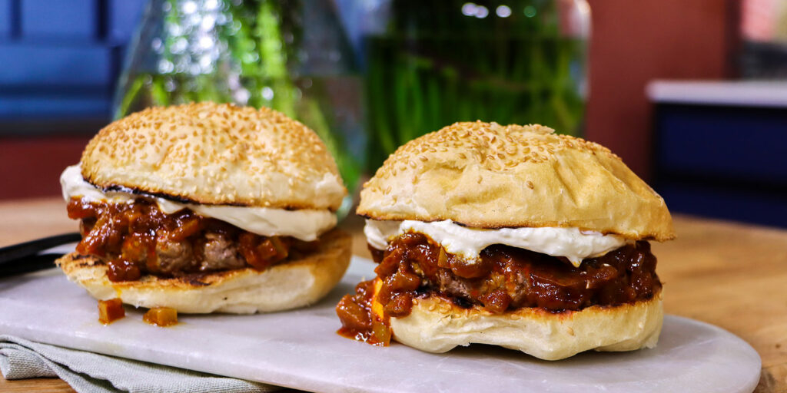

# Chakalaka Burger

*South Africa's spicy burger: a juicy beef patty topped with a generous spoon of warm chakalaka (the South African spicy vegetable relish of onion, carrot, peppers, baked beans, chilli and curry powder), a slice of melty cheddar, lettuce and tomato, on a soft toasted bun. The braai-and-shisanyama burger of South African weekends; comfort food with a slow-burning chilli kick.*

**Serves:** 4

**Prep Time:** 25 minutes

**Cook Time:** 25 minutes

## Overview
South Africa's defining take on the hamburger: a juicy beef patty topped with chakalaka, the country's iconic spicy vegetable relish that originated in the townships of Johannesburg in the 1950s. The chakalaka is a quick-cooked relish-stew of onion, garlic, fresh ginger, peppers, grated carrot, tinned tomato, mild curry powder, paprika, chilli, and the traditional ingredient that distinguishes it from any other African pepper-and-tomato relish: a tin of Heinz baked beans stirred in at the end (the beans aren't an addition, they're a defining ingredient). Spooned warm over a grilled patty with a slice of melty cheddar, crisp lettuce, tomato and red onion on a soft toasted bun. The chakalaka goes warm, not cold from the fridge; warmth releases its aromas. Melted cheddar between patty and chakalaka holds the relish back from making the bun soggy.

## Ingredients

### Chakalaka
- 4 tablespoons vegetable oil
- 2 large onions (chopped)
- 1 thumb (3 cm) fresh ginger (grated)
- 6 garlic cloves (crushed)
- 3 large carrots (coarsely grated)
- 1 green bell pepper (sliced thin)
- 1 red bell pepper (sliced thin)
- 1 fresh red chilli (deseeded for milder; left whole and chopped for hotter)
- 1 tablespoon mild curry powder
- 1 tablespoon paprika
- 1 teaspoon ground cumin
- 1 teaspoon ground coriander
- 1 teaspoon dried thyme
- 1 tin (400 g) chopped tomatoes
- 2 tablespoons tomato paste
- 1 tin (415 g) baked beans (Heinz or local equivalent; in tomato sauce)
- 1 teaspoon fine sea salt
- 1 teaspoon ground black pepper
- 1 small bunch fresh coriander (chopped, for finishing)

### Patty
- 800 g ground beef chuck (80/20)
- 1 teaspoon fine sea salt
- 1 teaspoon ground black pepper
- 1 teaspoon paprika
- 1 teaspoon garlic powder
- 1 teaspoon onion powder

### Build
- 4 slices mature cheddar cheese
- 4 brioche or potato burger buns (split)
- 2 tablespoons butter (for toasting buns)
- 1 cos lettuce heart (leaves separated)
- 1 large tomato (sliced)
- 1 small red onion (sliced into thin rings)

### To serve
- Hand-cut chips
- Cold Castle lager or Black Label

## Method

### Stage 1 - Make chakalaka
1. Heat oil in a wide saucepan over medium heat.
2. Sauté chopped onions 8 minutes till soft and golden at the edges.
3. Add grated ginger and crushed garlic; cook 30 seconds.
4. Add grated carrot, sliced peppers, chopped chilli; cook 6 minutes till the vegetables are softening.
5. Stir in curry powder, paprika, cumin, coriander, thyme. Cook 1 minute to bloom the spices.
6. Add tomato paste; cook 1 minute.
7. Pour in the chopped tomatoes; simmer 10 minutes till the sauce reduces and thickens.
8. Stir in the baked beans (with their sauce); warm through 3 minutes.
9. Season with salt and pepper.
10. Stir in the chopped fresh coriander.
11. Keep warm.

### Stage 2 - Mix the patty
1. Season the beef with salt, pepper, paprika, garlic and onion powder.
2. Form into 4 patties about 12 cm wide. Press a shallow dimple into each.

### Stage 3 - Toast the buns
1. Butter the bun cut sides.
2. Toast cut-side-down 90 seconds till golden.

### Stage 4 - Cook patties with cheese
1. Heat a cast-iron pan or grill pan to high.
2. Cook patties 3-4 minutes per side for medium.
3. In the last minute, top each patty with a slice of cheddar; cover briefly to melt.

### Stage 5 - Build the burgers
1. Layer lettuce and tomato on the bottom bun.
2. The cheese-topped patty.
3. A generous spoonful of warm chakalaka over the patty.
4. Sliced red onion.
5. Close.

### Stage 6 - Serve
1. Cut diagonally.
2. Chips on the side.
3. Cold lager.

## Notes
- **Baked beans essential to the chakalaka:** without them, it's not chakalaka. Don't skip.
- **Chakalaka warm, not cold:** straight from the fridge it tastes muted.
- **Cheese melted over the patty:** holds the bun together against the wet chakalaka.
- **Spice level adjustable:** the chakalaka can range from mild (1 chilli deseeded) to braai-fire hot (3 chillies seeds in).

## Variations
- **With boerewors patty:** swap the beef burger for a flat boerewors patty (South Africa's seed-spiced sausage as a patty).
- **Vegetarian chakalaka burger:** swap the patty for a grilled portobello or a halloumi steak.
- **With biltong on top:** add slices of South African biltong (cured beef) on top of the patty.
- **Spicier:** add a chopped fresh African bird's eye chilli to the chakalaka.
- **With fried egg:** the South African "kraz" style, a fried egg over the chakalaka.

## Serving
- At a Sunday braai (barbecue). At a shisanyama (township grill house). At home with chips and a cold beer.

## Storage
- Chakalaka keeps refrigerated 5 days; freezes 3 months. Better the next day (the flavours marry).
- Raw patties refrigerate 1 day; freeze 2 months.
- Don't store assembled burgers; the bun goes soggy.
